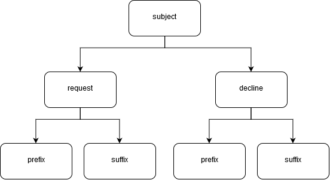

# Configuration File
This object contains the settings to compute up the script.

::: tip PREVIEW
Preview code at [https://github.com/sagelga/approval-workflow/blob/master/src/Config.js](https://github.com/sagelga/approval-workflow/blob/master/src/Config.js)
:::

### CONFIG.`headerRow`

`Number`

How many rows that works as `header` row. Last row (if defined more than one) will be used as sheet "attribute".

Unit: row(s)

Default: 1

### CONFIG.`responseTimeout`

`Number`

How many days since request has been sent, until counted as 'Timeout'.

Unit of time: day(s)

Default : 14

### CONFIG.`flow_step`

`Number`

How many steps of approval that you need.

::: danger DANGER
Script currently supports 2 steps of approval. 
Dynamic steps is not being developed yet.
:::

Unit: step(s)

Default: 2

### CONFIG.`header_sheet`

`String`, `case sensitive`

What is the header sheet name.

### CONFIG.`inbound_sheet`

`String`

What is the inbound sheet name

Inbound = Receiving approval result

### CONFIG.`form_column_range`

`String`

In the key `form_column_range`, there is a `start` and `stop` key.

In the `start` key, type in string that is a column character (starts with A) that is the first column that is a information range.

Similar to `stop` key, type in string that is the last column of the information range.

A column that is in between (includes the `start` and `stop` ) is included* in the response summary table.

### CONFIG.`approval_form_url`

`String`, `case sensitive`

URL to the form (**with a Response ID Parameter**)

### CONFIG.`admin_email_address`

`String`

Email address that will receives a failure notification

### CONFIG.`email`

Contains information about the prefix of the email (as noted as `CONFIG.email.step0.subject.request.prefix`)

In the diagram described below, one node represents a dot notation. A leaf node represents value (`String`).

