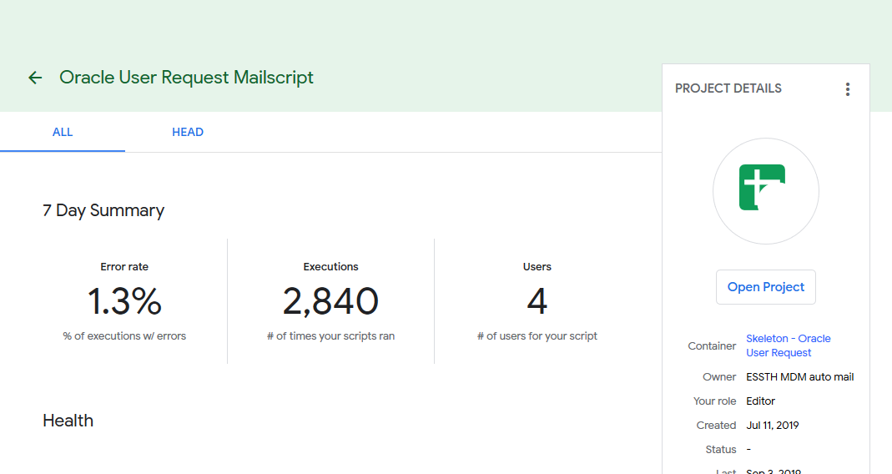
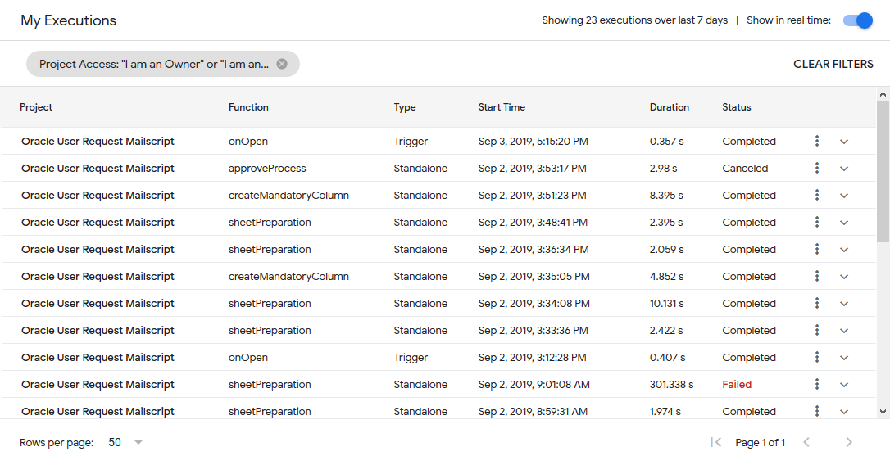
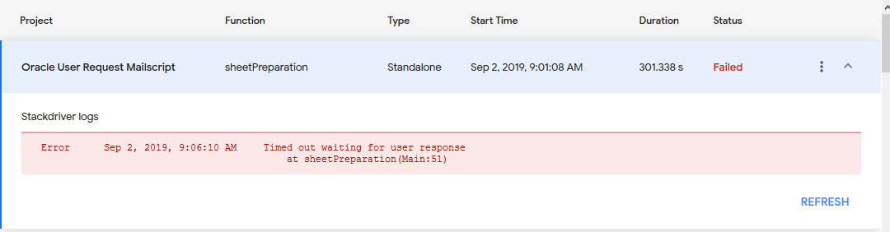

# Dealing with Issues
## What defines as working unexpectedly
If the workflow goes wrong, it will give one or more of of these signs of issue report :
- Email(s) sent to admin (via the admin sending list) containing error code
- Working status in 'My Executions' start turning "Timeout", "Suspended" or "Failed"
- Working status inside of the core sheet returning incorrect result, not showing any result or the script stops before running through the last line of the request (run through the last request)

or you are suspecting of script malfunctioning, you can start looking at the execution debug terminal

### Check script's performance
Error rates are the indication of incidents that have happened during past executions. It is designed to be the indication of a script's reliability and should be highly prioritized. To check on the error rate, click on the project name in "My Project" and you will see this screen.

Dashboard contains:
- Error rate (of executions per error)
- Executions (of times the script runs)
and
- Container (sheets/documents that the script is built into)
- Owner

### Checking execution debug
You can check each execution by going through the log created in 'My Executions'. If you like to do the debug on your own, this steps will guide you, but please make sure that you understands how the log report for Google Apps Script works first.

1. Go to [https://script.google.com/home/executions](https://script.google.com/home/executions)
2. There will be a list of executed functions and information about that run.
- Project : Google Script that runs the function
- Function : Function name that gets run
- Type : [Type of execution trigger]()
- Start time : Time that triggers the function
- Duration : Duration of the execution
- Status : Status of that run
- [Types of execution status]()

3. When the script show its status as 'Failed', that execution will always create a Error Code for you to search on StackOverflow or any website that shows how to deal with that error code.
 

Simply copy the error description (in which this starts from 'Time out waiting for user response') without any words/location/function that cause this issue, and start looking at the dependent, dependency and the function itself for the cause of this issue.
StackDriver Logs is a Google Apps Script way to create logs (including work status to confirm the task is being processed or creating errors)
Read more at [https://developers.google.com/apps-script/guides/logging#stackdriver_logging](https://developers.google.com/apps-script/guides/logging#stackdriver_logging)

## Time out issue
System timeout is normally generated when the runtime of the current operation reaches 30 minutes (1800 second). Google will stop all process being calculated and will not doing anything.
Tested with normal request, it takes 3 seconds to go around each row. In the other hand, leaving the system with 600 request to run at the same time can cause havoc and system timeout. But that large amount of request is quite 'not going to happen' , so you don't have to worry that much.
System will restart the task and will not start from where its left (just for now) and fix the unfinished task based on the status it is currently on.
Normally, dealing with the system timeout is nothing you can do much. What you can do is to improve it from 'not going timeout'. Here's some few examples you can try:

## Issues created by Constrains
This is the list of all constraints that exist in the script. Make sure that you did not do things as following, as the data retrieval or update can create a bigger issue.
