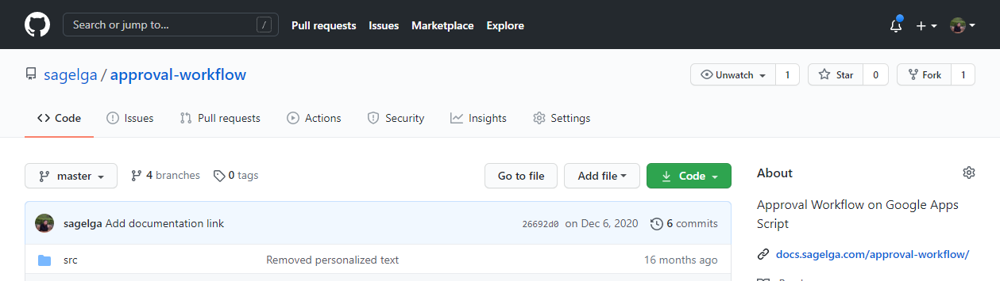
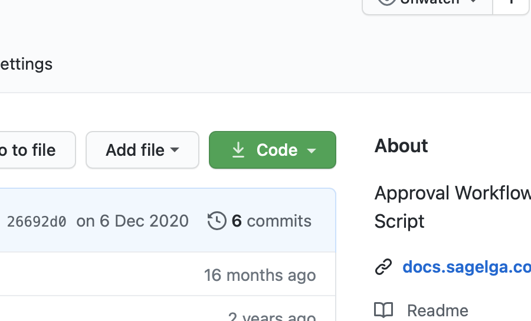
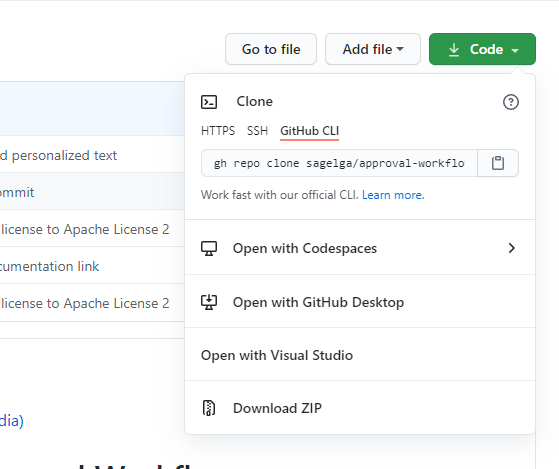
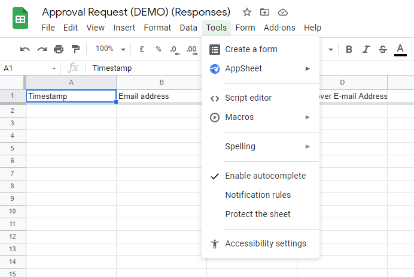
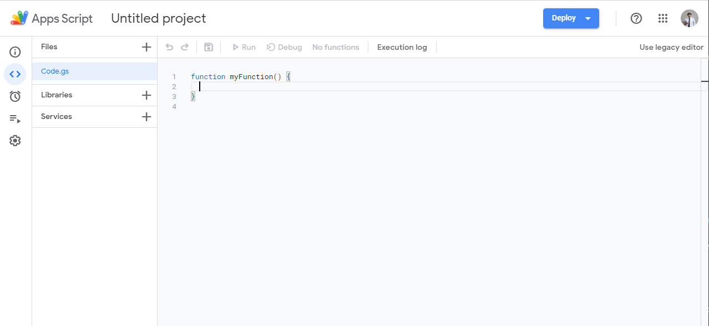

# Setup
*Tags: Github, Repository, Install, Setup, Sheets, Forms*

## Installing
Before you can start using the script, here's something you need to install and manually setup.

First thing you need to do is to install the script. The script will allows you to run the flow. 
To use the script, you must have acesss to items that is defined on [System Requirement](./requirement) and do the following step(s) to complete the installation.

1. Visit [https://github.com/sagelga/approval-workflow](https://github.com/sagelga/approval-workflow)
 
2. Select "Clone" (noticeable by the bright green button)
 
3. Select "Download ZIP"
 
4. After extrating the `.zip` file, there will be multiple `.js` file in `src/`.
 
5. Go to your Target sheet (optional)
6. In Tool Bar, select Tools > Script editor
 
7. You will be directed to Target sheet's script editor.
 
8. For each file, do as following
    1. Open the file using any Text Editor application (i.e. Visual Studio Code)
    2. Copy all of its content
    3. Paste it to the Target Google Apps Script script page.
    4. (Optional) Create a new script file by clicking a 
    5. Repeat the process until you copied all of the files.
9. Done.
