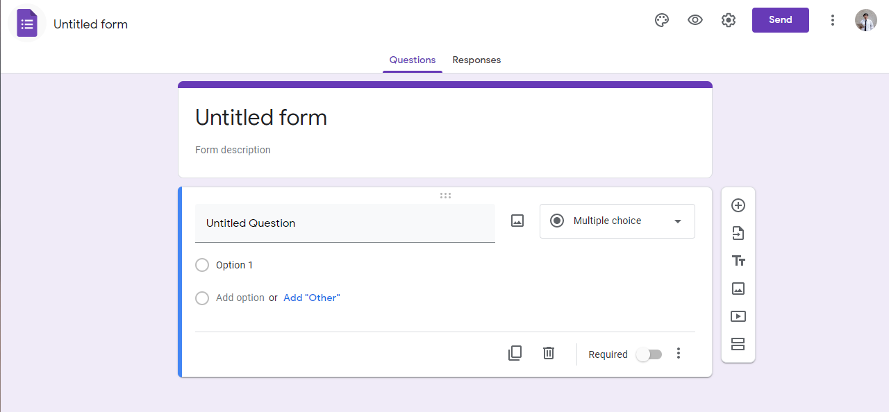

# Setup
*Tags: Github, Repository, Install, Setup, Sheets, Forms*

For the script to be ready to serve, here's what you will need to have before starting the script.

- [x] [Installs the script](/approval-workflow/docs/overall/install/#installing).
- [x] Create a [Request Form](#create-a-request-form) and Request collection Sheet.
- [x] Create an [Approval Form](#create-an-approval-form) and Approval collection Sheet.
- [x] Rename Request collection Sheet to 'Response'.
- [x] Rename Approval collection Sheet to 'Inbound'.

## Installing
Before you can start using the script, here's something you need to install and manually setup.

First thing you need to do is to install the script. The script will allows you to run the flow. 
To use the script, you must have acesss to items that is defined on [System Requirement](./requirement) and do the following step(s) to complete the installation.

1. Visit [https://github.com/sagelga/approval-workflow](https://github.com/sagelga/approval-workflow).
   
2. On the page, select 'Code' (noticeable by the bright green button).
    
3. On option dropdown, select "Download ZIP". You will be downloading a `.zip` file containing the source code.
   
4. Go to the download destination, extracts the `.zip` file, there will be multiple `.js` file in `src/`.
   
5. Go to your Target sheet (optional).
6. In Tool Bar, select Tools > Script editor.
   
7. You will be directed to Target sheet's script editor as following.
   
8. For each `.js` file (in step 4), do as following.
    1. Open the file using any Text Editor (i.e. [Visual Studio Code](https://code.visualstudio.com))
    2. Copy all of its content.
    3. (Optional) Create a new script file by clicking a  and named it with the same name as the file.
    4. Paste it to the Target Google Apps Script script page (in step 7).
    5. Repeat the process until you copied all of the files.
9.  Done.

## Create a Request Form
To create a target form (form that will **digest in** an approval request) and link it to Google Sheets, please carefully follow the instruction.

1. Create a new Google Form by vising [https://forms.new](https://forms.new) 
(Short URL for creating new Google Forms)

2. Add questions you liked to ask. Make sure that you request an 'Approver E-mail Address' with 'E-mail only' constraint

3. In settings, make sure 'Collect Email Address' is ticked and 'Edit after Submit' is not ticked. These settings option are already ticked and not ticked by default. If you managed to make change to these two options, please make sure you revert it back.

4. After you complete adding questions to the script, go to 'Response'
   
5. Click 'More' button (), next to a Sheet button ()
   
6. Click 'Select response destination'. There will be two options for you to choose from.
    - Select 'Create a new spreadsheet' if you start using this script for the first time.
    - Select 'Select existing spreadsheet' if you already have the Target worksheet.
  
7. You will be directed to/back to a spreadsheet. This will be your Target spreadsheet.
   
8. Rename this sheet to 'Response' (default) (Edit the `Response` sheet to something else in `CONFIG`).

## Create an Approval Form
1. Create a new Google Form by vising [https://forms.new](https://forms.new) (Short URL for creating new Google Forms)
   
2. Add any approval questions you like.
3. Add a question and named it 'Approval Response' (default)
   - In answer field, have an option of 'Approve' or 'Decline'.
   - (Recommend) use Dropdown to let user respond to avoid unintentional approval/decline of the request.
4. After you complete adding questions to the script, go to 'Response'
   
5. Click 'More' button (), next to a Sheet button ()
   
6. Click 'Select response destination' → 'Select existing spreadsheet'.
  
7. Select the same worksheet as 'Request collection sheet'.
8. Rename the sheet to 'Inbound' (Edit the `Response` sheet to something else in `CONFIG`).
