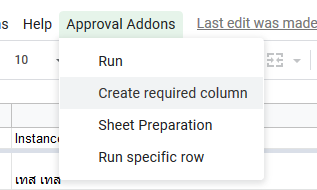

# System Requirements
To start and use this script, you will have to create/check whaever you qualified with the requirement or not. Here are the list of requirement you will need to start things up.

**Google Apps Script**
- Google Account
- Permission to use Apps Script and send email on your behalf

**Google Sheets**
- Worksheet & Sheets
- Form format (for data input)
- Sheet (for data processing)

## Google Account
You can use any Google Account you want (subscription not required, until further noticed). This account will serves as a Sheet storage, Form storage and email sender. 
For more information about Google Apps Script, visit [https://script.google.com/](https://script.google.com/)

## Target Worksheet + Forms
*Topic : Permission to use Google Apps Script*

This is everything for the script (via Google Sheets). In order to let the script to ingest the current situation and decide on what it should do, these sheet is required in order to work.

- **Approval Request**: The Workflow `Sheet` sheet.
Works as the Request data ingestion. This sheet may contain additional request attributes created by the form. This sheet connects to the Approval Request form.

- **Approval Response**: The Workflow `InboundSheet` sheet.
Works as the Approval Response data ingestion for the script. This sheet will contain ID (for connecting it with a Request that is being responded via the form) and an Approval Response (for allowing the script to update the request status and continue the workflow.

Visit [Create Sheet and InboundSheet on Google Forms - Sheets]() to learn more on how you can create a system-required sheet.

## Worksheet Column
or `Required Column` in the script. This allows the script to understand and pull up the correct data column. In each `sheet`, there will be required column that will be either from generate or manually create. Here are the list of all required column that will be used by the script.

|  Sheet Name   | Required Column                                                                                                                                                                                                                                                                                                                           |
| :-----------: | ----------------------------------------------------------------------------------------------------------------------------------------------------------------------------------------------------------------------------------------------------------------------------------------------------------------------------------------- |
|     Sheet     | <ul><li> Response ID</li><li> Step xx Status [replace xx with step number]</li><li> Step xx Comments [replace xx with step number]</li><li> Step xx Response Form URL [replace xx with step number]</li><li> Step xx Timestamp [replace xx with step number]</li><li> Skips Override</li><li> Timestamp (created automatically)</li></ul> |
| Inbound Sheet | <ul><li>Bound to Response ID</li><li>Response Result</li><li>Comments</li><li>Timestamp (created automatically)</li><li>Email Address (created automatically)</li></ul>                                                                                                                                                                   |

You can choose one of the following ways to create these columns

If you think that you have completed the instruction, try running the script with a sample request. If the script worked perfectly, as it does not crash during run, the setup for this step is complete.

### Option 1 Automatically via Sheet UI
::: warning
This method might not work if the sheet name is different to a default sheet name.

Adding a new column in InboundSheet might not work via this method.
You might have to create it manually.
:::

1. In the sheet that the script is contained, wait a while and see 'Approval Addons' tab. Click on the tab to show more options.
2. On 'Approval Addons' tab, select 'Create required column'

The script will run and automatically add a column for you. Script will not generate a new column name when the script can detect existed system-related column. All column will be inserted at the end of the sheet.

### Option 2 Manual
1. Selecting a blank column that hasn't been used (either by the script or the form), by clicking or selecting the cell at the first row (row 1) and the column that you like to add the attribute on (i.e. on cell D1)
2. Type in the column name, as in the format defined previously
3. Repeat step 1 and 2 until you completely typed in all of the system-required columns.

::: tip
Noted that, you don't have to list it in order. You can place wherever you feel like to. But for Best Practice, you should be adding it at the very last to lower the impact from Google Form data ingestion.
:::

## Form
Form works as the data ingestion and will put its result to the sheet (noted above), using Google Forms. Approval requests and response is recorded by one of the following forms, as described in The Worksheet, the form will be connected to the corresponding sheet.

With its ability to add attributes to the Sheets by adding/modifying the form, you are advised to deal with the issue created by this action. For more information about adding/modifying a form, please checkout [Dealing with Issues](../../maintain/) on what you can or cannot do with the form or/and the worksheet.
