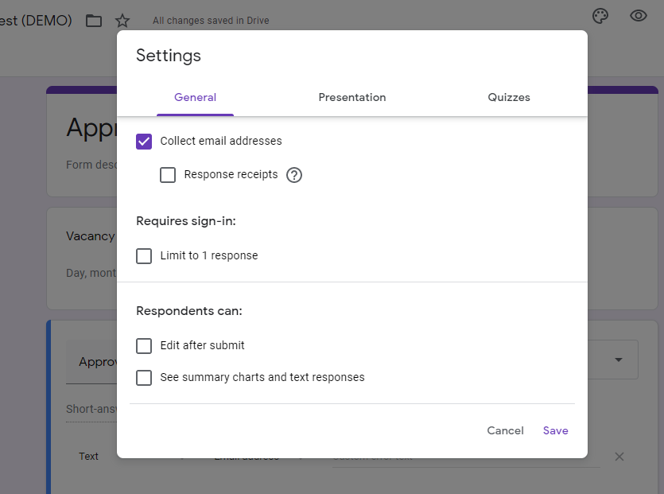

# Setup
Before continuing this setup process, please make sure you can access every required service (as listed in [requirement](../requirement))

## Agenda
You will have to set this following service up manually on manager's account:

- Google Sheets
    - Worksheet & Sheets
    - Form format (for data input)
    - Sheet (for data processing)
- Google Forms
    - Request Form
    - Approval Form

## Create Google Sheets' Script Target
This is everything for the script (via Google Sheets). In order to let the script to ingest the current situation and decide on what it should do, these sheet is required in order to work.

1. If you do not have any Google Sheets Worksheet, create a new one by visiting [sheets.new](https://docs.google.com/spreadsheets/u/0/create?usp=dot_new).
2. Create 2 Sheets (located on the bottom left of the screen) and name it as following:
    1. `Sheet` 
        a.k.a Approval Request sheet. Works as the brain of the script and task board.
    2. `InboundSheet` 
        a.k.a Approval Response sheet. Works as the Approval Response data ingestion for the script.

### Setup a Worksheet Column (System-required columns)
This allows the script to understand and pull up the correct data column. In each sheet, there will be required column that will be either from generate or manually create. Here are the list of all required column that will be used by the script.

|  Sheet Name   | Required Column                                                                                                                                                                                                                                                                                                                           |
| :-----------: | ----------------------------------------------------------------------------------------------------------------------------------------------------------------------------------------------------------------------------------------------------------------------------------------------------------------------------------------- |
|     Sheet     | <ul><li> Response ID</li><li> Step xx Status [replace xx with step number]</li><li> Step xx Comments [replace xx with step number]</li><li> Step xx Response Form URL [replace xx with step number]</li><li> Step xx Timestamp [replace xx with step number]</li><li> Skips Override</li><li> Timestamp (created automatically)</li></ul> |
| Inbound Sheet | <ul><li>Bound to Response ID</li><li>Response Result</li><li>Comments</li><li>Timestamp (created automatically)</li><li>Email Address (created automatically)</li></ul>                                                                                                                                                                   |

You may choose one of these methods to complete this task:

#### Option 1 Automatically via Sheet UI
::: warning
This method might not work if the sheet name is different to a default sheet name.

Adding a new column in InboundSheet might not work via this method.
You might have to create it manually.
:::

1. In the sheet that the script is contained, wait a while and see 'Approval Addons' tab. Click on the tab to show more options.
2. On 'Approval Addons' tab, select 'Create required column'

The script will run and automatically add a column for you. Script will not generate a new column name when the script can detect existed system-related column. All column will be inserted at the end of the sheet.

#### Option 2 Manual
1. Selecting a blank column that hasn't been used (either by the script or the form), by clicking or selecting the cell at the first row (row 1) and the column that you like to add the attribute on (i.e. on cell D1)
2. Type in the column name, as in the format defined previously
3. Repeat step 1 and 2 until you completely typed in all of the system-required columns.

If you think that you have completed the instruction, try running the script with a sample request. If the script worked perfectly, as it does not crash during run, the setup for this step is complete.

::: tip
Noted that, you don't have to list it in order. You can place wherever you feel like to. But for Best Practice, you should be adding it at the very last to lower the impact from Google Form data ingestion.
:::

## Setup the Google Form
Form works as the data ingestion and will put its result to the sheet (noted above), using Google Forms. Approval requests and response is recorded by one of the following forms, as described in The Worksheet, the form will be connected to the corresponding sheet.

With its ability to add attributes to the Sheets by adding/modifying the form, you are advised to deal with the issue created by this action. For more information about adding/modifying a form, please checkout [Dealing with Issues](../../maintain/) on what you can or cannot do with the form or/and the worksheet.

## Create a Request Form
To create a target form (form that will **digest in** an approval request) and link it to Google Sheets, please carefully follow the instruction.

1. Create a new Google Form by vising [https://forms.new](https://forms.new) 
(Short URL for creating new Google Forms)

2. Add questions you liked to ask. Make sure that you request an 'Approver E-mail Address' with 'E-mail only' constraint

3. In settings, make sure 'Collect Email Address' is ticked and 'Edit after Submit' is not ticked. These settings option are already ticked and not ticked by default. If you managed to make change to these two options, please make sure you revert it back.

4. After you complete adding questions to the script, go to 'Response'
   
5. Click 'More' button (), next to a Sheet button ()
   
6. Click 'Select response destination'. There will be two options for you to choose from.
    - Select 'Create a new spreadsheet' if you start using this script for the first time.
    - Select 'Select existing spreadsheet' if you already have the Target worksheet.
  
7. You will be directed to/back to a spreadsheet. This will be your Target spreadsheet.
   
8. Rename this sheet to 'Response' (default) (Edit the `Response` sheet to something else in `CONFIG`).

## Create an Approval Form
1. Create a new Google Form by vising [https://forms.new](https://forms.new) (Short URL for creating new Google Forms)
   
2. Add any approval questions you like.
3. Add a question and named it 'Approval Response' (default)
   - In answer field, have an option of 'Approve' or 'Decline'.
   - (Recommend) use Dropdown to let user respond to avoid unintentional approval/decline of the request.
4. After you complete adding questions to the script, go to 'Response'
   
5. Click 'More' button (), next to a Sheet button ()
   
6. Click 'Select response destination' → 'Select existing spreadsheet'.
  
7. Select the same worksheet as 'Request collection sheet'.
8. Rename the sheet to 'Inbound' (Edit the `Response` sheet to something else in `CONFIG`).

## Rename Google Form collection sheet
When you have completed creating the Google Forms and connected it to a single Google Sheet worksheet, there will be an additional sheet that has been created. This will works as a collection sheet.

1. Renames one that are from 'Request Form' as 'Response'
2. Renames one that are from 'Approval Form' as 'Inbound'
