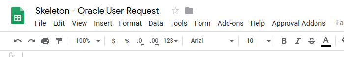
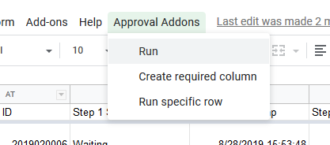
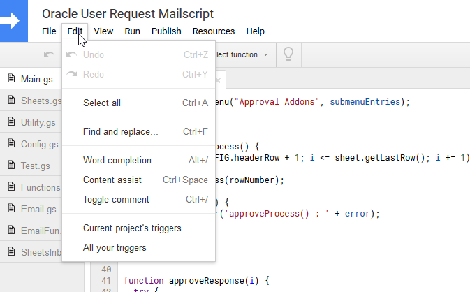
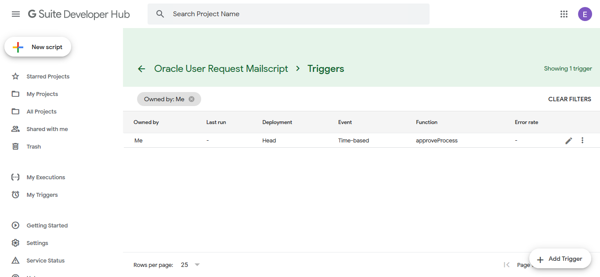

# Start the script
Here's some options you can run the script

### Option 1 Manually via UI
1. Open the `sheet`
 
2. In tool bar, select `Approval Addons`
3. Click on `Run` to start the script.
 

::: tip MISSING SOMETHING?
If you did not see `Approval Addons`, it might means you improperly install the script.
:::

### Option 2 Automatically via Triggers
Running the script manually is too hard work for you. We recommended you to set the triggers and let Google do it's job.
1. Go to the Script editing page, click Edit > Current project's triggers
     
2. Click Add Trigger
     
3. Edit Trigger parameters
    - In "Choose which function to run" Select `approveProcess`
    - In "Select event source", specify when or how you want to start the script.
        - Time-based (e.g. Hourly, Daily)
        - Event-based (e.g. After new Form sent)
    - and for other parameter, you can leave it as is.
    ::: tip
    We recommend you to read Google Documentations on what each options differs on
    :::
4. After you done configuring, press "Save"

## Permission Request
When you start the script, Google will request your permission to
- Send emails as you
- See, edit, create, delete your spreadsheets in Google Drive

If you decline to give us the permission, this script will be unable to send email to approver or run. Prompt will ask for your permission again if it fails to acquire your permission.

::: warning
After you authorized your account to the script, the script will run on your behalf.

If you like to use other account to send the emails and running the workflow, please authorize this step with that account.
:::
