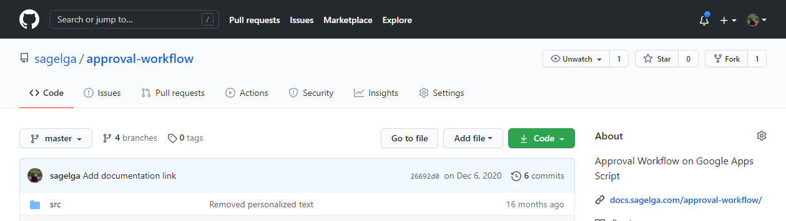

# Before you start
Before you can start using the script, here's something you need to install and manually setup.

## Install the script
*Tags: Github, Repository*

First thing you need to do is to install the script. The script will allows you to run the flow. 
To use the script, you must have acesss to items that is defined on [System Requirement](./requirement) and do the following step(s) to complete the installation.

1. Visit [https://github.com/sagelga/approval-workflow](https://github.com/sagelga/approval-workflow)
 
2. Select "Clone" (noticeable by the bright green button)
 
3. Select "Download ZIP"
 
4. After extrating the `.zip` file, there will be multiple `.js` file in `src/`.
 
5. Go to your Target sheet (optional)
6. In Tool Bar, select Tools > Script editor
 
7. You will be directed to Target sheet's script editor.
 
8. For each file, do as following
    1. Open the file using any Text Editor application (i.e. Visual Studio Code)
    2. Copy all of its content
    3. Paste it to the Target Google Apps Script script page.
    4. (Optional) Create a new script file by clicking a 
    5. Repeat the process until you copied all of the files.
9. Done.

## Start the script
Here's some options you can run the script

When you start the script, Google will ask your permission to
- Send emails as you
- See, edit, create, delete your spreadsheets in Google Drive

If you decline to give us the permission, this script will be unable to send email to approver or run. Prompt will ask for your permission again if it fails to acquire your permission.

::: warning
After you authorized your account to the script, the script will run on your behalf.

If you like to use other account to send the emails and running the workflow, please authorize this step with that account.
:::

### Option 1 Manually via UI
1. Open the `sheet`
 
2. In tool bar, select `Approval Addons`
3. Click on `Run` to start the script.
 

::: tip MISSING SOMETHING?
If you did not see `Approval Addons`, it might means you improperly install the script.
:::

### Option 2 Automatically via Triggers
Running the script manually is too hard work for you. We recommended you to set the triggers and let Google do it's job.
1. Go to the Script editing page, click Edit > Current project's triggers
     
2. Click Add Trigger
     
3. Edit Trigger parameters
    - In "Choose which function to run" Select `approveProcess`
    - In "Select event source", specify when or how you want to start the script.
        - Time-based (e.g. Hourly, Daily)
        - Event-based (e.g. After new Form sent)
    - and for other parameter, you can leave it as is.
4. After you done configuring, press "Save"

::: tip
We recommend you to read Google Documentations on what each options differs on
:::
