# Customer Membership
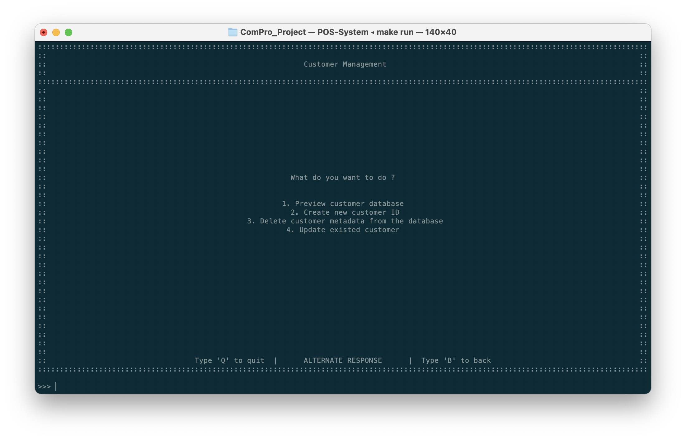

| คีย์ลัด  | ฟีเจอร์                                                             | การทำงาน |
| :---: | ----------------------------------------------------------------- | ------- |
|   1   | Preview customer database                   *ดูข้อมูลของลูกค้า*    |         |
|   2   | Create new customer ID                      *สร้างข้อมูลลูกค้าใหม่* |         |
|   3   | Delete customer metadata from the database  *ลบข้อมูลลูกค้า*      |         |
|   4   | Update existed customer                     *แก้ไขข้อมูลลูกค้า*    |         |

## ดูข้อมูลของลูกค้า
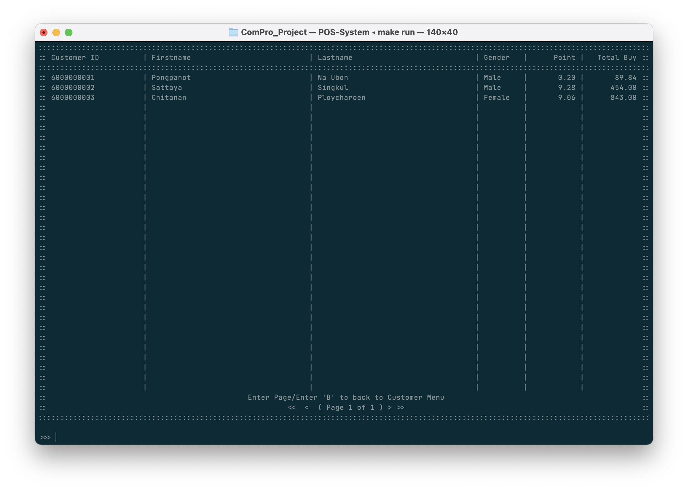

## สร้างข้อมูลลูกค้าใหม่
1. กรอก ID (เลขบัตรประชาชน) ของลูกค้า
   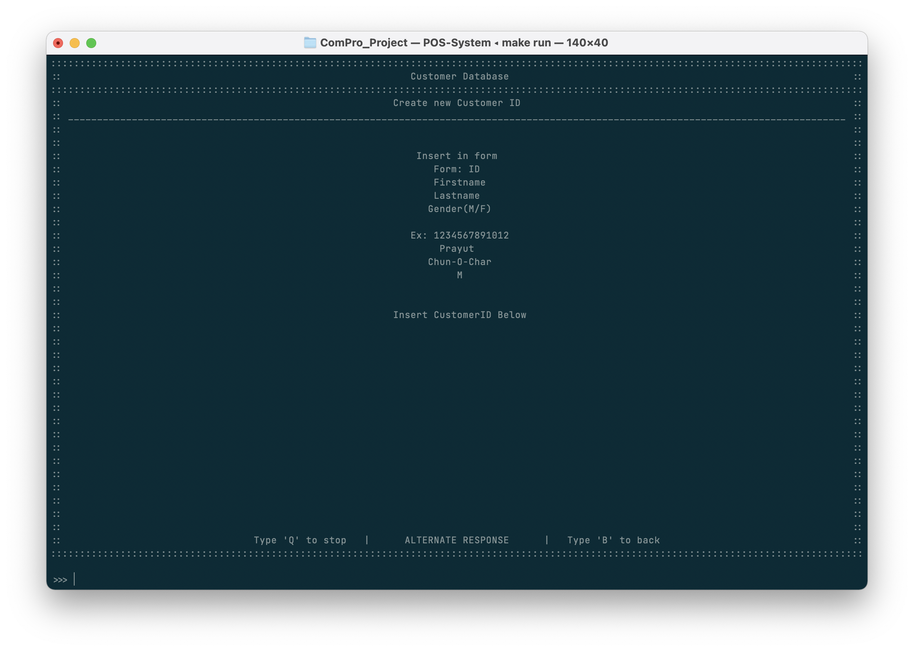
2. กรอกชื่อของลูกค้า
   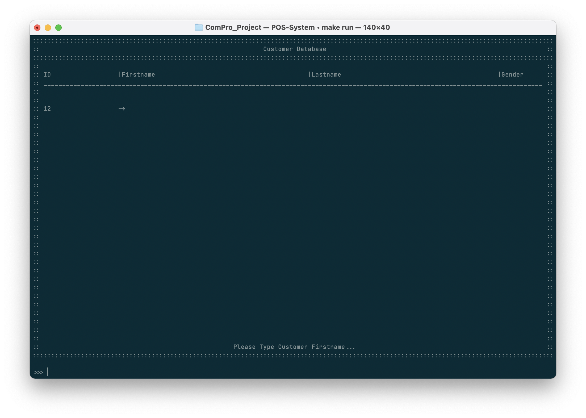
3. กรอกนามสกุลของลูกค้า
   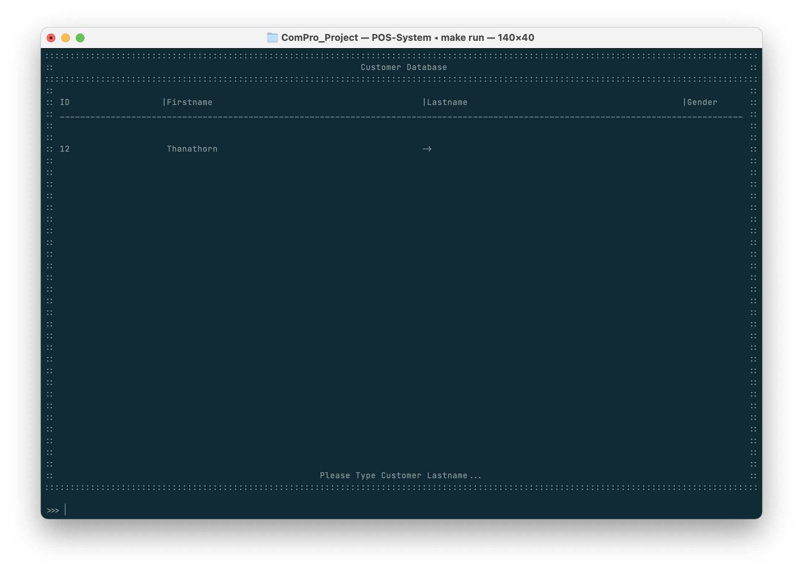
4. กรอกเพศของลูกค้า โดยกรอก 'M' เพื่อเพศชาย และ 'F' สำหรับเพศหญิง
   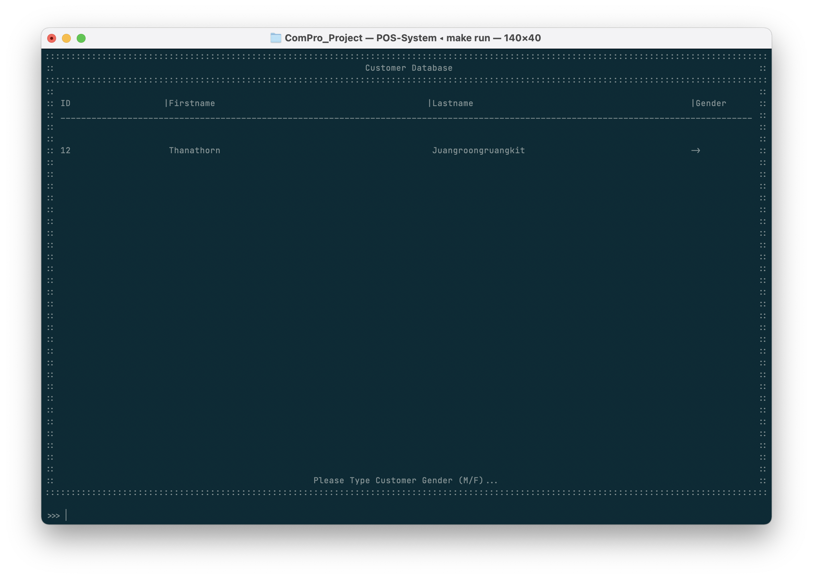
5. ยืนยันข้อมูลลูกค้า กด 'Y' และ 'ENTER' เพื่อยืนยันการเพิ่มข้อมูลลูกค้า
   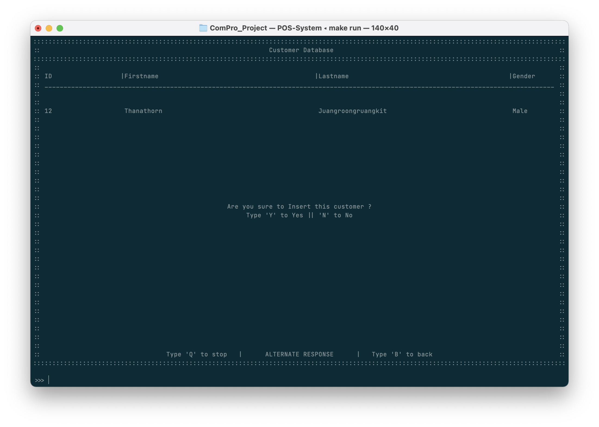
6. เพิ่มข้อมูลสำเร็จ
   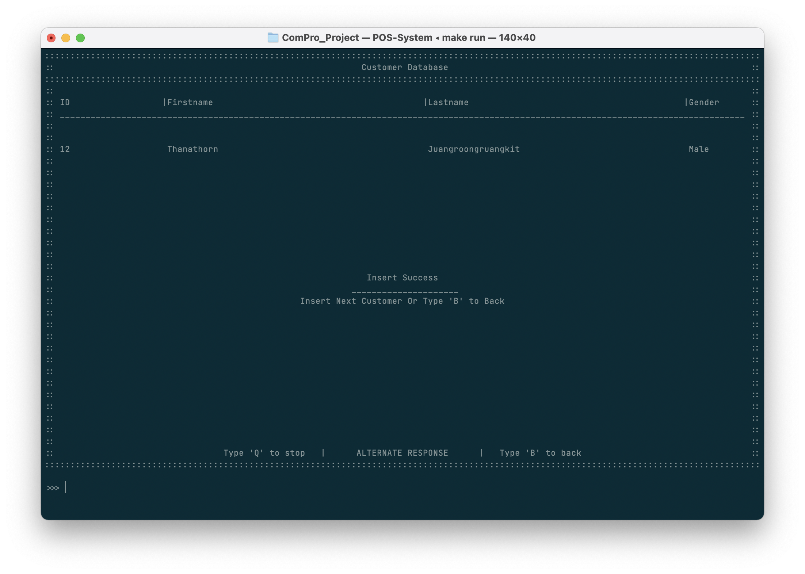
7. ผู้ใช้งานสามารถเพิ่มข้อมูลลูกค้าท่านใหม่ได้ในขั้นตอนนี้ โดยล้อตามขั้นตอนตั้งแต่แรก หรือกด 'B' เพื่อออกจากหน้าต่าง

## ลบข้อมูลลูกค้า
หากท่านไม่ต้องการให้ระบบเก็บข้อมูลของลูกค้าท่านใดแล้วก็สามารถทำการลบข้อมูลของลูกค้า โดยการทำตามขั้นตอนดังนี้

1. กรอก ID ของลูกค้า
   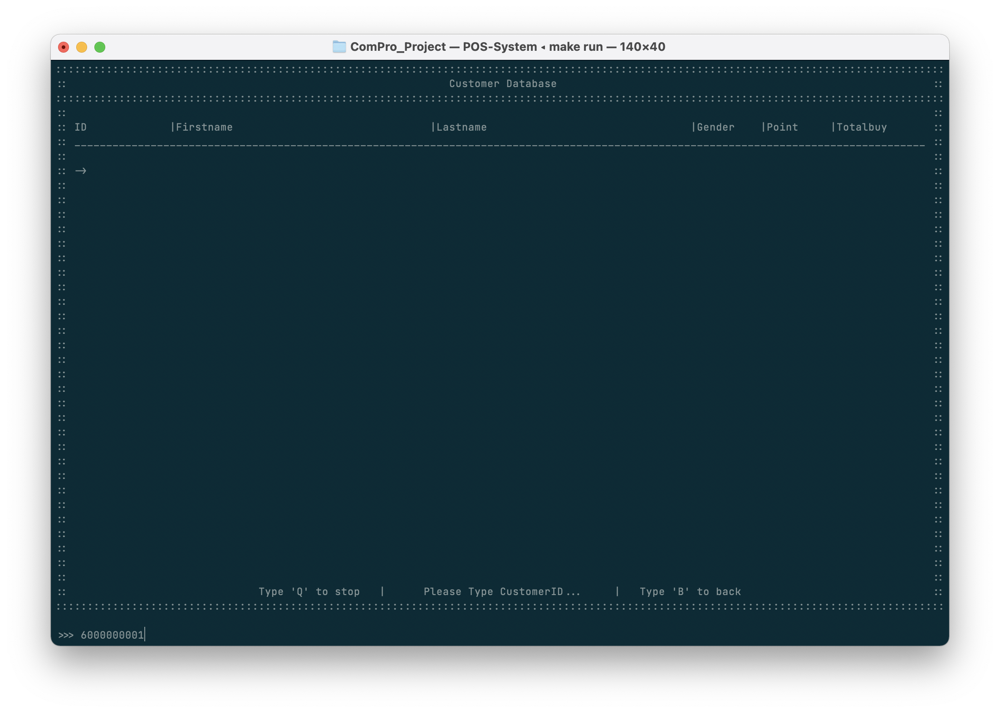
2. หากมี ID ของลูกค้าคนนั้นอยู่ ระบบจะทำการแสดงข้อมูลของลูกค้าบนตาราง โดยระบบจะให้ท่านเลือกว่าจะต้องการลบข้อมูลของลูกค้าท่านนั้นหรือไม่ โดยระบบจะทำการแสดงข้อมูล
   - ชื่อ (First Name)
   - นามสกุล (Last Name)
   - เพศ (Gender)
   - คะแนนสะสม (Point)
   - ยอดซื้อสะสม (Total Buy)
   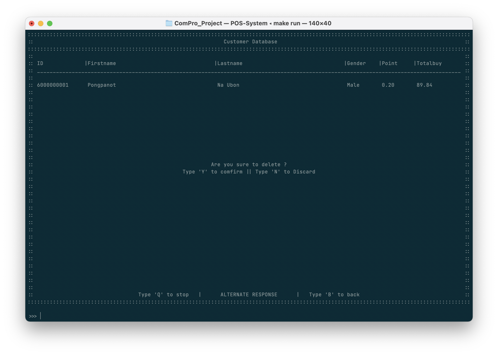
3. หากผู้ใช้งานต้องการลบข้อมูลลูกค้า ให้ผู้ใช้ทำการกด 'Y' และ 'ENTER' เพื่อยืนยัน
4. การลบข้อมูลลูกค้าเสร็จสิ้น
   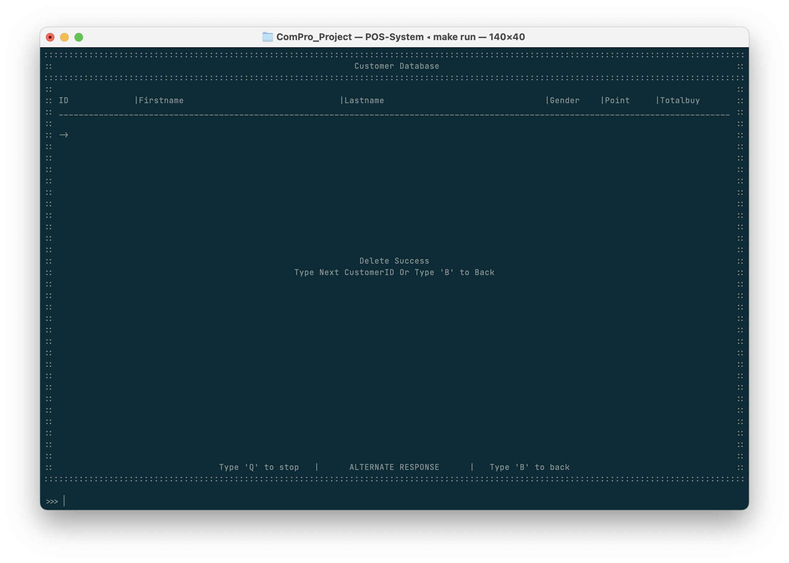
5. หากต้องการลบข้อมูลเพิ่มเติม ให้ทำตามขั้นตอนที่ 1 อีกครั้ง หรือกด 'B' และ 'ENTER' เพื่อกลับหน้าหลัก

## แก้ไขข้อมูลลูกค้า
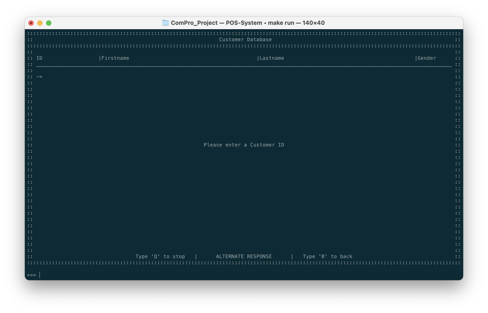
