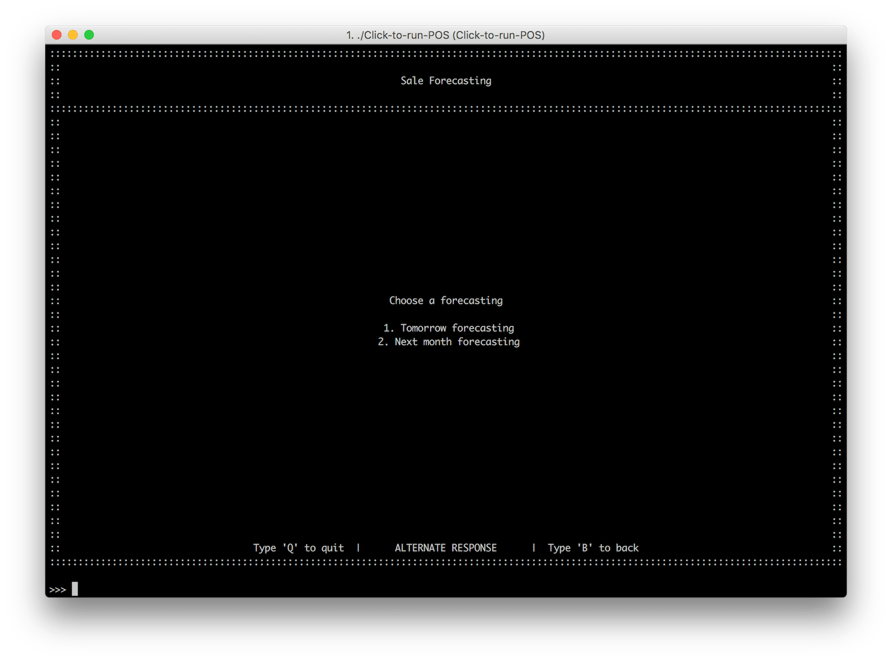
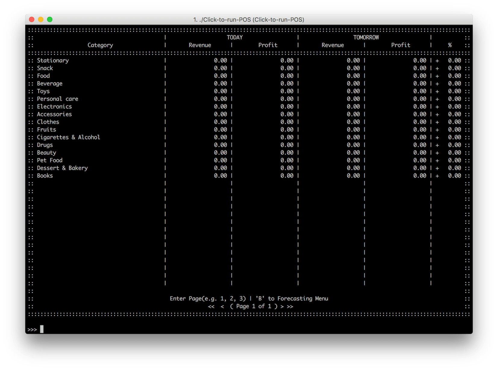

# Sale Forecasting
อีกหนึ่งฟีเจอร์โดดเด่นของระบบนั่นคือการคาดเดายอดขายในอนาคต ซึ่งระบบสามารถสร้างโมเดลและคาดคะเนได้ดังนี้

1. การคาดเดายอดขายพรุ่งนี้ (Daily Forecasting)
2. การคาดเดายอดขายเดือนหน้า (Monthly Forecasting)

## Daily Forecasting
::: tip
เพื่อทำการสร้างรายงานการแสดงการคาดการณ์ยอดขายวันพรุ่งนี้
ในหน้าแรก **กด 1** เพื่อเลือกดู​ Tomorrow Forecasting
:::

ภายในหน้าจอ จะมีการแสดงการคาดการณ์ยอดขายวันพรุ่งนี้ตามประเภทสินค้า

ซึ่งมีการเปรียบเทียบข้อมูลของวันนี้ และวันพรุ่งนี้ และเปอร์เซ็นต์การเปลี่ยนแปลงว่ามีการเปลี่ยนแปลงในด้านของรายได้เป็นอย่างไร โดยการคาดการณ์นี้สามารถมีการเปลี่ยนแปลงจากข้อมูลในอดีตที่มากขึ้นอีกด้วย

พร้อมทั้งในรายงานนั้นอาจจะมีหลายหน้า ผู้ใช้งานสามารถพิมพ์เลขหน้าที่ต้องการเข้าไปดู (ตัวอย่างเช่นหน้า 2 เป็นต้น) เพื่อให้ระบบได้ทำการเปลี่ยนหน้าและแสดงข้อมูลที่อยู่ในหน้านั้นๆ ซึ่งในหนึ่งหน้านั้นจะมีการจัดเรียงลำดับตามเลขรหัสของประเภทสินค้า ซึ่งผู้ใช้งานสามารถทำการ[ตรวจสอบรหัสประเภทสินค้า](../inventory/)

## Monthly Forecasting
::: tip
เพื่อทำการสร้างรายงานการแสดงการคาดการณ์ยอดขายเดือนหน้า
ในหน้าแรก **กด 2** เพื่อเลือกดู Next month forecasting
:::

โดยในหน้านี้ก็จะมีความเหมือนกับการคาดการณ์วันพรุ่งนี้ในด้านของข้อมูลที่ถูกแสดง แต่ในข้อมูลที่ได้นำมาใช้งานนั้นจะเป็นการคำนวณเพื่อหายอดซึ้อของเดือนถัดไป

## หลักการคำนวณ
สำหรับวิธีการคาดคะเนนั้น ทางเราใช้ Exponential Smoothing ในการคาดเดา

Exponential Smoothing เป็นรูปแบบหนึ่งของการพยากรณ์ท่ีให้ความสําคัญกับข้อมูลเก่าทุกค่า โดยให้ความสําคัญแก่ค่าท่ีใกล้ปัจจุบันมากท่ีสุด ลดหลั่นลงไปจนถึงค่าที่ 1 และถ่วงน้ําหนักข้อมูล โดยใช้สัมประสิทธิ์การปรับเรียบ (alpha)

$$
F_t = F_{t-1} + \alpha(A_{t-1} - F_{t-1} )
$$

โดยที่
- $$ F_t $$ คือค่าทำนาย
- $$F_{t-1}$$ คือค่าที่ทำนายในอดีต
- $$A_{t-1}$$ คือค่าจริงในอดีต
- $$\alpha$$ คือสัมประสิทธิ์การปรับเรียบ (Weight) โดยที่ $$0 <= \alpha <= 1$$

และ Sum of squared errors (SSE) คือ การหาค่าความคลาดเคลื่อนของข้อมูลที่ได้จากการทำนาย กับข้อมูลที่เกิดขึ้นจริง

$$
SSE = \sum_{i=1}^N(X_i - \hat{X}_i)^2
$$

- $$X_i$$ เซตของข้อมูลที่เกิดขึ้นจริง
- $$\hat{X}_i$$ คือเซตข้อมูลที่ได้จากการทำนาย
- $$N$$ คือจำนวนข้อมูล

โปรแกรม Point of Sales (POS) Systems สามารถพยากรณ์ยอดขายให้ผู้ใช้ระบบ สามารถดูการพยากรณ์ยอดขายของวันถัดไป และเดือนถัดไปได้ โดยใช้หลักการของ Exponential Smoothing ร่วมกับค่า Sum of squared errors (SSE)

จากหลักการพยากรณ์ของ Exponential Smoothing จะต้องมีการเลือกค่าสัมประสิทธิ์การปรับเรียบ (alpha) ที่เหมาะสม ซึ่งโปรแกรม POS จะทำการเลือกค่า ที่เหมาะสมจากการคำนวนค่า Sum of squared errors โดยจะเลือกค่า alpha ที่มีค่า Sum of squared errors ที่น้อยที่สุด
