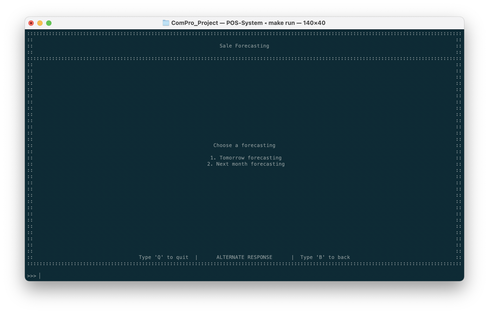
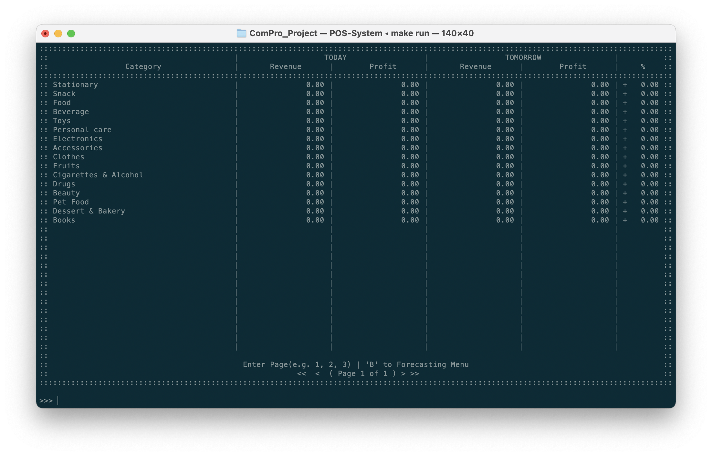
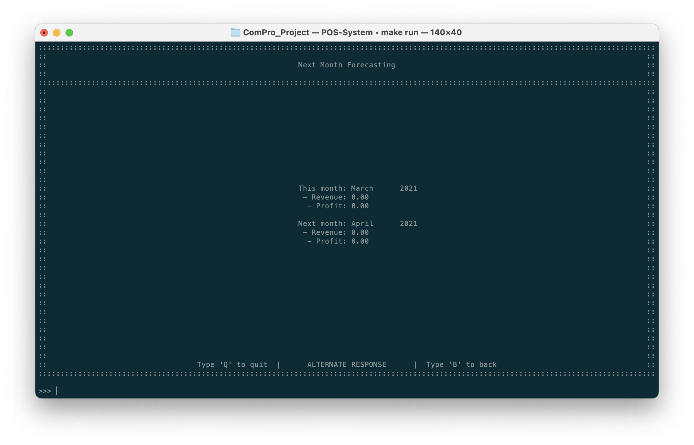

# Sales Forecasting
อีกหนึ่งฟีเจอร์โดดเด่นของระบบนั่นคือการคาดเดายอดขายในอนาคต ซึ่งระบบสามารถสร้างโมเดลและคาดคะเนได้ดังนี้

|  พิมพ์  | ฟีเจอร์               | คำอธิบาย                 |
| :---: | ------------------- | ---------------------- |
|   1   | Daily Forecasting   | การคาดเดายอดขายพรุ่งนี้    |
|   2   | Monthly Forecasting | การคาดเดายอดขายเดือนหน้า |

## การคาดเดายอดขายพรุ่งนี้
::: tip
เพื่อทำการสร้างรายงานการแสดงการคาดการณ์ยอดขายวันพรุ่งนี้
ในหน้าแรก **กด 1** เพื่อเลือกดู​ Tomorrow Forecasting
:::

ภายในหน้าจอ จะมีการแสดงการคาดการณ์ยอดขายวันพรุ่งนี้ตามประเภทสินค้า

ซึ่งมีการเปรียบเทียบข้อมูลของวันนี้ และวันพรุ่งนี้ และเปอร์เซ็นต์การเปลี่ยนแปลงว่ามีการเปลี่ยนแปลงในด้านของรายได้เป็นอย่างไร โดยการคาดการณ์นี้สามารถมีการเปลี่ยนแปลงจากข้อมูลในอดีตที่มากขึ้นอีกด้วย

พร้อมทั้งในรายงานนั้นอาจจะมีหลายหน้า ผู้ใช้งานสามารถพิมพ์เลขหน้าที่ต้องการเข้าไปดู (ตัวอย่างเช่นหน้า 2 เป็นต้น) เพื่อให้ระบบได้ทำการเปลี่ยนหน้าและแสดงข้อมูลที่อยู่ในหน้านั้นๆ ซึ่งในหนึ่งหน้านั้นจะมีการจัดเรียงลำดับตามเลขรหัสของประเภทสินค้า ซึ่งผู้ใช้งานสามารถทำการ[ตรวจสอบรหัสประเภทสินค้า](../inventory/)

## การคาดเดายอดขายเดือนหน้า
::: tip
เพื่อทำการสร้างรายงานการแสดงการคาดการณ์ยอดขายเดือนหน้า
ในหน้าแรก **กด 2** เพื่อเลือกดู Next month forecasting
:::

โดยในหน้านี้ก็จะมีความเหมือนกับการคาดการณ์วันพรุ่งนี้ในด้านของข้อมูลที่ถูกแสดง แต่ในข้อมูลที่ได้นำมาใช้งานนั้นจะเป็นการคำนวณเพื่อหายอดซึ้อของเดือนถัดไป
