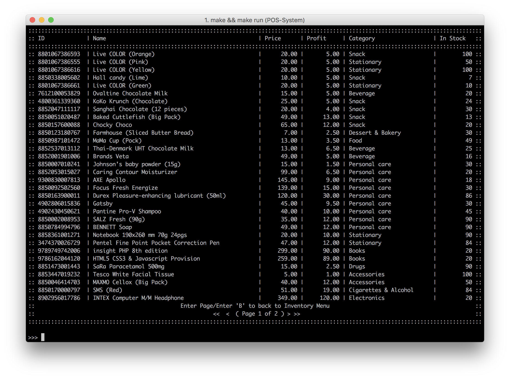
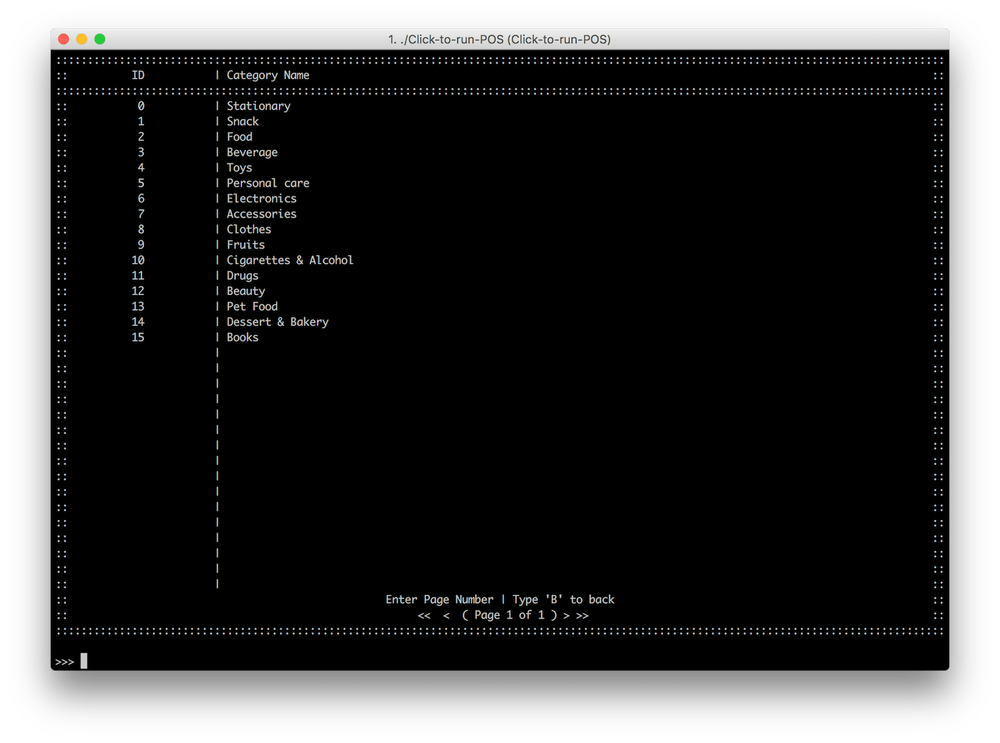

# Inventory Management
ระบบจัดการสินค้าคงคลังนั้นเป็นระบบที่จะทำให้ผู้ใช้งานที่มีสิทธิเป็นผู้ดูแลระบบหรือเจ้าหน้าที่ดูแลในการจัดการสินค้าคงคลังและเปิดให้ระบบ POS นั้นทำการขายสินค้าดังกล่าวได้ โดยภายในระบบการจัดการนี้มีหน้าต่างและฟีเจอร์ดังนี้

## Dashboard
หน้า Dashboard นั้นออกแบบมาเพื่อการนำผู้ใช้งานไปยังหน้ารองที่มีหน้าที่และการจัดการที่แตกต่างกัน โดยภายในหน้า Dashboard นั้นมีตัวเลือกดังนี้

| พิมพ์ | ความหมาย             | หน้าที่ในการทำงาน                              |
| --- | -------------------- | ------------------------------------------ |
| 1   | เช็คสินค้าคงคลัง         | เพื่อเข้าตรวจสอบข้อมูลภายในฐานข้อมูล              |
| 2   | เพื่มรายการ            | ด้วยการกรอกข้อมูลของสินค้า และนำข้อมูลเข้าสู่ฐานข้อมูล  |
| 3   | เปลี่ยนข้อมูลในฐานข้อมูล   | แก้ไขข้อมูลในรายการใดรายการหนึ่ง                |
| 4   | ลบสินค้าในฐานข้อมูล      | ลบข้อมูลภายในฐานข้อมูลด้วยการกรอกรหัสสินค้า        |
| 5   | เช็คประเภทสินค้า        | ตรวจสอบข้อมูลจากฐานข้อมูลตามประเภทของสินค้า      |
| 6   | เพื่มประเภทสืนค้า        | เพิ่มประเภทสินค้าเพื่อให้นำไประบุสินค้า               |
| 7   | เปลี่ยนชื่อของประเภทสืนค้า | เปลี่ยนชื่อประเภทสินค้า (สินค้าเดิมจะไม่ได้รับผลกระทบ) |

## เช็คสินค้าคงคลัง
::: tip
ผู้ใช้งานที่ต้องการเข้าไปยังหน้านี้
ให้ทำการกด 1 ในหน้า Dashboard (Check the database)
:::

ในหน้าต่างนี้มีหน้าที่ในการดูภาพรวมและข้อมูลที่อยู่ในฐานข้อมูลสินค้าคงคงคลัง

ภายในฐานข้อมูลสินค้าคงคลังนั้นจะเป็นฐานข้อมูลที่เก็บข้อมูลทุกอย่างของสินค้านี้ไว้อย่างเช่น

- **ID** รหัสสินค้า
- **Name** ชื่อสินค้า
- **Price** ราคา (ก่อนภาษี)
- **Profit** กำไรที่จะได้จากการขายสินค้านี้
- **Category** ประเภทของสินค้า
- **In Stock** จำนวนสินค้าคงคลัง

โดยผู้ใช้งานสามารถกดเลือกเลขหน้าที่ต้องการดูได้โดยการพิมพ์เลขหน้าที่ต้องการเข้าไปดูได้ โดยจำนวนหน้าทั้งหมดและจำนวนหน้าที่กำลังดูอยู่นั้นจะมีการระบุไว้ในหน้าต่างนี้แล้ว

## เช็คประเภทสินค้า
::: tip
ให้ทำการกด 5 ในหน้า Dashboard (Check the category database)
:::

