# Inventory Management
ระบบจัดการสินค้าคงคลังนั้นเป็นระบบที่จะทำให้ผู้ใช้งานที่มีสิทธิเป็นผู้ดูแลระบบหรือเจ้าหน้าที่ดูแลในการจัดการสินค้าคงคลังและเปิดให้ระบบ POS นั้นทำการขายสินค้าดังกล่าวได้

::: tip
วิธีเข้าหน้าต่าง Inventory
จากหน้าแรก ให้ทำการกด '2' (Inventory management) และกด 'ENTER' เพื่อเข้าสู่หน้าต่าง Inventory Management
:::
## หน้าแรก
โดยภายในหน้าแรกนั้นมีตัวเลือกดังนี้

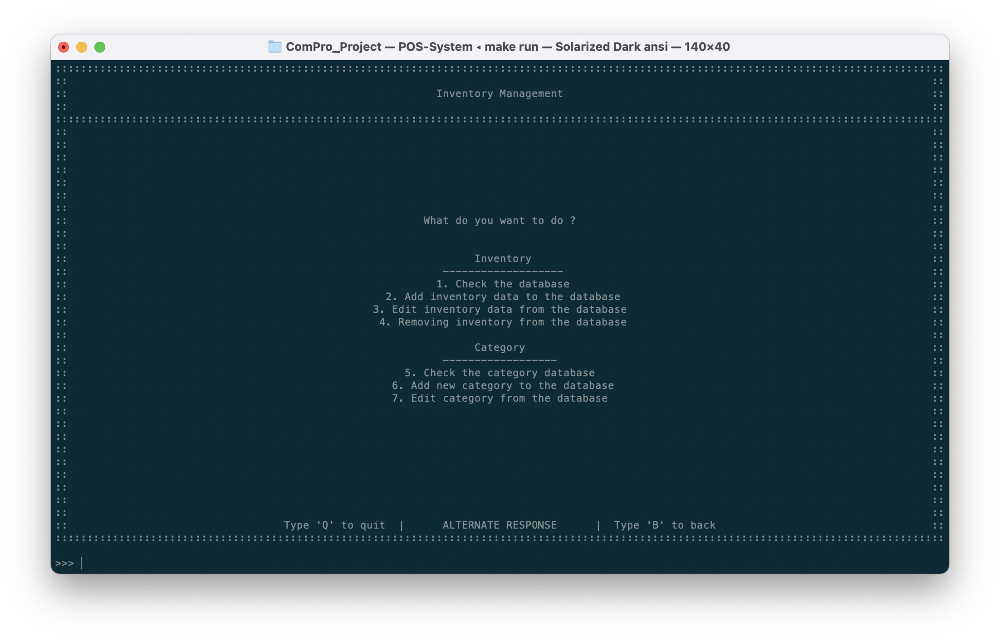

|  พิมพ์  | ฟีเจอร์                                                           | คำอธิบาย                                |
| :---: | --------------------------------------------------------------- | ------------------------------------- |
|   1   | Check the database                    *เช็คสินค้าคงคลัง*        | แสดงข้อมูลสินค้าทั้งหมดในระบบ               |
|   2   | Add inventory data to the database    *เพิ่มรายการสินค้า*       | เพิ่มสินค้าเข้าสู่ฐานข้อมูล                    |
|   3   | Edit inventory from the database      *แก้ไขข้อมูลในฐานข้อมูล*   | แก้ไขข้อมูลในรายการใดรายการหนึ่ง           |
|   4   | Removing inventory from the database  *ลบสินค้าในฐานข้อมูล*     | ลบข้อมูลภายในฐานข้อมูลด้วยการกรอกรหัสสินค้า   |
|   5   | Check the category database           *เช็คประเภทสินค้า*       | ตรวจสอบข้อมูลจากฐานข้อมูลตามประเภทของสินค้า |
|   6   | Add new category to the database      *เพิ่มประเภทสินค้า*       | เพิ่มประเภทสินค้าเพื่อให้นำไประบุสินค้า          |
|   7   | Edit category from the database       *แก้ไขชื่อของประเภทสินค้า* | แก้ไขชื่อประเภทสินค้า                      |

## เช็คสินค้าคงคลัง
หน้าต่างนี้จะทำการแสดงข้อมูลของสินค้าทั้งหมดในลักษณะตาราง โดยหน้าที่ของฟีเจอร์นี้คือการดูภาพรวมของสินค้าที่ยังมีอยู่ในระบบ

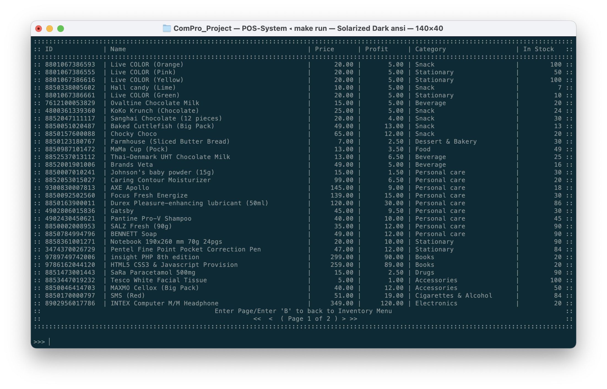

ภายในฐานข้อมูลสินค้าคงคลังนั้นเก็บข้อมูลของสินค้านี้ไว้ดังนี้

| คอลลัมน์   | ความหมาย               |
| -------- | ---------------------- |
| ID       | รหัสสินค้า (UPC/ISBN)     |
| Name     | ชื่อสินค้า                 |
| Price    | ราคา (ก่อนภาษี)          |
| Profit   | กำไรที่จะได้จากการขายสินค้านี้ |
| Category | ประเภทของสินค้า          |
| In Stock | จำนวนสินค้าคงคลัง          |

โดยผู้ใช้งานสามารถกดเลือกเลขหน้าที่ต้องการดูได้โดยการพิมพ์เลขหน้าที่ต้องการเข้าไปดูได้ โดยจำนวนหน้าทั้งหมดและจำนวนหน้าที่กำลังดูอยู่นั้นจะมีการระบุไว้ในหน้าต่างนี้แล้ว

## เพิ่มรายการสินค้า
ในหน้าต่างนี้จะทำให้ผู้ใช้งานเพิ่มข้อมูลเข้าไปในระบบได้ ผ่านหน้าต่าง Inventory Management โดยมีขั้นตอนในการเพิ่มข้อมูลดังนี้

1. จากหน้าดังกล่าว ให้ทำการกรอกเลข ID ของสินค้า ด้วยการกรอกเลขหรือสแกนบาร์โค้ดของสินค้า และกด 'ENTER'
   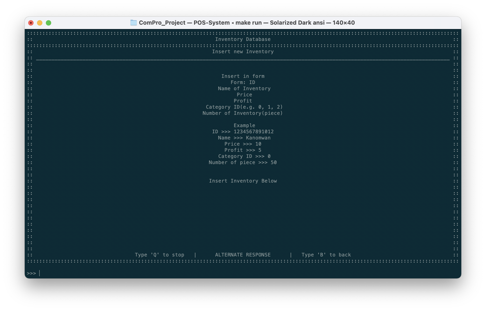
2. กรอกชื่อสินค้า (Inventory Name) และกด 'ENTER'
   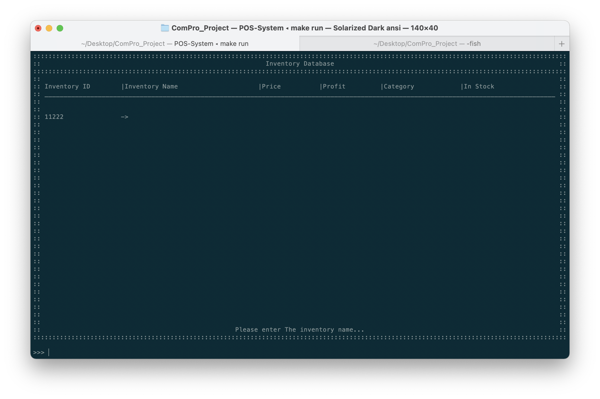
3. กรอกราคาสินค้า และกด 'ENTER'
   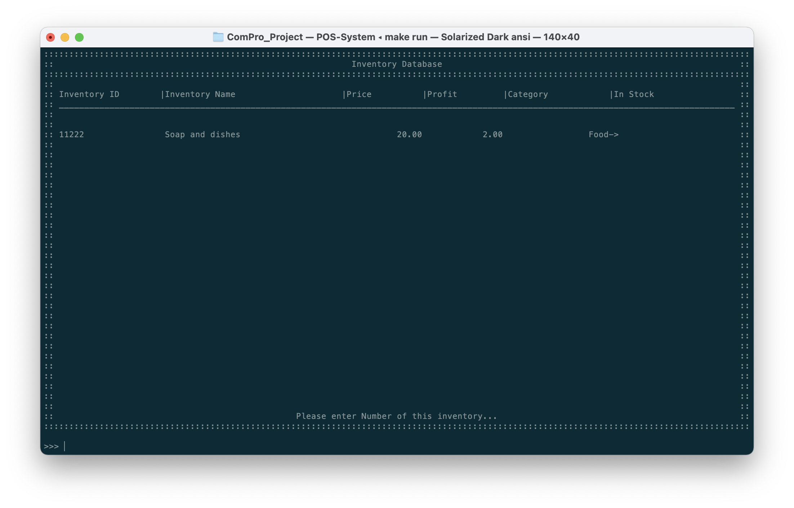
4. กรอกกำไรที่ต้องการจากสินค้า และกด 'ENTER'
5. กรอกรหัสประเภทสินค้า และกด 'ENTER'
   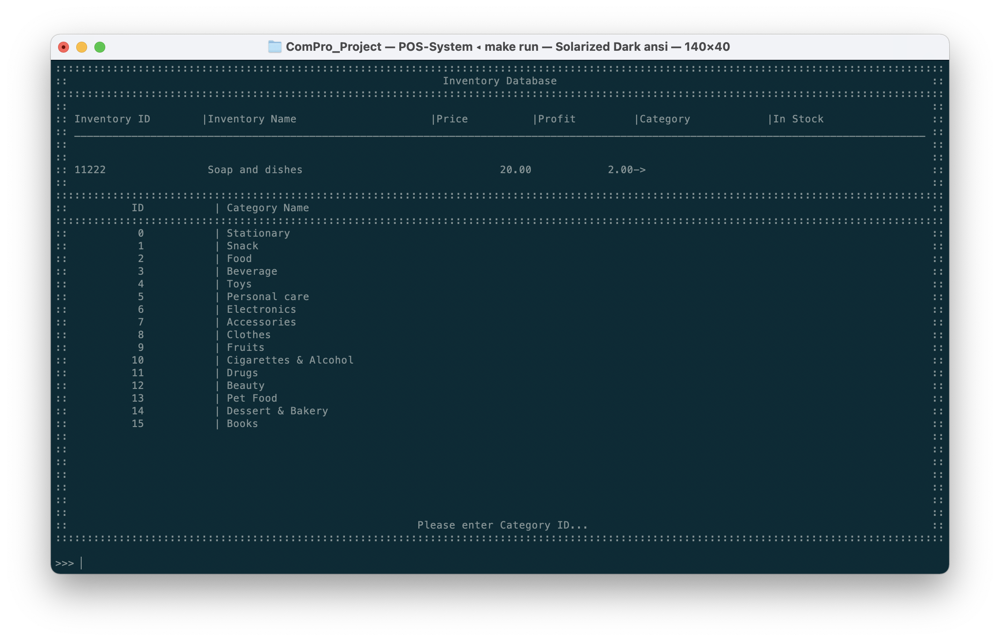
7. กรอกจำนวนสินค้าที่จะเพื่มในระบบ และกด 'ENTER'
   
8. ยืนยันการเพิ่มสินค้าด้วยการกด 'Y' และ 'ENTER'
   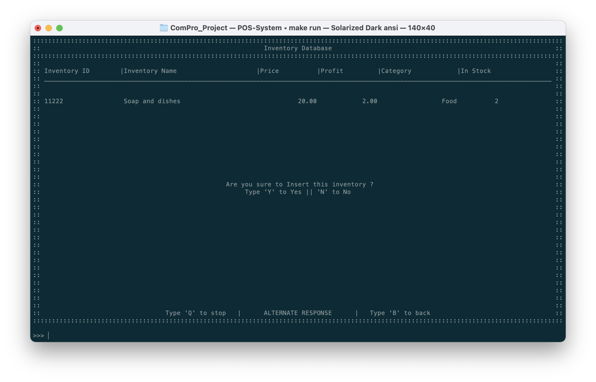
9. หน้าต่างจะมีข้อความยืนยันว่าข้อมูลถูกเพิ่มในระบบเรียบร้อยแล้ว
   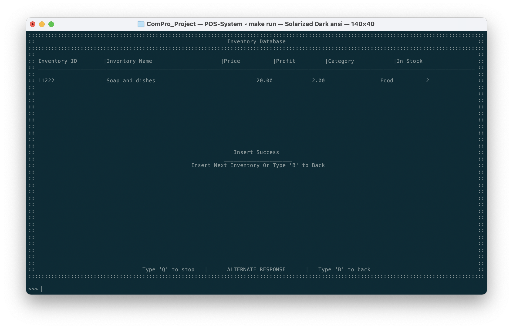
10. หากผู้ใช้งานต้องการเพิ่มข้อมูลอีกก็สามารถเริ่มตามขั้นตอนที่ 1 หรือกด 'B' เพื่อออกจากหน้าต่างนี้

เมื่อข้อมูลเข้าไปสู่ระบบแล้ว ผู้ใช้งานอื่นก็จะสามารถใช้งานข้อมูลนั้นได้ทันที

## แก้ไขข้อมูลในฐานข้อมูล

1. พิมพ์/สแกนเลข ID ของสินค้าที่ต้องการจะแก้ไข
   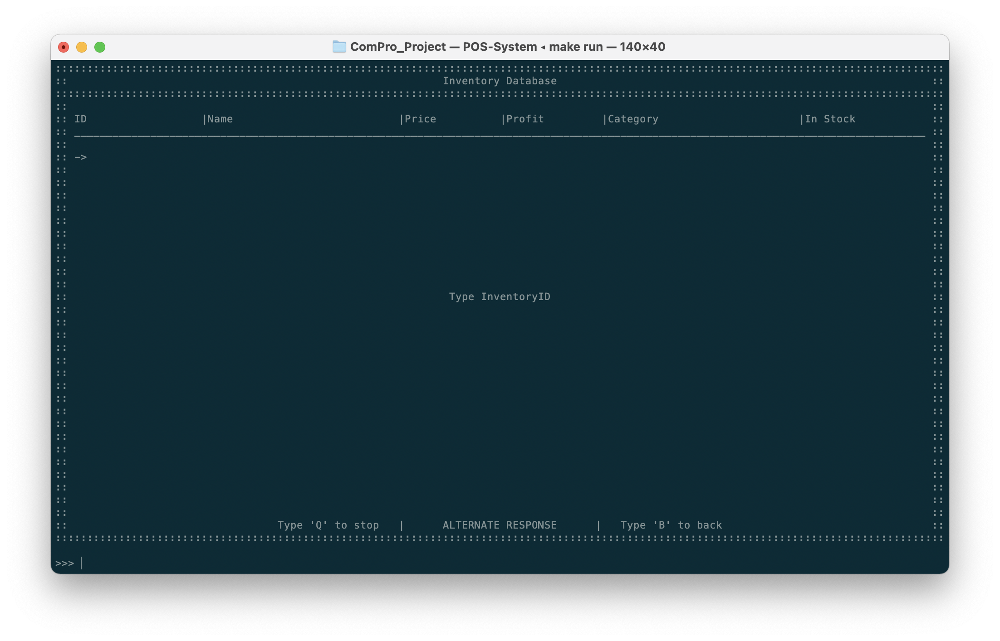
2. หากระบบพบเจอสินค้าที่ตรงกับ ID ตารางด้านบนจะแสดงข้อมูลเดิมของสินค้านั้น และถามหาข้อมูลใหม่ด้านล่าง
   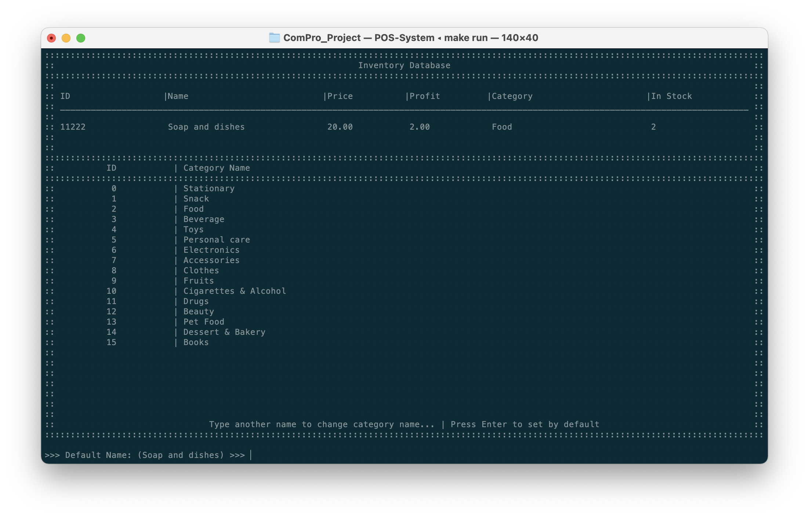
   1. โดยเรื่มจากชื่อสินค้า - ราคา - กำไร - รหัสประเภทสินค้า - สินค้าคงคลัง
   2. หากผู้ใช้งานไม่ต้องการแก้ไขข้อมูลใด ให้ทำการกด 'ENTER' เพื่อข้ามการแก้ไขในช่องข้อมูลนั้น
   3. หากผู้ใช้งานต้องการแก้ไขข้อมูล ให้ทำการพิมพ์ข้อมูลใหม่ในช่องข้อความด้านล่าง และกด 'ENTER' เพื่อยืนยัน ในตัวอย่างด้านล่างจะเป็นการแก้ไขชื่อสินค้า
   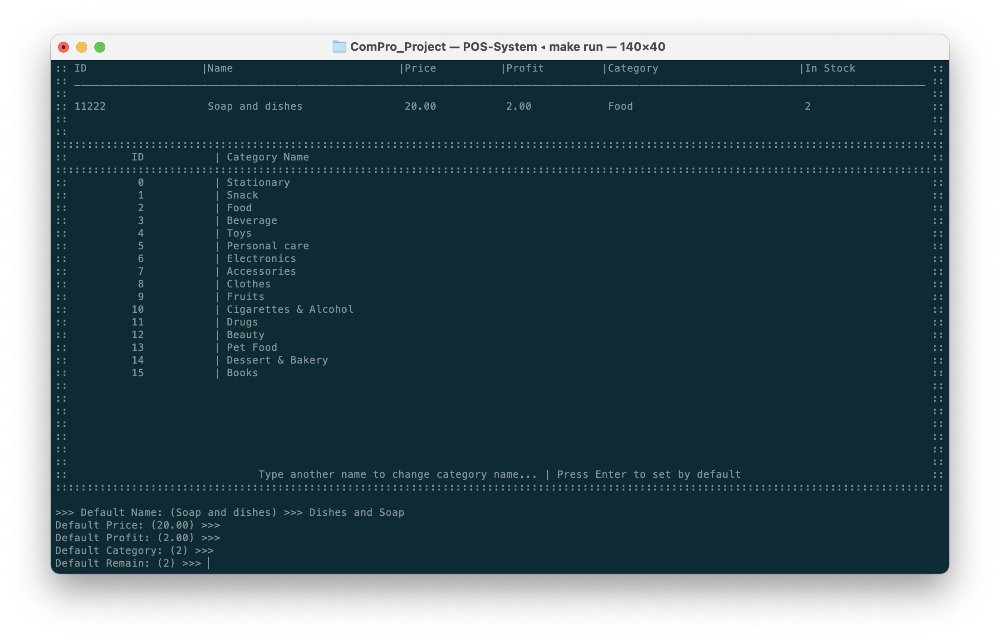
3. เสร็จเรียบร้อย ข้อมูลจะถูกแก้ไขภายในระบบโดยอัตโนมัติ
   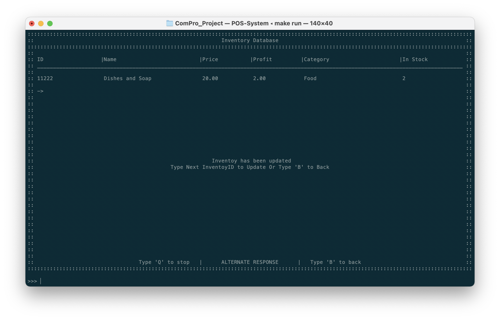
4. หากต้องการแก้ไขข้อมุลเพิ่มเติมก็สามารถเริ่มตามขั้นตอนที่ 1 หรือกด 'B' เพื่อออกจากหน้าต่างนี้

## ลบสินค้าในฐานข้อมูล
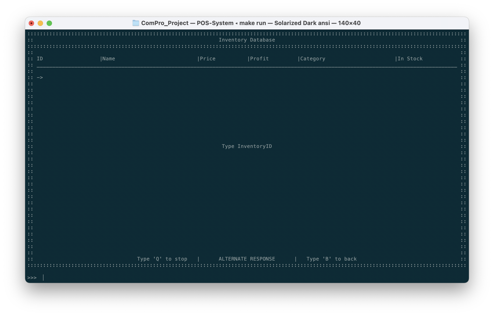

## เช็คประเภทสินค้า
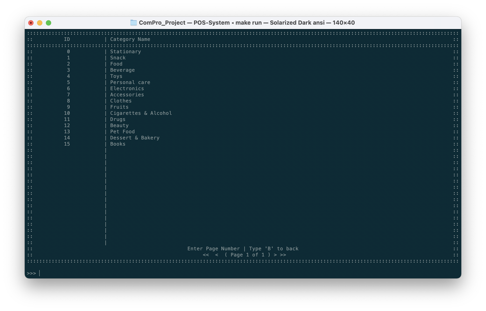

## เพิ่มประเภทสินค้า
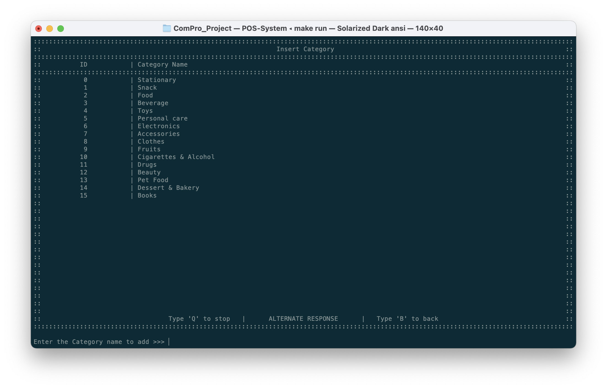

## แก้ไขชื่อของประเภทสินค้า
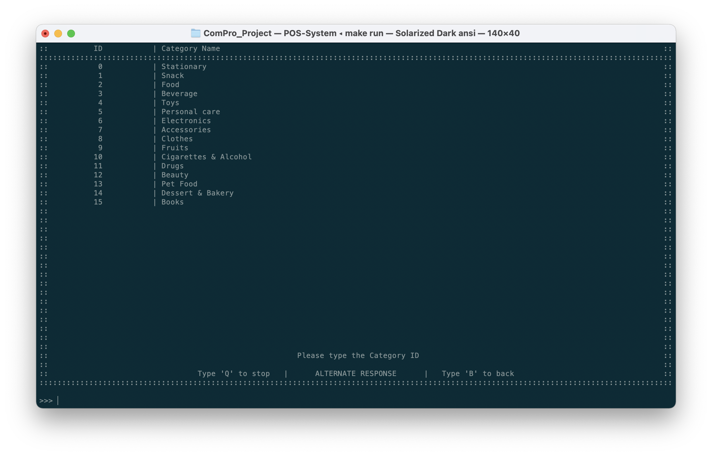
