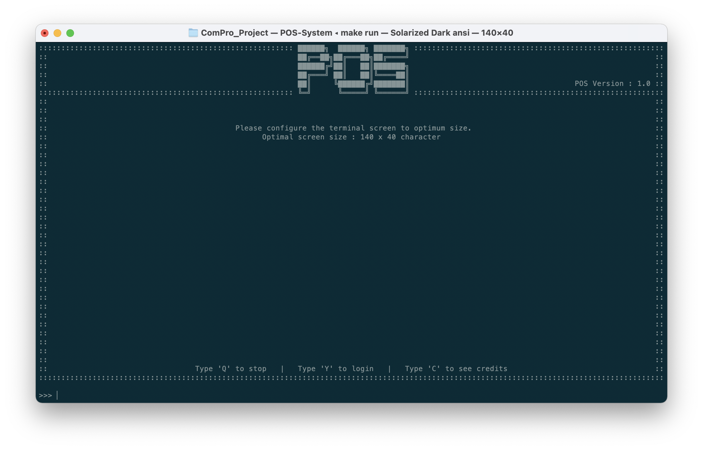
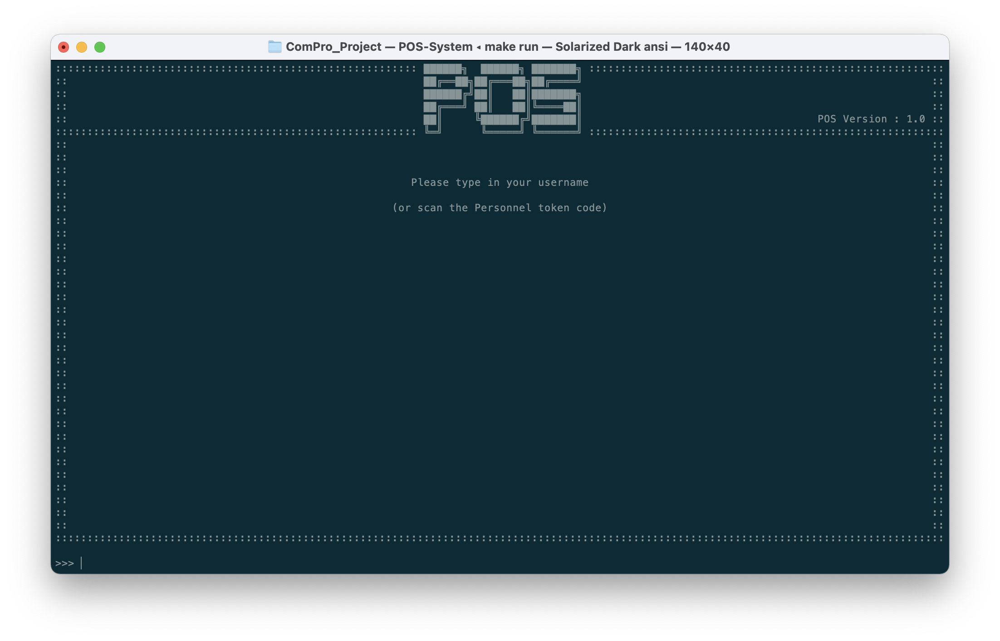
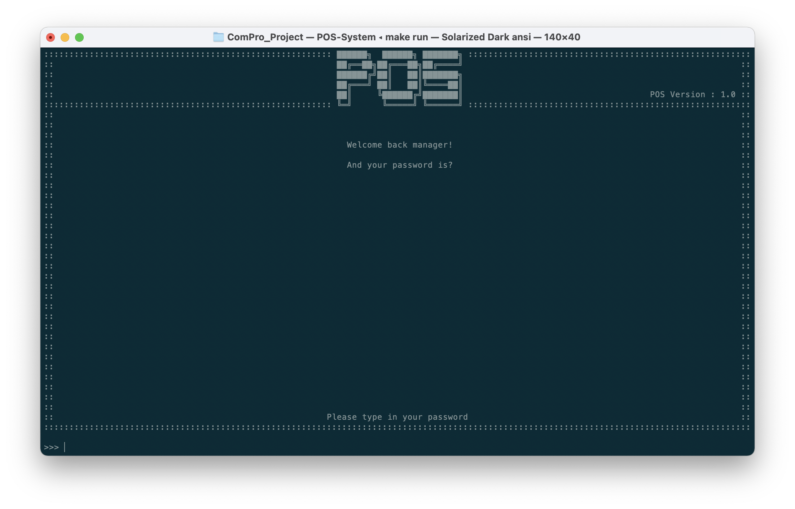
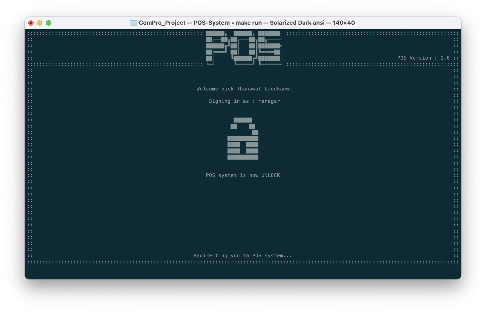

# Login
ก่อนที่จะใช้งานระบบ POS ลูกค้าจำเป็นที่จะต้อง login เพื่อจะเข้าระบบเสียก่อน โดยการเข้าระบบจากหน้าแรก (หน้าปรับขนาดหน้าจอ)​

## วิธีการเข้าสู่ระบบ
1. เมื่อเข้าสู่โปรแกรม กด 'Y' แล้ว 'ENTER' เพื่อเข้าสู่ระบบ
   
2. พิมพ์/สแกนบาร์โค้ด ในส่วนของ ชื่อผู้ใช้งาน (username) และกด 'ENTER'
   
3. พิมพ์รหัสผ่านของผู้ใช้งาน (user) และกด 'ENTER'
   
4. หากว่ารหัสผ่านของผู้ใช้ถูกต้อง ระบบจะทำการเข้าสู่ระบบและเข้าไปยังหน้าแรกของระบบ
   
5. แต่หากว่าชื่อผู้ใช้งานไม่มีอยู่ในระบบ หรือรหัสผ่านไม่ถูกต้อง หน้าจอจะแสดงการแจ้งเตือนว่าไม่มีชื่อผู้ใช้งานหรือรหัสผ่านในระบบ

## ชื่อผู้ใช้งานและรหัสผ่านสำหรับ Demo
เพื่อการนำเสนอ (demo) เราจึงสร้างชื่อผู้ใช้งานและรหัสผ่านให้ดังนี้
| หน้าที่           | ชื่อผู้ใช้งาน    | รหัสผ่าน |
| -------------- | ----------- | ------ |
| Manager Role   | `manager`   | `demo` |
| Marketing Role | `marketing` | `demo` |
| Sale Role      | `sale`      | `demo` |

::: tip
แต่ละบัญชีผู้ใช้งานมีระดับการเข้าถึงที่ต่างกัน โดยท่านสามารถเข้าไปดูความแตกต่างได้ที่ [สิทธิของผู้ใช้งาน](../access-management/)
:::

## การแก้ไขรหัสผ่าน
โดยผู้ใช้งานที่มีสิทธิ์เป็นผู้ดูแลระบบสามารถปิดการใช้งานในบัญชีที่เป็นประเภท demo ได้ผ่านในระบบ โดยมีขั้นตอนการแก้ไขและเพื่มผู้ใช้งานตามเอกสารประกอบ
