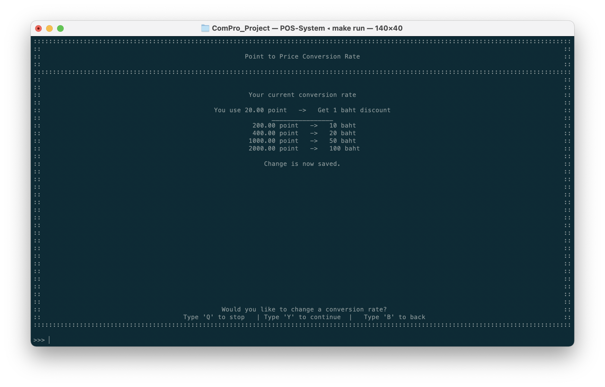

# Loyalty Program
เป็นฟีเจอร์ที่จะสนับสนุนให้ลูกค้าสมัครสมาชิกจากการใช้ยอดซื้อมาใช้เป็นส่วนลดในการซื้อครั้งต่อไป

โดยในฟีเจอร์นี้จะส่งผลต่อการสะสมคะแนนที่เกิดขึ้นและการใช้คะแนนเป็นส่วนลดหลังการแก้ไขเรทการแลกเท่านั้น
## เปลี่ยนเรทการแปลงยอดซื้อเป็นคะแนน
หน้าต่างนี้เป็นการเปลี่ยนเรทที่ว่า "หากลูกค้าซื้อสินค้า xx บาท จะได้คะแนนจากยอดซื้อเท่าไหร่"

โดยมีขั้นตอนในการเปลี่ยนเรทดังนี้

1. เข้าหน้าต่างการเปลี่ยนแปลงยอดซื้อเป็นคะแนน ผู้ใช้จะเห็นเรทปัจจุบันที่ใช้อยู่ นั่นก็คือคะแนนที่จะได้จากการแปลงยอดซื้อ  หากต้องการแก้ไข ให้ทำการกด 'Y' และ 'ENTER' เพื่อยืยยัน

2. กรอกเรทที่ต้องการ โดยกรอกจากว่า 1 บาทจะได้กี่คะแนน

3. ดูเรทใหม่ที่จะถูกใช้ ในตัวอย่างด้านล่างเป็นการเปลี่ยนจาก 1 คะแนนได้รับ 0.02 คะแนนเปลี่ยนมาเป็น 2 คะแนน

4. หากพึงพอใจ ให้ทำการกด 'Y' และ 'ENTER' เพื่อยืนยันการแก้ไขเรท

## เปลี่ยนเรทการแลกคะแนนเป็นส่วนลด

