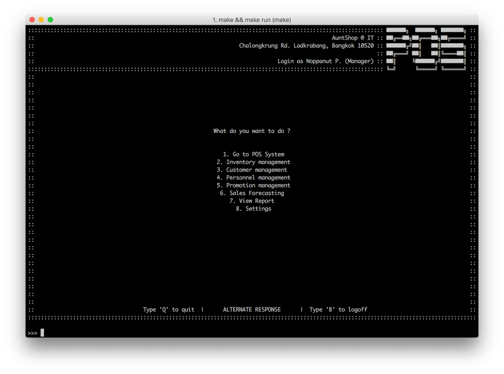

# Main menu
สำหรับการใช้งานระบบ POS ก็จะมีระบบย่อยๆ ต่างๆ เพื่อช่วยในการขาย เช่น

| ชื่อฟีเจอร์   | หน้าที่การทำงาน           |
| --------- | --------------------- |
| Inventory | เช็คสินค้าคงคลัง          |
| Sales     | เช็คถึงยอดขาย           |
| Forecast  | เช็คถึงยอดขายในอนาคต    |
| Personnel | เช็คผู้ใช้งานอื่น           |
| Category  | เช็คประเภทของสินค้า      |
| Promotion | เปลี่ยนโปรโมชั่นสำหรับลูกค้า  |
| Settings  | แก้ไขข้อมูลพื้นฐานของร้านค้า |

โดยทุกระบบที่ได้กล่าวมานั้น ผู้ใช้งานที่เป็น เจ้าของร้าน (ผู้ใช้งานระดับ admin) สามารถเข้าไปปรับแก้ได้ และ สามารถเปลี่ยน/เพื่ม/ลด ได้ทั้งหมด
