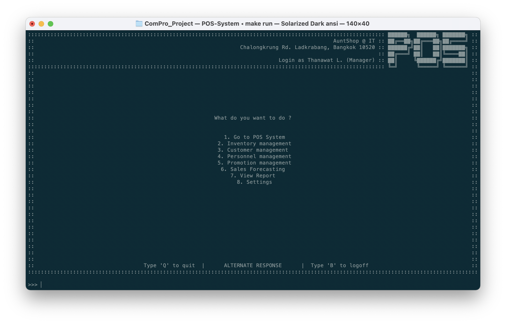

# Main menu
สำหรับการใช้งานระบบ POS ก็จะมีระบบย่อยๆ ต่างๆ เพื่อช่วยในการขาย

::: tip NOTE
หน้าต่างนี้จะแสดงตัวเลือกตามระดับการเข้าถึงระบบของแต่ละผู้ใช้งาน

โดยหน้าด้านล่างจะเป็นตัวเลือกทั้งหมดที่ผู้ใช้งานระดับ Manager จะเห็น
:::

|  พิมพ์  | ฟีเจอร์                | คำอธิบาย                                                |
| :---: | -------------------- | ----------------------------------------------------- |
|   1   | Go to POS System     | เข้าไปยังหน้า [POS](../sales/)                           |
|   2   | Inventory management | เข้าไปยังหน้า [Inventory Management](../inventory/)      |
|   3   | Customer management  | เข้าไปยังหน้า [Loyalty Program](../customer/)            |
|   4   | Personnel management | เข้าไปยังหน้า [Access Management](../access-management/) |
|   5   | Promotion management | เข้าไปยังหน้า [Promotion](../promo/)                     |
|   6   | Sales Forecasting    | เข้าไปยังหน้า [Sales Forecasting](../forecast/)          |
|   7   | View Report          | เข้าไปยังหน้า [Report](../report/)                       |
|   8   | Settings             | เข้าไปยังหน้า [Settings](../settings/)                   |
