# Promotion
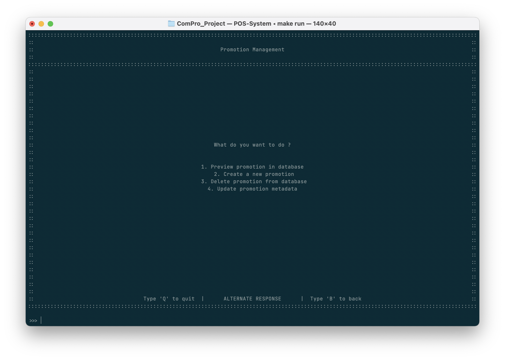

| คีย์ลัด  | ฟีเจอร์                                                |
| :---: | ---------------------------------------------------- |
|   1   | Preview promotion in database   *ดูข้อมูลโปรโมชัน*   |
|   2   | Create a new promotion          *สร้างโปรโมชันใหม่* |
|   3   | Delete promotion from database  *ลบโปรโมชัน*      |
|   4   | Update promotion metadata       *อับเดทโปรโมชัน*   |

## ดูข้อมูลโปรโมชัน
เป็นการแสดงข้อมูลเกี่ยวกับโปรโมชันที่มีทั้งหมด (ทั้งใช้แล้วและยังไม่ได้ใช้)

โดยมีข้อมูลรหัสคูปอง (Promotion ID), ยอดส่วนลด (Price) และ สถานะการใช้งานคูปอง (Status)
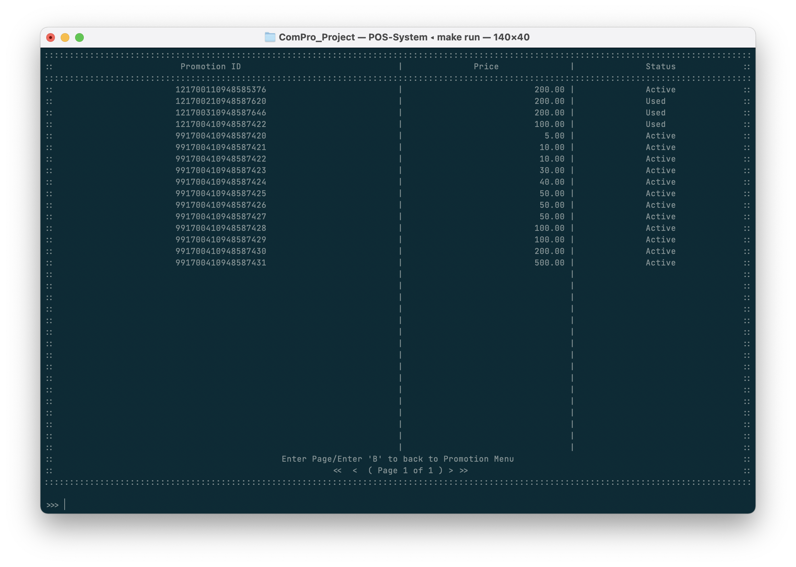
โดยผู้ใช้สามารถกดเลขหน้าเพื่อข้ามไปดูหน้าอื่นๆ ได้

## สร้างโปรโมชันใหม่
หากผู้ใช้งานต้องการสร้างโปรโมชันใหม่ก็สามารถทำได้ดังนี้

1. กรอกเลขรหัสโปรโมชันที่ต้องการใช้
   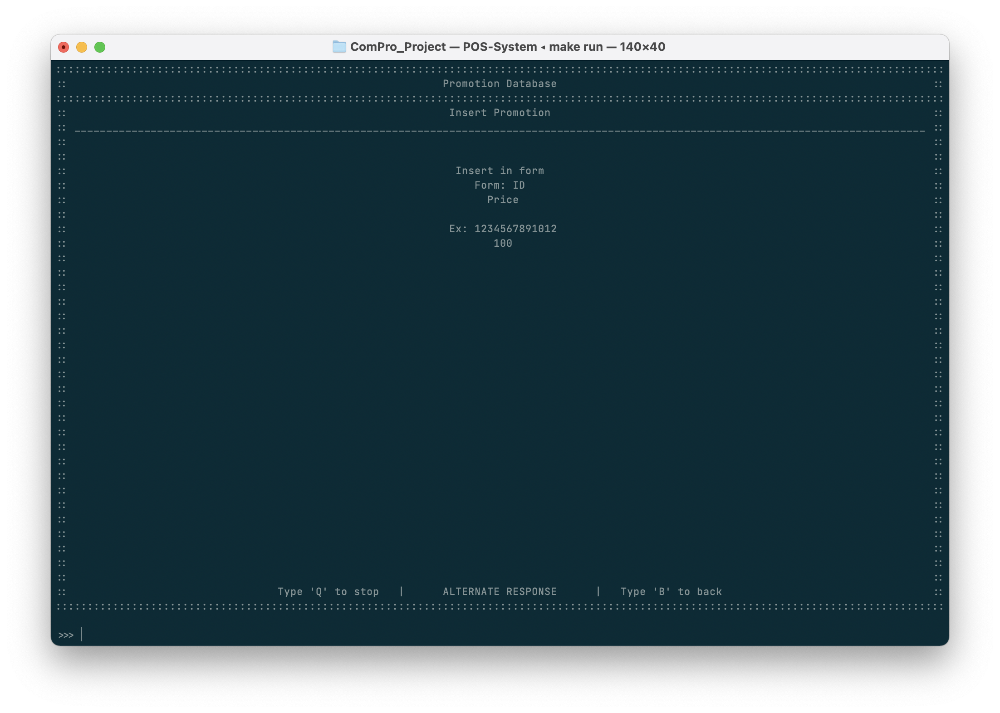
2. กรอกจำนวนเงินสำหรับคูปองนี้
   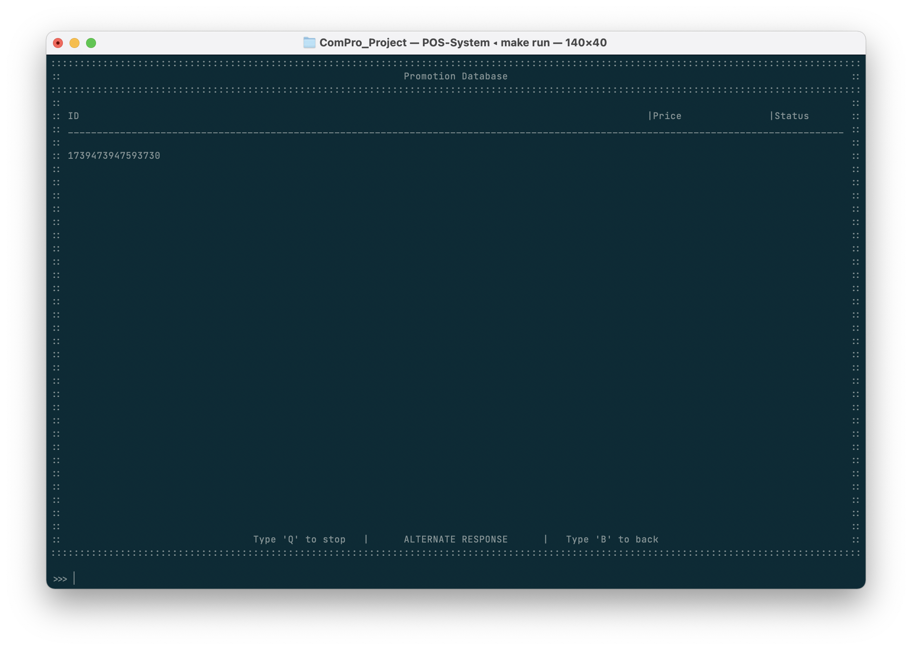
3. ยืนยันการเปิดใช้งานโปรโมชันนี้ ด้วยการกด 'Y' และ 'ENTER'
   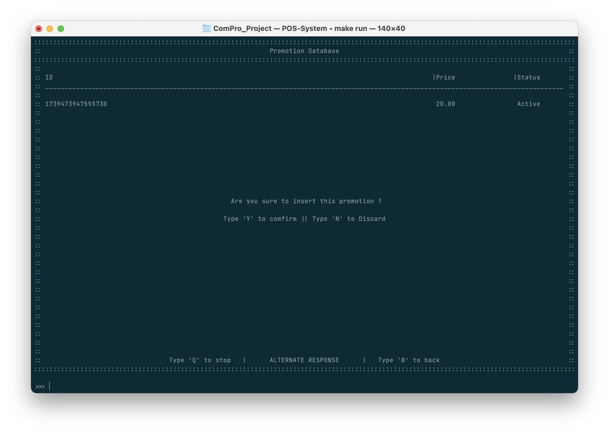
4. เปิดใช้โปรโมชันสำเร็จ
   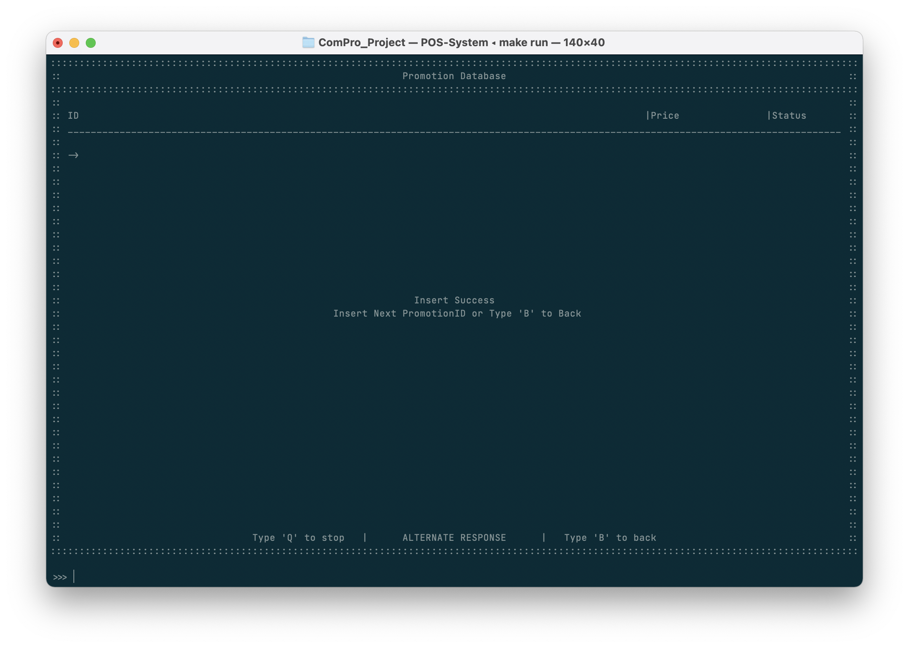

## ลบโปรโมชัน
หากผู้ใช้งานต้องการลบโปรโมชันก็สามารถทำได้ดังนี้

::: tip
โปรโมชันที่ถูกลบไปจะทำให้ผู้ใช้สามารถนำรหัสโปรโมชันกลับมาใช้งานได้ เราแนะนำให้ท่านอัพเดทโปรโมชันและปิดการใช้ (Used) แทนเพื่อป้องกันการใช้รหัสส่วนลดซ้ำ
:::

1. กรอกเลขรหัสโปรโมชัน
   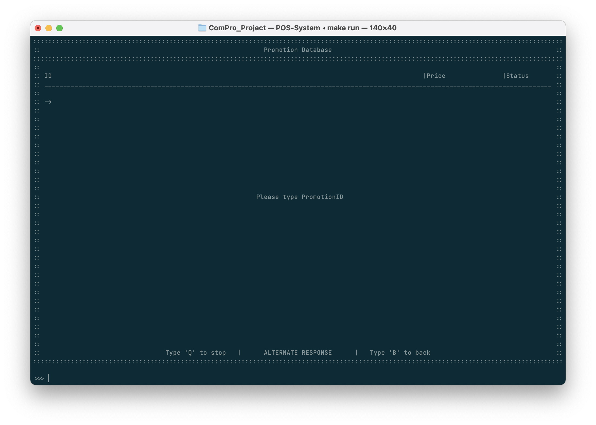
2. ระบบจะทำการแสดงข้อมูลของรหัสโปรโมขันนั้นบนตารางข้อมูล หากต้องการลบรหัสโปรโมชันนั้นให้ทำการกด 'Y' และ 'ENTER' เพื่อลบรหัสโปรโมชันนั้น
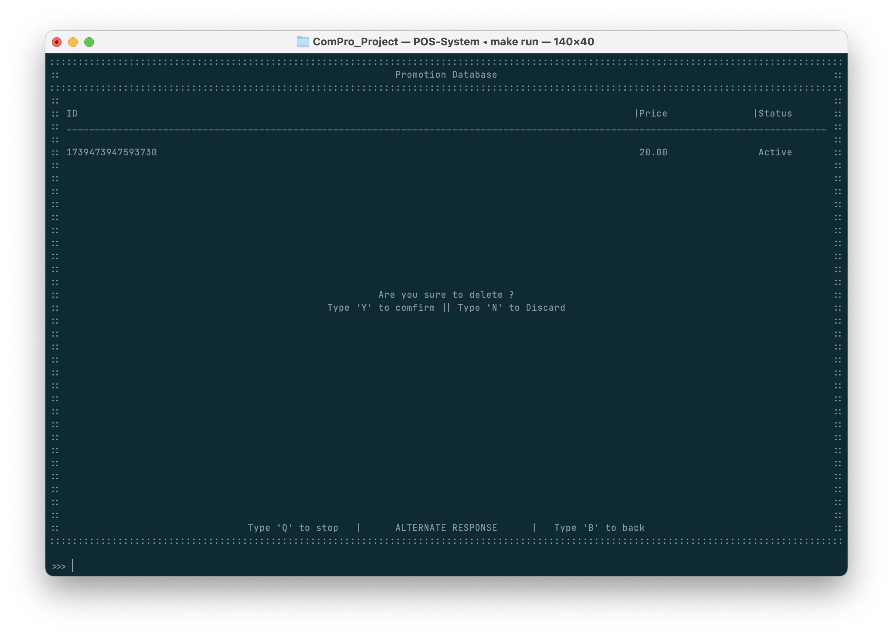
3. หน้าจอจะแสดงผลลัพธ์ของการลบรหัสโปรโมชันนั้น โดยผู้ใช้สามารถทำการลบข้อมูลต่อได้โดยการเริ่มขั้นตอนที่ 1 อีกครั้ง หรือกด 'B' เพื่อกลับไปยังหน้าหลักอีกครั้ง

## อับเดทโปรโมชัน
หากผู้ใช้งานต้องการแก้ไขยอดเงินสำหรับโปรโมชันก็สามารถทำได้ดังนี้
1. กรอกเลขรหัสโปรโมชัน
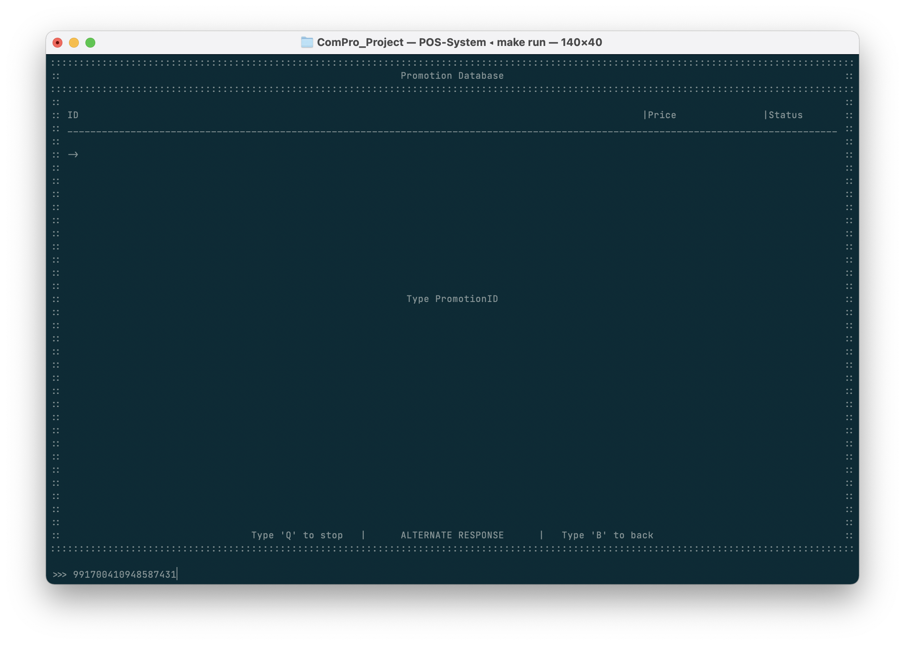
2. ระบบจะทำการแสดงข้อมูลของรหัสโปรโมขันนั้นบนตารางข้อมูล หากต้องการเปลี่ยนแปลงยอดเงิน ให้ทำการกรอกยอดเงินใหม่สำหรับรหัสโปรโมชันนั้น และทำการกด 'Y' และ 'ENTER' เพื่อยืนยันการเปลี่ยนแปลง
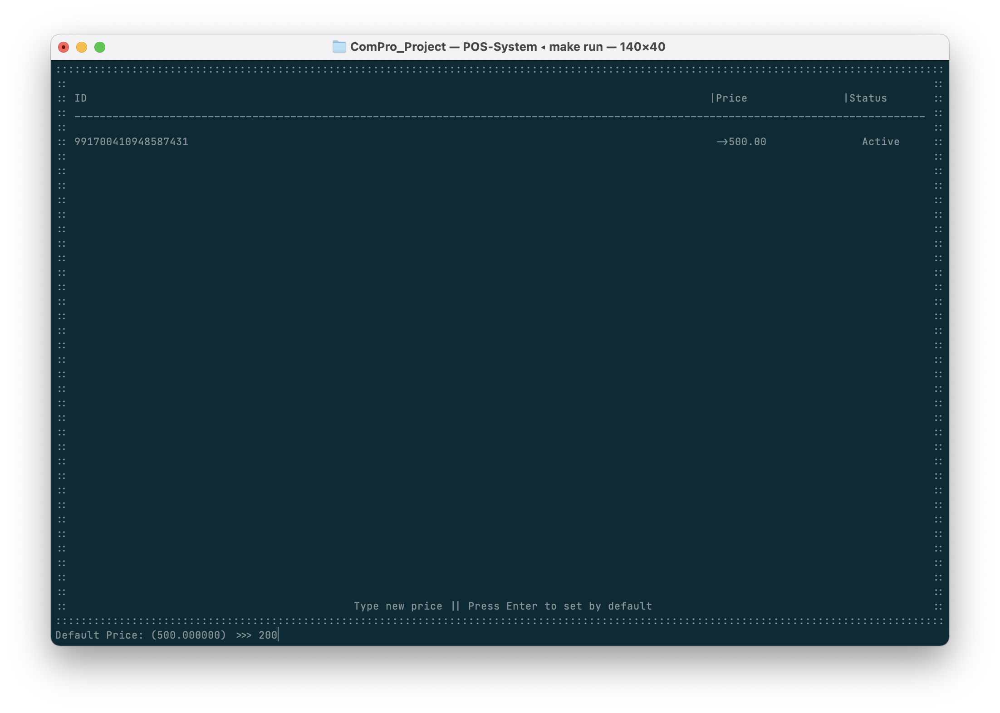
1. หน้าจอจะแสดงผลลัพธ์การแก้ไขข้อมูลดังกล่าว โดยผู้ใช้สามารถทำการแก้ไขข้อมูลต่อได้โดยการเริ่มขั้นตอนที่ 1 อีกครั้ง หรือกด 'B' เพื่อกลับไปยังหน้าหลักอีกครั้ง
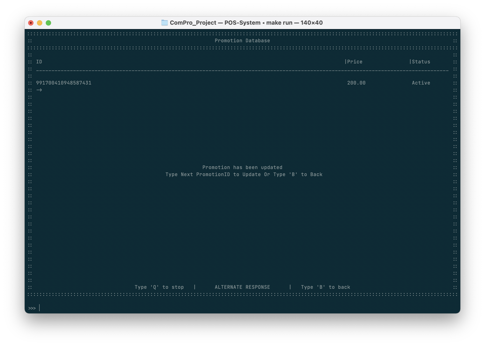
