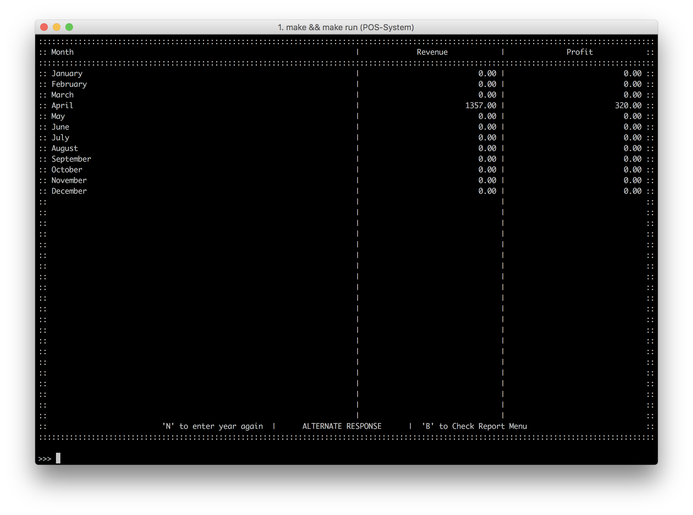

# Sales Report
นอกจากการขายแล้วนั้น ระบบของเรายังมีฟีเจอร์ในการแสดงผลในด้านยอดขายอีกด้วย โดยภาพด้านล่างนั้นเป็นการสร้างรายงานโดยแยกออกมาเป็นยอดขายในแต่ละเดือน ซึ่งจะมีทั้งรายได้ทั้งหมด (Revenue) และกำไรสุทธิ​ (Profit)

ซึ่งข้อมูลเหล่านี้จะนำไปประกอบในการสร้างโมเดลการคาดเดายอดขายสินค้าในนอนาคตได้อีกด้วย
