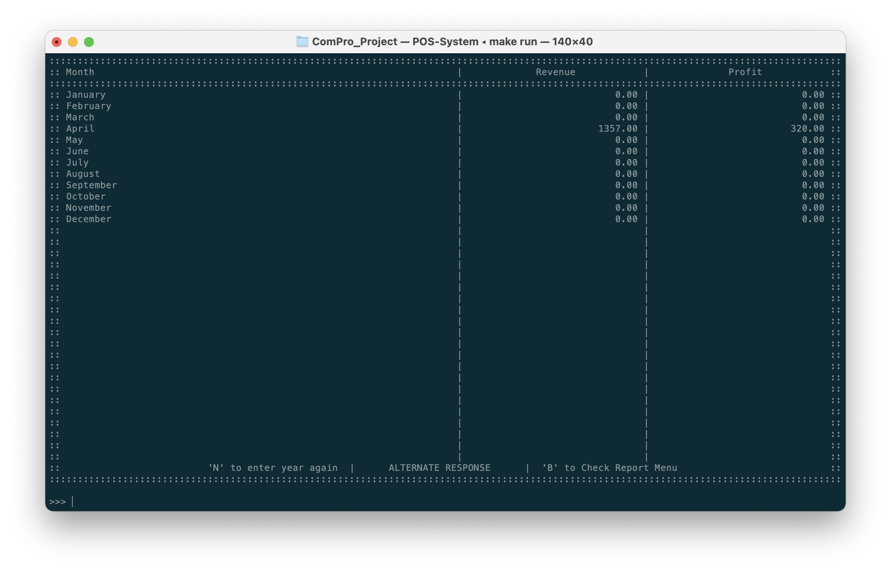

# Sales Report
นอกจากการขายแล้วนั้น ระบบของเรายังมีฟีเจอร์ในการแสดงผลในด้านยอดขายอีกด้วย โดยภาพด้านล่างนั้นเป็นการสร้างรายงานโดยแยกออกมาเป็นยอดขายในแต่ละเดือน ซึ่งจะมีทั้งรายได้ทั้งหมด (Revenue) และกำไรสุทธิ​ (Profit)

ซึ่งข้อมูลเหล่านี้จะนำไปประกอบในการสร้างโมเดลการคาดเดายอดขายสินค้าในนอนาคตได้อีกด้วย

| คีย์ลัด  | ฟีเจอร์                                                    |
| :---: | -------------------------------------------------------- |
|   1   | View one day report        *ดูรายงานของวัน*            |
|   2   | view monthly report        *ดูรายงานของแต่ละเดือน*      |
|   3   | View personal sales report  *ดูรายงานยอดขายของพนักงาน* |
|   4   | View multiple day report   *ดูรายงานตามช่วงเวลา*       |

## ดูรายงานของวัน
เพื่อดูรายงานการขาย ตามประเภทสินค้า ของวันใดวันหนึ่ง

1. กรอกวันที่ต้องการดูรายงานตามลักษณะ `วว/ดด/ปปปป` (เช่น 31/12/2017)

2. ระบบจะแสดงผลยอดขายตามประเภทสินค้า

## ดูรายงานของแต่ละเดือน
1. กรอกปี (ค.ศ.) ที่ต้องการดูรายงาน (เช่นปี 2017)

2. ระบบจะแสดงยอดขายรายเดือนของปีนั้น หากปีนั้นยังไม่มีข้อมูลของเดือนไหน ระบบจะยังแสดงยอดขายเป็น 0

## ดูรายงานยอดขายของพนักงาน
เพื่อให้ผู้ใช้งานดูยอดขายที่พนักงาน (พนักงานแคชเชียร์) สามารถทำได้ในปีนั้นๆ

1. กรอกปี (ค.ศ.) ที่ต้องการดูรายงาน (เช่นปี 2017)

2. ระบบจะแสดงชื่อ นามสกุลของพนักงาน พร้อมกับยอดขายและรายได้ที่พนักงานแต่ละคนทำได้

## ดูรายงานตามช่วงเวลา
เป็นการออกรายงานตามช่วงเวลาที่ผู้ใช้งานระบุ (เช่นช่วงเวลาเป็นรายไตรมาส) ที่ไม่สามารถระบุได้จากตัวเลือกประเภทรายงานอื่น

1. ระบุเวลา<u>เริ่มต้น</u>ของช่วงเวลานั้นตามลักษณะ `วว/ดด/ปปปป` (เช่น 1/09/2017)
2. ระบุเวลา<u>สิ้นสุด</u>ของช่วงเวลานั้นตามลักษณะ `วว/ดด/ปปปป` (เช่น 31/12/2017)

3. ระบบจะแสดงผลยอดขายตามประเภทสินค้า

