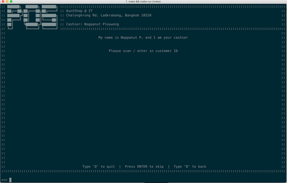
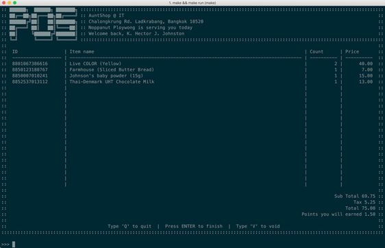
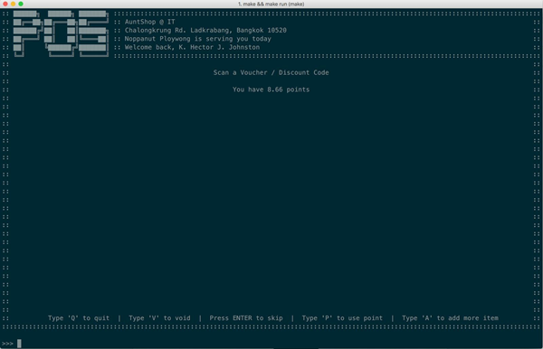
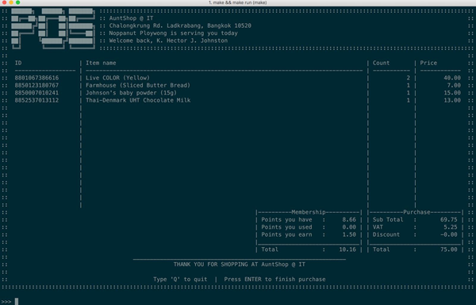

# Sales Platform
วิธีการใช้งาน Sales Platform มีขั้นตอนในการใช้งานดังนี้

## กรอกรหัสบัตรสมาชิก / รหัสลูกค้า
หากลูกค้าเป็นสมาชิกกับทางร้าน พนักงานสามารถสแกนรหัสลูกค้าได้จากขั้นตอนดังนี้ หรือหากว่าลูกค้าท่านดังกล่าวไม่เคยเป็นสมาชิกมาก่อน ก็สามารถข้ามขั้นตอนการกรอกรหัสลูกค้าได้โดยการกด 'Enter'

## สแกนสินค้าที่ต้องการจ่าย
ในขั้นตอนนี้ พนักงานจะทำการสแกนสินค้าหรือกรอกรหัสสินค้าเข้าไปยังระบบ เพื่อให้ระบบเพิ่มสินค้าเข้าไปยังตะกร้า

โดยภายในหน้าการสแกนนั้นจะบอกถึง

- รหัสสินค้า
- ชื่อสินค้า
- จำนวนสินค้า
- ราคาสุทธิของสินค้า

และรวมไปถึง

- ยอดซื้อ
- ภาษีมูลค่าเพิ่ม
- ราคาสุทธิ
- คะแนนที่จะได้รับจากการซื้อครั้งนี้ (หากมีการกรอกรหัสลูกค้า)

::: tip NOTE
ในกรณีที่สินค้านั้นหมดแล้ว (หมดในฐานข้อมูล) หรือรหัสสินค้า (UPC, EAN หรือ ISBN) นั้นไม่มีอยู่ในระบบฐานข้อมูล สินค้านั้นจะไม่ถูกเพิ่มเข้าไปยังตะกร้าและแจ้งเตือนว่าไม่สามารถสแกนได้
:::
## ใช้งานคะแนน หรือ รหัสส่วนลด
หากลูกค้ามีรหัสส่วนลด หรือ/และ คะแนนสะสม ลูกค้าจะสามารถเลือกระหว่างการใช้รหัสส่วนลด (Coupon) หรือใช้คะแนนเพื่อแลกเป็นส่วนลด โดยเลือกได้เพียงอย่างใดอย่างหนึ่งเท่านั้น

### เลือกใช้รหัสส่วนลด
หากลูกค้ามีความประสงค์ในการใช้รหัสส่วนลด (Coupon) พนักงานสามารถสแกนหรือกรอกรหัสส่วนลดเพื่อใช้งานส่วนลด และกด 'Enter' เพื่อทำการยืนยันการใช้งานรหัสส่วนลด

::: warning เงื่อนไขการใช้รหัสส่วนลด
คูปองส่วนลดไม่สามารถใช้ได้หากส่วนลดทำให้ยอดชำระสุทธิต่ำกว่า 1 บาท
:::
### เลือกใช้คะแนนสะสม
*ตัวเลือกนี้สำหรับลูกค้าที่เป็นสมาชิกกับทางร้านเท่านั้น*

หากลูกค้าต้องการเลือกใช้คะแนนเพื่อแลกเป็นส่วนลด ให้ทำการกด 'P' เพื่ออนุญาตให้ระบบทำการแลกคะแนนมาเป็นส่วนลด ซึ่งคะแนนนั้นจะถูกนำไปใช้งานทั้งหมด (ตามเงื่อนไขการใช้คะแนน) เพื่อแลกเป็นส่วนลด

::: tip
คะแนน (ปัดเศษลง) จะถูกตัดตามยอดซื้อที่สามารถลดได้ โดยยอดซื้อสุทธิจะเหลือต่ำสุดที่ 1 บาท
:::

หรือหากผู้ขายต้องการเพิ่มสินค้าเพิ่มเติม ก็สามารถทำการกด 'A' เพื่อกลับไปยังหน้าที่แล้ว (หน้าเพิ่มสินค้า) ได้ หรือต้องการยกเลิกการขายนี้ด้วยการกด 'V' เพื่อทำการยกเลิกการซื้อ (void) หรือกด 'Q' เพื่อกลับไปยังหน้าหลักและยกเลิกการขาย

## สรุปยอดซื้อ
ในขั้นตอนนี้ ลูกค้าจะทำการชำระเงิน ในจำนวนที่ได้ทำการหักคะแนนเพื่อแลกเป็นส่วนลด หรือ/และ ใช้คูปองส่วนลด
ยอดการใช้จ่ายครั้งนี้ และ ยอดคะแนนสะสมของลูกค้า ตามยอดซื้อและข้อมูลที่แสดงในหน้านี้

โดยหน้าสรุปการขายนี้จะเป็นการแสดงสรุปของการซื้อครั้งนี้ โดยจะมีการแสดงรายละเอียดดังนี้

- Points you have (คะแนนที่มีก่อนหน้า)
- Points you used (คะแนนที่ถูกใช้ในการซื้อครั้งนี้)
- Points you earn (คะแนนที่ได้จากการซื้อครั้งนี้)
- Total (คะแนนสะสมหลังจากการซื้อ)

และ
- Subtotal (ราคาก่อนบวกภาษีมูลค่าเพิ่ม)
- VAT (ภาษีมูลค่าเพิ่ม)
- Discount (ส่วนลดจากคูปองหรือจากการแลกคะแนน)
- Total (ราคาสุทธิหลังบวกภาษีมูลค่าเพิ่มแล้ว)

ซึ่งการแสดงหน้านี้หมายความถึงว่าการซื้อขายนั้นสิ้นสุดลงแล้ว หากต้องการให้บริการแก่ลูกค่าท่านต่อไปก็สามารถกด 'Enter' เพื่อเริ่มขั้นตอนในการขายใหม่อีกครั้ง หรือกดคีย์ลัดเพื่อไปกลับยังหน้าอื่น
