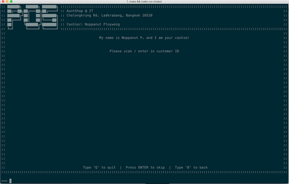
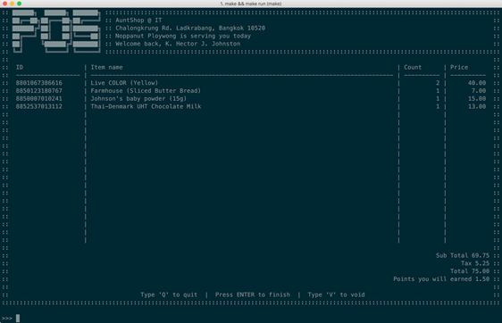
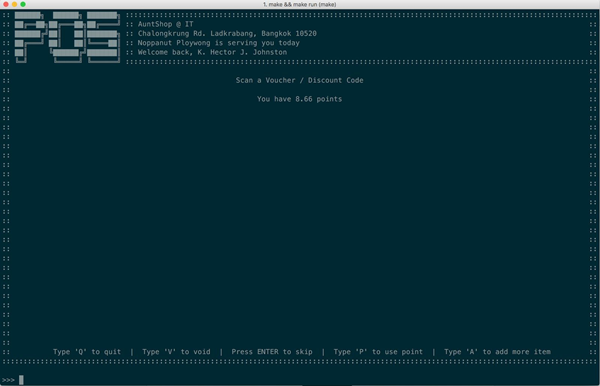
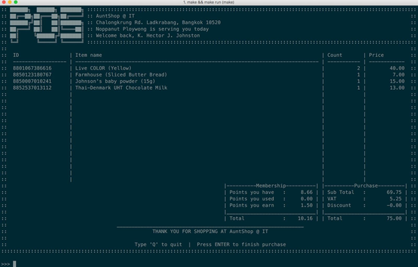

# Sales Platform
วิธีการใช้งาน Sales Platform มีขั้นตอนในการใช้งานดังนี้

### กรอกรหัสบัตรสมาชิก / เลขประจำตัวลูกค้า
หากลูกค้ามีรหัสลูกค้า พนักงานสามารถสแกนรหัสลูกค้าได้จากขั้นตอนดังนี้ หรือหากว่าลูกค้าท่านดังกล่าวไม่เคยเป็นสมาชิกมาก่อน ก็สามารถข้ามขั้นตอนการกรอกรหัสลูกค้าได้โดยการกด 'Enter'

### สแกนสินค้าที่ต้องการจ่าย
ในขั้นตอนนี้ พนักงานจะทำการสแกนสินค้า หรือกรอกรหัสสินค้าเข้าไปยังระบบ เพื่อให้ระบบได้ทำการเปรียบเทียบและเพิ่มสินค้าเข้าไปยังตะกร้า โดยยอดซื้อและจำนวนจะมีการเปลี่ยนแปลงเมื่อมีการสแกนสินค้าชิ้นใหม่

ในกรณีที่สินค้านั้นหมดในฐานข้อมูลแล้ว หรือเลขประจำสินค้า (UPC, EAN หรือ ISBN) นั้นไม่มีอยู่ในระบบฐานข้อมูล สินค้านั้นจะไม่ถูกเพิ่มเข้าไปยังตะกร้า และจะทำการแจ้งทางผู้คีย์ข้อมูลว่าไม่สามารถสแกนได้
โดยภายในหน้าการสแกนนั้นจะบอกถึง

- รหัสสินค้า
- ชื่อสินค้า
- จำนวนสินค้า
- ราคาสุทธิของสินค้า

และรวมไปถึง

- ยอดซื้อ
- ภาษีมูลค่าเพิ่ม
- ราคาสุทธิ
- คะแนนที่จะได้รับจากการซื้อครั้งนี้ (หากมีการกรอกรหัสลูกค้า)

### ใช้งานคะแนนหรือรหัสส่วนลด
หากลูกค้ามีความประสงค์ในการใช้รหัสส่วนลด (Coupon) พนักงานสามารถสแกนหรือกรอกรหัสส่วนลดเพื่อใช้งานส่วนลด

หรือหากลูกค้าต้องการเลือกใช้คะแนนเพื่อแลกเป็นส่วนลดก็สามารถทำได้ในขั้นตอนนี้ ซึ่งพนักงานจำเป็นที่จะต้องกด 'P' เพื่อเปิดให้ระบบทำการแลกคะแนนเพื่อนำมาเป็นส่วนลดได้ ซึ่งคะแนนนั้นจะถูกนำไปใช้งานทั้งหมดเพื่อแลกมาเป็นส่วนลด

และหลังจากนั้นให้พนักงานทำการกด 'Enter' เพื่อทำการยืนยันการใช้งานรหัสส่วนลด หรือ/และ คะแนน
ซึ่งหากว่าการใช้งานคูปองหรือการใช้คะแนนนั้นทำให้ยอดชำระต่ำกว่า 1 บาท ระบบจะทำการแจ้งให้แก่ทางพนักงานว่าไม่สามารถใช้คูปองหรือคะแนนเพื่อแลกเป็นส่วนลดได้ และระบบจะทำการกลับไปยังหน้าก่อนหน้าเพื่อให้ทำการแก้ไขยอดซื้อก่อนการเลือกใช้งานคูปองอีกครั้งหนึ่ง

หรือหากผู้ขายต้องการเพิ่มสินค้าเพิ่มเติม ก็สามารถทำการกด 'A' เพื่อกลับไปยังหน้าที่แล้ว (หน้าเพิ่มสินค้า) ได้ หรือต้องการยกเลิกการขายนี้ด้วยการกด 'V' เพื่อทำการยกเลิกการซื้อ (void) หรือกด 'Q' เพื่อกลับไปยังหน้าหลักและยกเลิกการขาย

### สรุปยอดซื้อ
ในขั้นตอนนี้ ลูกค้าจะทำการชำระเงิน ในจำนวนที่ได้ทำการหักคะแนนเพื่อแลกเป็นส่วนลด หรือ/และ ใช้คูปองส่วนลด
ยอดการใช้จ่ายครั้งนี้ และ ยอดคะแนนสะสมของลูกค้า จะถูกแสดงในขั้นตอนนี้

โดยหน้าสรุปการขายนี้จะเป็นการแสดงสรุปของการซื้อครั้งนี้ โดยจะมีการแสดงรายละเอียดดังนี้

- Points you have (คะแนนที่มีก่อนหน้า)
- Points you used (คะแนนที่ได้ถูกใช้ในการซื้อครั้งนี้)
- Points you earn (คะแนนที่ได้จากการซื้อครั้งนี้)
- Total (คะแนนคงเหลือ)

และ
- Subtotal (ราคาก่อนบวกภาษีมูลค่าเพิ่ม)
- VAT (ภาษีมูลค่าเพิ่ม)
- Discount (ส่วนลดจากการซื้อ)
- Total (ราคาหลังบวกภาษีมูลค่าเพิ่มแล้ว ซึ่งถูกหักโดยส่วนลดแล้ว)

ซึ่งการแสดงหน้านี้หมายความถึงว่าการซื้อขายนั้นสิ้นสุดลงแล้ว หากต้องการให้บริการแก่ลูกค่าท่านต่อไปก็สามารถกด 'Enter' เพื่อเริ่มขั้นตอนในการขายใหม่อีกครั้ง หรือกดคีย์ลัดเพื่อไปกลับยังหน้าอื่น
