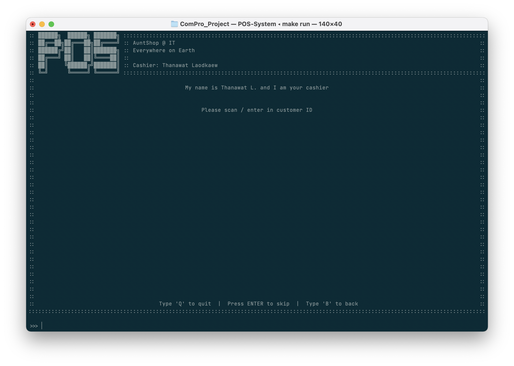
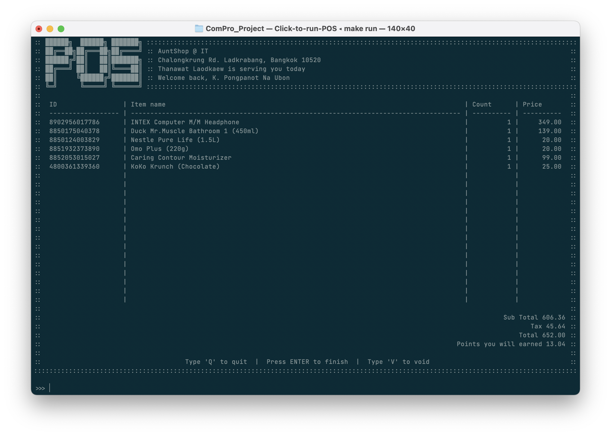
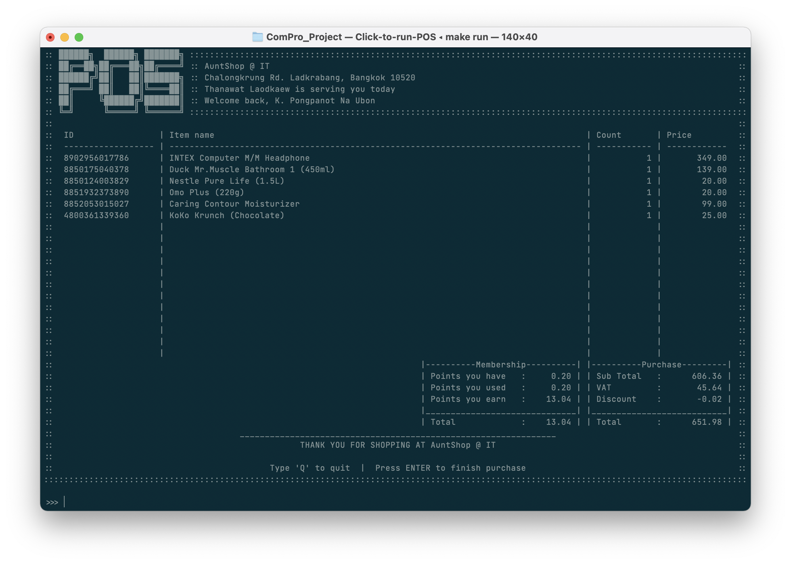

# Sales Platform
วิธีการใช้งาน Sales Platform หรือหน้าขายสินค้า มีขั้นตอนในการใช้งานดังนี้

## กรอกรหัสบัตรสมาชิก / รหัสลูกค้า
หากลูกค้าเป็นสมาชิกกับทางร้าน พนักงานสามารถกรอก/สแกนรหัสลูกค้าได้จากขั้นตอนดังนี้ และชื่อลูกค้าจะถูกแสดงในหน้าถัดไป

หรือหากว่าลูกค้าท่านดังกล่าวไม่ได้เป็นสมาชิกของร้าน ก็สามารถข้ามขั้นตอนนี้โดยการกด 'Enter' และชื่อลูกค้าจะถูกแสดงเป็น 'Customer' ในหน้าถัดไป

## สแกนสินค้าที่ต้องการจ่าย
ในขั้นตอนนี้ พนักงานจะทำการกรอก/สแกนรหัสสินค้าเข้าไปยังระบบ เพื่อให้ระบบเพิ่มสินค้าเข้าไปยังตะกร้า

โดยภายในหน้าการสแกนนั้นจะบอกถึง

- รหัสสินค้า
- ชื่อสินค้า
- จำนวนสินค้า
- ราคาสุทธิของสินค้า

และรวมไปถึง

- ยอดซื้อ
- ภาษีมูลค่าเพิ่ม
- ราคาสุทธิ
- คะแนนที่จะได้รับจากการซื้อครั้งนี้ (หากมีการกรอกรหัสลูกค้า)

และเมื่อผู้ใช้งานสแกนเสร็จทุกรายการแล้ว ให้ผู้ใช้งานทำการกด 'ENTER' เพื่อจบขั้นตอนการเพิ่มสินค้า

### หากสินค้าหมดหรือไม่พบข้อมูล
ในกรณีที่สินค้านั้นหมดแล้ว (หมดในฐานข้อมูล) หรือรหัสสินค้า (UPC, EAN หรือ ISBN) นั้นไม่มีอยู่ในระบบฐานข้อมูล (No item in the inventory)
สินค้านั้นจะไม่ถูกเพิ่มเข้าไปยังตะกร้าและแจ้งเตือนว่าไม่สามารถสแกนได้

### เพื่มจำนวนสินค้า
หากลูกค้าซื้อสินค้าเดียวกันมากกว่าหนึ่งชิ้น/หน่วย ให้ทำการสแกนสินค้านั้นอีกครั้งเพื่อเพิ่มจำนวนสินค้า

### หากต้องการยกเลิกตะกร้าสินค้า
หากผู้ใช้งานต้องการยกเลิกการขายครั้งนี้ ก็สามารถกด 'V' และ 'ENTER' เพื่อยกเลิกการขายสินค้าในตะกร้า

## ใช้งานคะแนน หรือ รหัสส่วนลด
หากลูกค้ามีรหัสส่วนลด หรือ/และ คะแนนสะสม ลูกค้าจะสามารถเลือกระหว่างการใช้รหัสส่วนลด (Coupon) หรือใช้คะแนนเพื่อแลกเป็นส่วนลด โดยเลือกได้เพียงอย่างใดอย่างหนึ่งเท่านั้น

ลูกค้าสามารถดูยอดคะแนนที่ใช้ไป หรือ/และ ส่วนลดที่ได้จากหน้าสรุปยอดซื้อ

โดยมีคีย์ลัดดังนี้
| พิมพ์      | คำอธิบาย                                            |
| -------- | ------------------------------------------------- |
| Q        | <u>Q</u>uit            *ออกจากหน้า POS*        |
| V        | <u>V</u>oid            *ยกเลิกการขายครั้งนี้*      |
| ENTER    | Skip                   *ไม่ใช้คะแนนหรือรหัสส่วนลด* |
| รหัสส่วนลด | *ใช้รหัสส่วนลด*                                      |
| P        | Use <u>P</u>oint       *ใช้คะแนน*              |
| A        | <u>A</u>dd more item   *เพิ่มสินค้าในตะกร้าอีก*     |

### เลือกใช้รหัสส่วนลด
หากลูกค้ามีความประสงค์ในการใช้รหัสส่วนลด (Coupon) พนักงานสามารถสแกนหรือกรอกรหัสส่วนลดเพื่อใช้งานส่วนลด และกด 'Enter' เพื่อทำการยืนยันการใช้งานรหัสส่วนลด

โดยมีเงื่อนไขการใช้งานรหัสส่วนลดตามเงื่อนไขการใช้รหัสส่วนลด

::: warning เงื่อนไขการใช้รหัสส่วนลด
เพื่อใข้รหัสส่วนลด ลูกค้าต้องซื้อสินค้าให้ถึงขั้นต่ำ นั่นคือยอดชำระ (Total) เมื่อหักส่วนลด (Discount) แล้วจะต้องเหลือมากกว่าหรือเท่ากับ 1 บาท
:::
### เลือกใช้คะแนนสะสม
*ตัวเลือกนี้สำหรับลูกค้าที่เป็นสมาชิกกับทางร้านเท่านั้น*

หากลูกค้าต้องการเลือกใช้คะแนนเพื่อแลกเป็นส่วนลด ให้ทำการกด 'P' เพื่ออนุญาตให้ระบบทำการแลกคะแนนมาเป็นส่วนลด ซึ่งคะแนนนั้นจะถูกนำไปใช้งานทั้งหมด (ตามเงื่อนไขการใช้คะแนนสะสม) เพื่อแลกเป็นส่วนลด

::: warning เงื่อนไขการใช้คะแนนสะสม
คะแนนสะสมจะถูกตัด (จำนวนเต็ม) ตามยอดซื้อที่สามารถลดได้ โดยยอดซื้อสุทธิจะเหลือต่ำสุดที่ 1 บาท
:::

โดยที่คะแนนที่ใช้ไปนั้นจะถูกตัดไปจากคะแนนสะสมของลูกค้า และส่วนลดที่ได้รับจากการแลกคะแนนจะขึ้นในช่อง Discount

## สรุปยอดซื้อ
ในขั้นตอนนี้ ลูกค้าจะทำการชำระเงิน ในจำนวนที่ได้ทำการหักคะแนนเพื่อแลกเป็นส่วนลด หรือ/และ ใช้คูปองส่วนลด
ยอดการใช้จ่ายครั้งนี้ และ ยอดคะแนนสะสมของลูกค้า ตามยอดซื้อและข้อมูลที่แสดงในหน้านี้

โดยหน้าสรุปการขายนี้จะเป็นการแสดงสรุปของการซื้อ โดยจะมีการแสดงรายละเอียดดังนี้

### สิทธิของสมาชิก
| คำศัพท์            | ความหมาย              |
| --------------- | --------------------- |
| Points you have | คะแนนที่มีก่อนหน้า         |
| Points you used | คะแนนที่ถูกใช้ในการซื้อครั้งนี้ |
| Points you earn | คะแนนที่ได้จากการซื้อครั้งนี้  |
| Total           | คะแนนสะสมหลังจากการซื้อ  |

### ยอดซื้อ
| คำศัพท์     | ความหมาย                      |
| -------- | ----------------------------- |
| Subtotal | ราคาก่อนบวกภาษีมูลค่าเพิ่ม          |
| VAT      | ภาษีมูลค่าเพิ่ม                    |
| Discount | ส่วนลดจากคูปองหรือจากการแลกคะแนน |
| Total    | ราคาสุทธิหลังบวกภาษีมูลค่าเพิ่มแล้ว    |

ซึ่งการแสดงหน้านี้หมายความถึงว่าการซื้อขายนั้นสิ้นสุดลงแล้ว ผู้ใช้งานจะต้องทำหน้าที่ในการรับเงินที่ลูกค้าซื้อตามยอดเงิน (Total)

หากต้องการให้บริการแก่ลูกค่าท่านต่อไปก็สามารถกด 'Enter' เพื่อเริ่มขั้นตอนในการขายใหม่อีกครั้ง หรือกดคีย์ลัดเพื่อไปกลับยังหน้าอื่น
