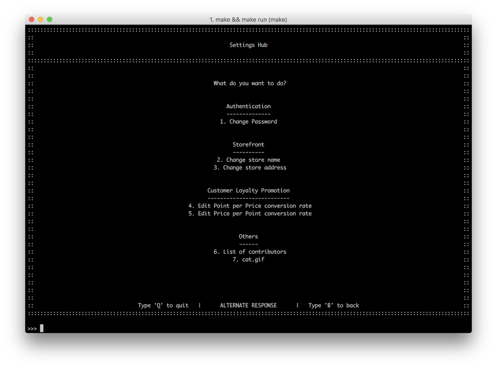

# Settings

|  พิมพ์  | เพื่อ                                                                         |                                                    |
| :---: | --------------------------------------------------------------------------- | -------------------------------------------------- |
|   1   | Change password                        *เปลี่ยนรหัสผ่าน*                    | เปลี่ยนรหัสผ่านกับบัญชีผู้ใช้งาน                             |
|   2   | Change store name                      *เปลี่ยนชื่อหน้าร้าน*                  | เปลี่ยนแปลงชื่อร้าน ซึ่งจะแสดงบนหน้าแรกและหน้าการขาย        |
|   3   | Change store address                   *เปลี่ยนที่อยู่ร้าน*                    | เปลี่ยนแปลงที่อยู่ ซึ่งจะแสดงบนหน้าแรก                      |
|   4   | Edit Point per Price conversion rate   *เปลี่ยนค่าคะแนนที่จะได้รับจากการใช้จ่าย* | เปลี่ยนจำนวนเงินที่จำเป็นต่อการเก็บคะแนน                     |
|   5   | Edit Price per Point conversion rate   *เปลี่ยนค่าคะแนนเป็นส่วนสดเงินสด*      | เปลี่ยนจำนวนคะแนนและอัตราแลกเปลี่ยนที่จำเป็นต่อการแลกเป็นเงินสด |

## เปลี่ยนรหัสผ่าน
ผู้ใช้งานทุกคนสามารถเปลี่ยนรหัสผ่านของตนเองเพื่อเข้าระบบได้
โดยการกรอกรหัสเก่า แล้วจึงสามารถเปลี่ยนรหัสใหม่ได้ โดยต้องพิมพ์ยืนยันอีกครั้งหนึ่ง
(หากพิมพ์ยืนยันผิด จะต้องเข้าไปทำการแก้ใหม่อีกครั้งตั้งแต่แรก)

## เปลี่ยนชื่อหน้าร้าน
ชื่อร้านจะปรากฎในหน้าแรก และ หน้าการชำระเงิน โดยสามารถแก้ได้โดยการพิมพ์ชื่อใหม่เข้าไปในระบบ

## เปลี่ยนที่อยู่ร้าน
ที่อยู่ร้านจะปรากฎในหน้าแรก และ หน้าการชำระเงิน โดยสามารถแก้ได้โดยการพิมพ์ชื่อใหม่เข้าไปในระบบ

## เปลี่ยนค่าคะแนนที่จะได้รับจากการใช้จ่าย
โดยที่ การใช้จ่ายทุกๆ x บาท จะได้ 1 คะแนน
โดยเจ้าของร้านสามารถแก้ไขค่า x ได้ และจะเรื่มใช้งานด้วยเรทใหม่กับการทำรายการหลังจากการเปลี่ยนเท่านั้น (ไม่แก้ไขย้อนหลัง)

## เปลี่ยนค่าคะแนนเป็นส่วนสดเงินสด
โดยที่ การใช้ x คะแนน สามารถแลกเป็นส่วนลดได้ 1 บาท
โดยเจ้าของร้านสามารถแก้ไขค่า x ได้ และจะเรื่มใช้งานด้วยเรทใหม่กับการทำรายการหลังจากการเปลี่ยนเท่านั้น (ไม่แก้ไขย้อนหลัง)
