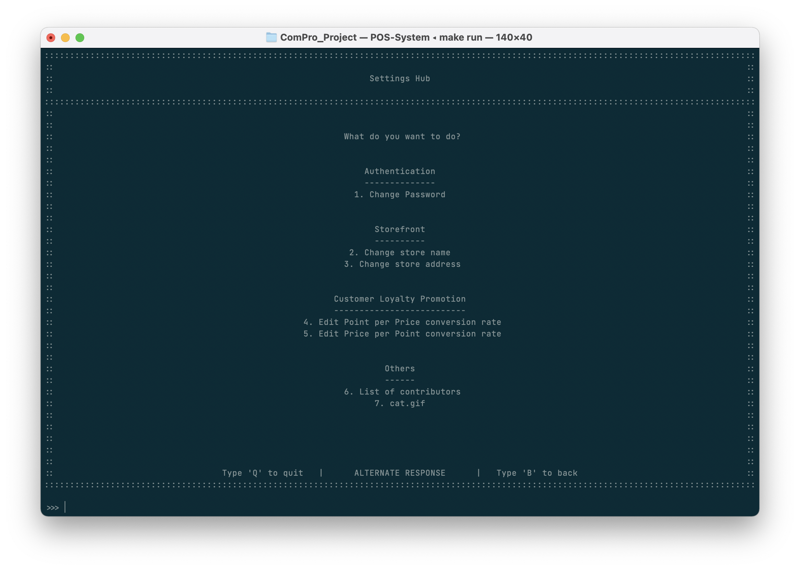
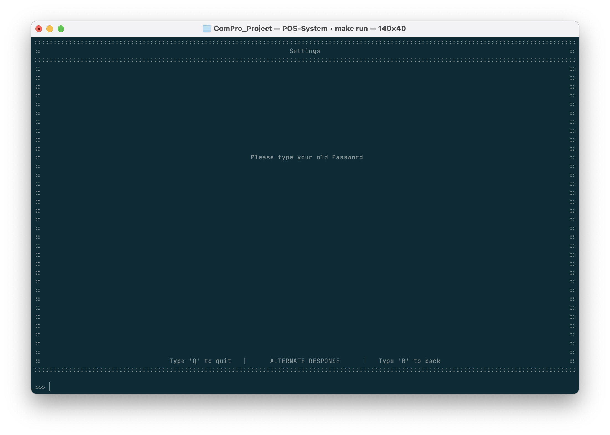
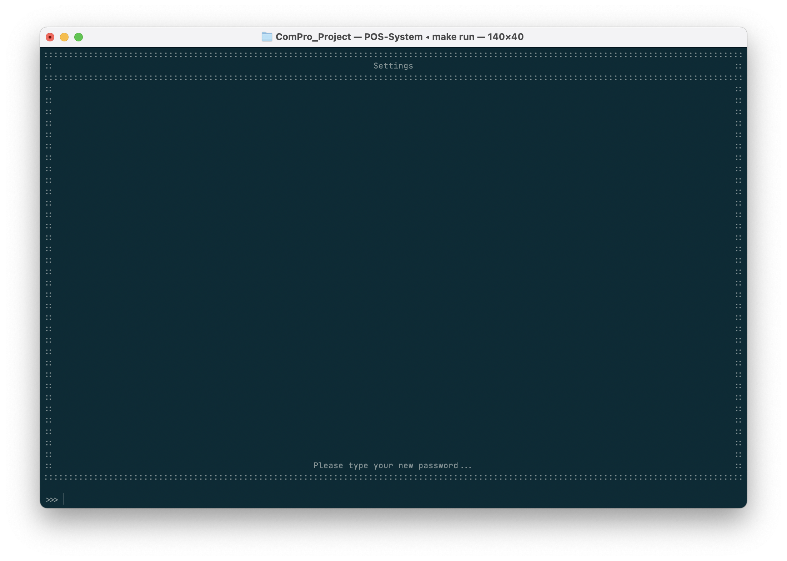
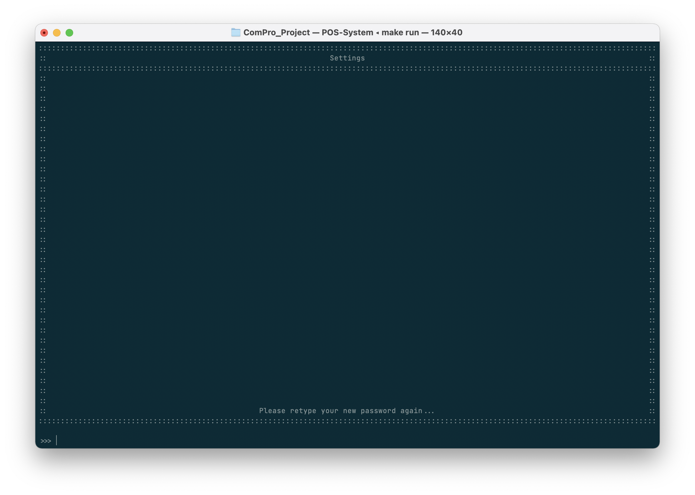
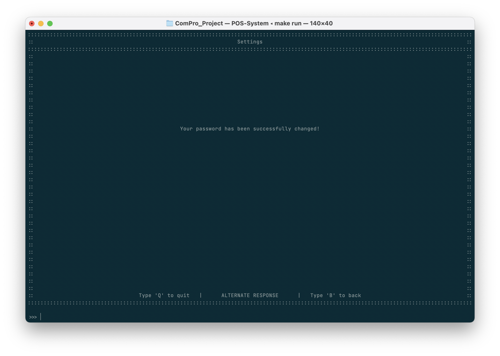
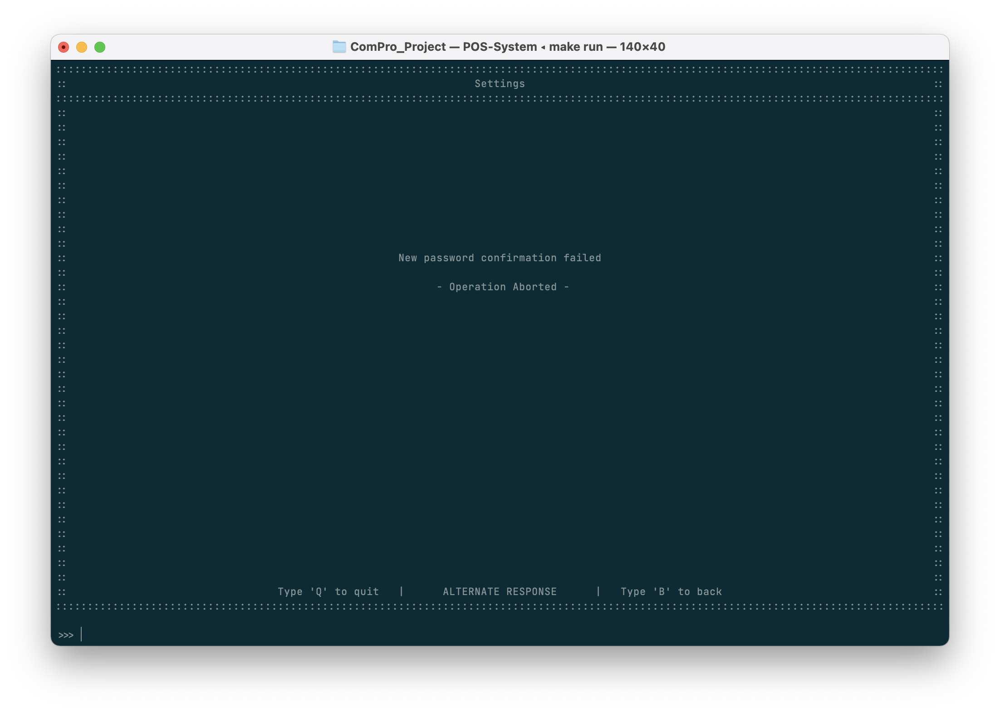
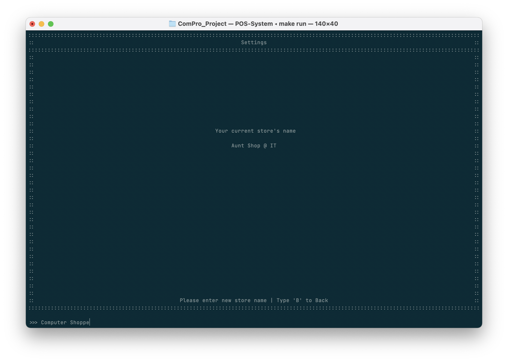
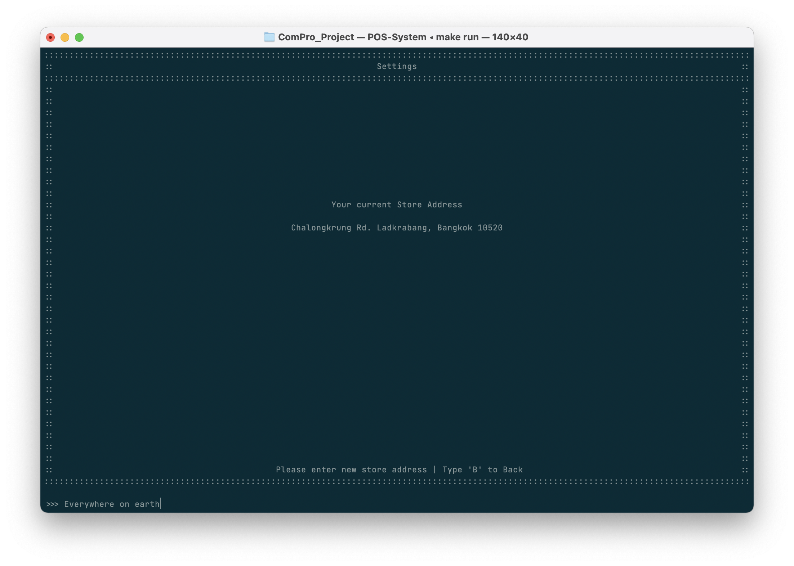
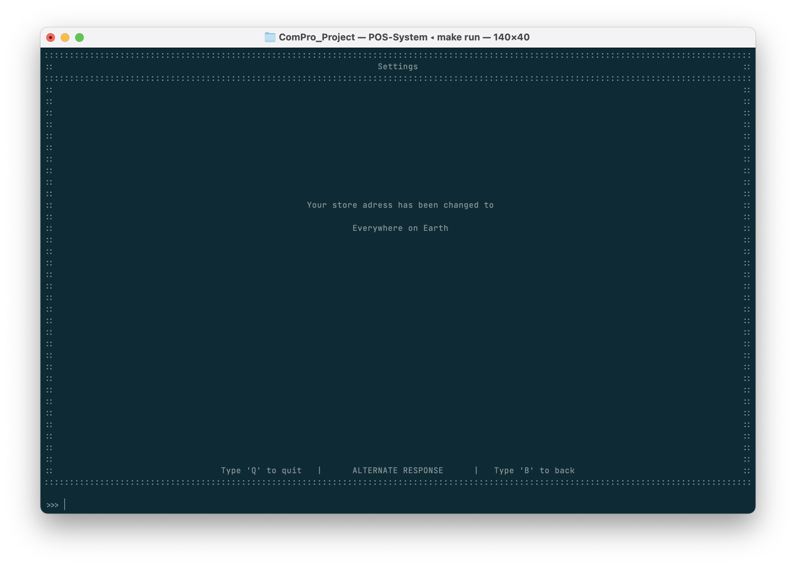

# Settings

|  พิมพ์  | ฟีเจอร์                                                      | คำอธิบาย                                      |
| :---: | ---------------------------------------------------------- | ------------------------------------------- |
|   1   | Change password                        *เปลี่ยนรหัสผ่าน*   | เปลี่ยนรหัสผ่านกับบัญชีผู้ใช้งาน                      |
|   2   | Change store name                      *เปลี่ยนชื่อหน้าร้าน* | เปลี่ยนแปลงชื่อร้าน ซึ่งจะแสดงบนหน้าแรกและหน้าการขาย |
|   3   | Change store address                   *เปลี่ยนที่อยู่ร้าน*   | เปลี่ยนแปลงที่อยู่ ซึ่งจะแสดงบนหน้าแรก               |

## เปลี่ยนรหัสผ่าน
ผู้ใช้งานทุกคนสามารถเปลี่ยนรหัสผ่านของตนเองเพื่อเข้าระบบได้
โดยการกรอกรหัสเก่า แล้วจึงสามารถเปลี่ยนรหัสใหม่ได้ โดยต้องพิมพ์ยืนยันอีกครั้งหนึ่ง
(หากพิมพ์ยืนยันผิด จะต้องเข้าไปทำการแก้ใหม่อีกครั้งตั้งแต่แรก)

1. กรอกรหัสผ่านปัจจุบัน
   
2. กรอกรหัสผ่านใหม่
   
3. กรอกรหัสผ่านใหม่อีกครั้ง
   
4. การแก้ไขรหัสผ่านสำเร็จ
   
   หรือหากกรอกรหัสผ่านอีกครั้งไม่ถูกต้อง ระบบจะแจ้งผู้ใช้งานว่าไม่สามารถแก้ไขรหัสผ่านได้เนื่องจากการพิมพ์รหัสผ่านอีกครั้งไม่ถูกต้อง
   
   ผู้ใช้งานสามารถกลับไปแก้ไขรหัสผ่านอีกครั้งได้โดยการกด 'B' แบะ 'ENTER' และทำตามขั้นตอนที่ 1
## เปลี่ยนชื่อหน้าร้าน
ชื่อร้านจะปรากฎในหน้าแรกและหน้าการชำระเงิน

1. หน้าจอจะแสดงชื่อร้านค้าเดิม ให้ผู้ใข้งานทำการกรอกชื่อร้านค้าใหม่
   
2. ระบบแก้ไขข้อมูลเสร็จสิ้น
   
## เปลี่ยนที่อยู่ร้าน
ที่อยู่ร้านจะปรากฎในหน้าแรกและหน้าการชำระเงิน

1. หน้าจอจะแสดงที่อยู่ของร้านค้าเดิม ให้ผู้ใช้งานทำการกรอกที่อยู่ร้านค้าใหม่
   
2. ระบบแก้ไขข้อมูลเสร็จสิ้น
   

---

## สำหรับการตั้งค่าเกี่ยวกับ Loyalty Program
อ่านเพิ่มเติมเกี่ยวกับ Customer Loyalty Promotion ได้จากหน้า [Customer Loyalty](../loyalty/)

---
