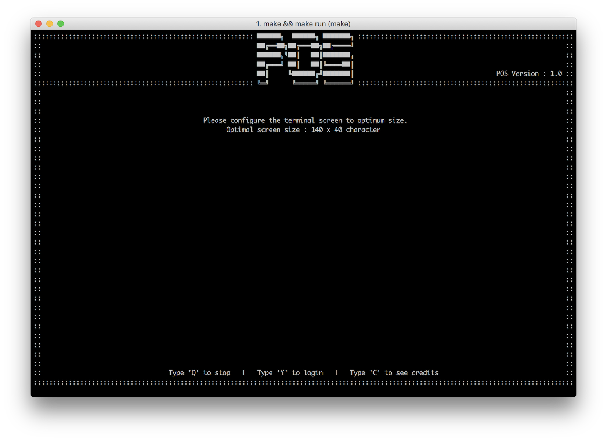

# Installation
สำหรับการใช้งานนั้น ผู้ใช้จะต้องทำการ git clone เพื่อทำการนำโปรเจ็คเข้าสู่คอมพิวเตอร์ก่อน

เมื่อท่านได้ทำการ clone มาแล้วให้ท่านเข้าไปยังโฟลเดอร์ที่ท่านทำการ clone มา ด้วยการใช้ Terminal หรือ Command Prompt และทำการพิมพ์สคริปต์ข้างต้น

```bash
make && make run
```

สคริปต์จะทำการสร้าง Executable File (หรือ .exe)​ เพื่อให้ผู้ใช้งานสามารถกดใช้งานตัวไฟล์ .exe ในครั้งต่อไปโดยที่ไม่จำเป็นต้องทำการพิมพ์สคริปต์นี้อีกครั้งหนึ่ง ซึ่งเมื่อตัวโปรแกรมนั้นได้ถูกเปิดใช้งานแล้ว หน้าจอจะแสดงข้อความและหน้าจอดังภาพด้านล่าง โดยผู้ใช้งานสามารถใช้งานระบบได้ในทันที



เพื่อที่จะใช้งานระบบ ผู้ใช้งานจำเป็นที่จะต้องใส่ชื่อผู้ใช้งาน (Username) และรหัสผ่าน (Password) เพื่อกรอกในหน้าต่อไป กรุณาใช้คำแนะนำวิธีการใช้งานในหน้าเข้าสู่ระบบ
