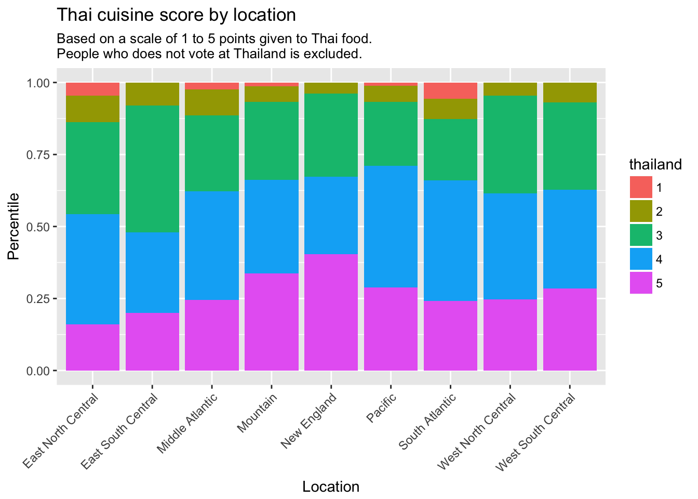
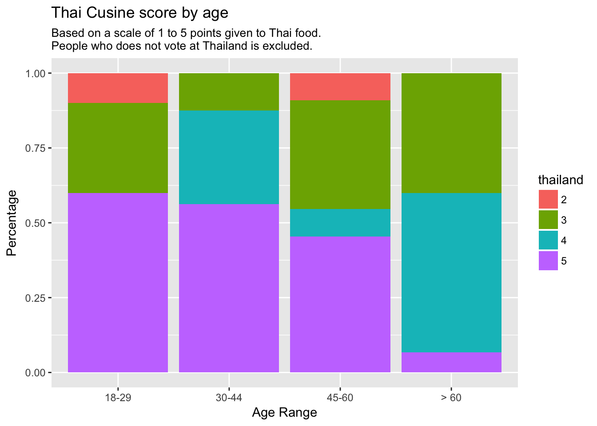
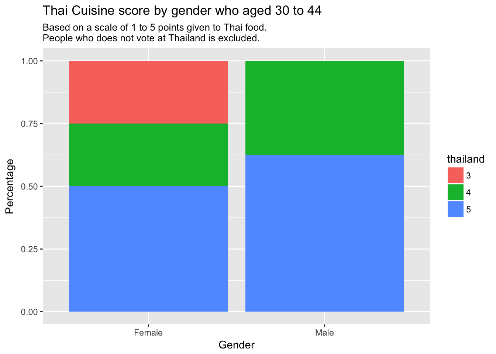
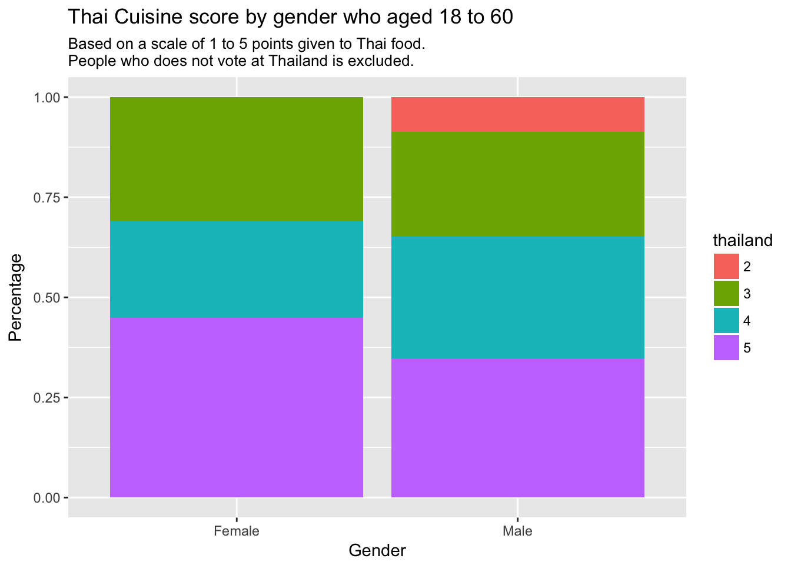

# Report
In United States of America, there is a lot of varieties of cuisine, which each Americans from each location might not have the same food preferences. The problem is that, we cannot find out where should we open a Thai resteraunt at which area.

Thai cuisines is not an American food nor European. As we are talking, we need to make sure that putting a resteraunt there will generate a profit. But we need more information about the customers also.

To find out, we use data from FiveThirtyThree that have surveys thousands of customers all around America.

Question from the data :
1. Where shall we start a Thai resteraunt at?
2. What group of people loves Thai resteraunt?
3. if we put Thai resteraunt there?

## 1 Installing mandatory packages
Package that is not have been installed on the computer will be downloaded.
Package that have been installed will be skipped instead.

``` r
if (!require("fivethirtyeight")) install.packages("fivethirtyeight");
if (!require("tidyverse")) install.packages("tidyverse");
if (!require("gapminder")) install.packages("gapminder");
if (!require("knitr")) install.packages("knitr");
if (!require("tidyr")) install.packages("tidyr");
```

## 2 Introduction to the dataset
Showing the dataset food_world_cup in table

``` r
# Show the data tibble of the dataset `food_world_cup`
food_world_cup
## # A tibble: 1,373 x 48
##    respondent_id knowledge    interest gender age   household_income
##            <dbl> <ord>        <ord>    <chr>  <fct> <fct>
##  1   3308895255. Intermediate Some     Male   18-29 $100,000 - $149,999
##  2   3308891308. Novice       Some     Male   18-29 $100,000 - $149,999
##  3   3308891135. Intermediate A lot    Male   30-44 $50,000 - $99,999
##  4   3308879091. Novice       Not much Male   45-60 $0 - $24,999
##  5   3308871671. Novice       Not much Male   30-44 $25,000 - $49,999
##  6   3308871406. Advanced     A lot    Female 30-44 $50,000 - $99,999
##  7   3308866182. Novice       Some     Male   45-60 <NA>
##  8   3308857114. Advanced     A lot    Male   45-60 $0 - $24,999
##  9   3308856510. Novice       Not much Female 30-44 $50,000 - $99,999
## 10   3308846915. Novice       Some     <NA>   <NA>  <NA>
## # ... with 1,363 more rows, and 42 more variables: education <ord>,
## #   location <chr>, algeria <chr>, argentina <chr>, australia <chr>,
## #   belgium <chr>, bosnia_and_herzegovina <chr>, brazil <chr>,
## #   cameroon <chr>, chile <chr>, china <chr>, colombia <chr>,
## #   costa_rica <chr>, croatia <chr>, cuba <chr>, ecuador <chr>,
## #   england <chr>, ethiopia <chr>, france <chr>, germany <chr>,
## #   ghana <chr>, greece <chr>, honduras <chr>, india <chr>, iran <chr>,
## #   ireland <chr>, italy <chr>, ivory_coast <chr>, japan <chr>,
## #   mexico <chr>, nigeria <chr>, portugal <chr>, russia <chr>,
## #   south_korea <chr>, spain <chr>, switzerland <chr>, thailand <chr>,
## #   the_netherlands <chr>, turkey <chr>, united_states <chr>,
## #   uruguay <chr>, vietnam <chr>
```
Which is mostly a customer information and their ratings on the scale of 1 (as not favorable) to 5 (most favorable).

- **Respond ID** : Unique identifier of the people who surveys
- **Knowledge** : Knowledge on International cuisines (others than American cuisine) which levels from Novice to Advanced.
- **Interest** : Interests on International cuisines which levels from “Not much” to “A lot”
- **Gender** : Gender of those sample
- **Age** : Age of the respondent, which range from “18-29” to “>60”.
- **Household** Income : Household Income those sample
- **Education** : Education degree of the respondent, ranged from “High School Degree” to “Graduate Degree”
- **Location** : Region of the respondent lives at
     with ranges from
     - **East North Central** consists of Illinois, Indiana, Michigan, Ohio, and Wisconsin
     - **East South Central** consists of Alabama, Kentucky, Mississippi, and Tennessee)
     - **Middle** Atlantic consists of New Jersey, New York, and Pennsylvania
     - **Mountain** consists of Arizona, Colorado, Idaho, Montana, Nevada, New Mexico, Utah, and Wyoming
     - **New England** consists of Maine, Vermont, New Hampshire, Massachusetts, Rhode Island, and Connecticut.
     - **Pacific** consists of Alaska, California, Hawaii, Oregon, and Washington
     - **South Atlantic** consists of Delaware, Florida, Georgia, Maryland, North Carolina, South Carolina, Virginia, District of Columbia, and West Virginia
     - **West North Central** consists of Iowa, Kansas, Minnesota, Missouri, Nebraska, North Dakota, and South Dakota
     - **West South Central** consists of Arkansas, Louisiana, Oklahoma, and Texas
- **Others country** : Score of those country’s cuisine. Which ranged from
  - 5: I love this country’s traditional cuisine. I think it’s one of the best in the world.
  - 4: I like this country’s traditional cuisine. I think it’s considerably above average.
  - 3: I’m OK with this county’s traditional cuisine. I think it’s about average.
  - 2: I dislike this country’s traditional cuisine. I think it’s considerably below average.
  - 1: I hate this country’s traditional cuisine. I think it’s one of the worst in the world.
  - N/A: I’m unfamiliar with this country’s traditional cuisine.

with the introduction of the dataset, we shall start analyzing it.

## 3 Search for solution
We have 2 main question to ask.

1. Where shall we start a Thai resteraunt at?
2. What group of people loves Thai resteraunt, if we put Thai resteraunt there?

### 3.1 Where shall we start a Thai resteraunt at?
Starts with getting the data from the dataset and find which area in US loves Thai food the most
``` r
# Filtering the data from food_world_cup with no null data set from location or thailand
b1 <- ggplot(data = subset(subset(food_world_cup, thailand != "N/A"),
                           location != "NA"),
             aes(x = location, fill = thailand)) +

    # Create a stack bar graph
    geom_bar(position = "fill") +

    # Lable a stack bar graph
    labs(x = "Location",
         y = "Percentile",
         title = "Thai cuisine score by location",
         subtitle = "Based on a scale of 1 to 5 points given to Thai food.
People who does not vote at Thailand is excluded.") +

    # Align a lable to 45 degrees + adjust a lable location
    theme(axis.text.x = element_text(angle = 45,
                                     hjust = 1))

b1
```


#### Conclusion
The bar graph visualizes that people in New England really enjoyed Thai food.
People count in each location is varied. So we normalized it into a stacked bar graph for more impact result.

So we will dig down with the data on “Which type of people really loved Thai food”.

### 3.2 What group of people loves Thai resteraunt, if we put Thai resteraunt there?
We have found out that people in New England loves Thai food.
This graph will find out that which age range from New England loves Thai Food.
``` r
# Filtering data from food_world_cup with no null dataset and location is 'New England'
b2 <- ggplot(data=subset(subset(food_world_cup, thailand!="N/A"),
                         location == "New England"),
            # Using the data age as x-axis and thailand as y-axis
             aes(x = age, fill = thailand)) +

# Create Stacked Bar Graph
        geom_bar(position = "fill") +

# Label for the Bar Graph
        labs(x = "Age Range",
             y = "Percentage",
             title = "Thai Cusine score by age",
             subtitle = "Based on a scale of 1 to 5 points given to Thai food.
People who does not vote at Thailand is excluded.")

b2
```


#### Conclusion
This can conclude that people aged between 30-44 enjoyed Thai food the most. Followed by aged 18-29.
Again, the result is very come in close between people who aged 18-29 and 45-60. Thus, we may able to focus on age 18 to 60.

So another question is that “which gender from 18-29 and lives in New England also loves Thai cuisine?”.

### 3.3.1 Which gender loves Thai food the most?
This graph will find the people who is aged 30-44.
``` r
# Filtering data from food_world_cup with no null dataset and location is 'New England' and aged 30 to 44.
b3 <- ggplot(data = subset(subset(subset(food_world_cup, thailand != "N/A"),
                         location == "New England"),
                         age == "30-44"),

             # Using gender as x-axis and thailand as y-axis
             aes(x = gender, fill = thailand)) +

    # Create a stack bar graph
    geom_bar(position = "fill") +

    # Label a stack bar graph
    labs(x = "Gender",
         y = "Percentage",
         title = "Thai Cuisine score by gender who aged 30 to 44",
         subtitle = "Based on a scale of 1 to 5 points given to Thai food.
People who does not vote at Thailand is excluded.")

b3
```


Conclusion People who aged 30-44 and Female strongly love Thai food.
But is it with the age 18-29 and 44-60?

### 3.3.2 Do other range of age loves Thai food?
``` r
# Filtering data from food_world_cup with no null dataset and location is 'New England' and aged between 18 to 60.
b4 <- ggplot(data = subset(subset(subset(food_world_cup, thailand != "N/A"),
                         location == "New England"),
                         age != ">60"),

             # Using gender as x-axis and thailand as y-axis
             aes(x = gender, fill = thailand)) +

    # Create a stack bar graph
    geom_bar(position = "fill") +

    # Label a stack bar graph
    labs(x = "Gender",
         y = "Percentage",
         title = "Thai Cuisine score by gender who aged 18 to 60",
         subtitle = "Based on a scale of 1 to 5 points given to Thai food.
People who does not vote at Thailand is excluded.")

b4
```


Conclusion This strongly supports the fact that Women does love Thai food over Male, with almost 50% of the sample gives a full score to Thai cuisine.

## 4 Conclusions
When about to open a Thai resteraunt, there is a good chance that open in New England region (New England consists of Maine, Vermont, New Hampshire, Massachusetts, Connecticut and Rhode Island) is the best deal.
Main customer ages is mostly Female who aged between 18 to 60.

This may conclude that, we should support the Female with promotions and decorate the resteraunt with more female friendly. Thus can boosts the sales and reputation with the core customers.

With this data, we can safely sure that New England does have a lot of strong demand in Thai food. This confirms by the Google review made by user in New England area, with the average score of 4.5 stars.

## References
This project is part of Probability and Statistics (06016203)

Assistant Teacher : Sooksan Panichpapiboon

### Data Reference
- [https://cran.r-project.org/web/packages/fivethirtyeight/index.html](https://cran.r-project.org/web/packages/fivethirtyeight/index.html)
- [https://fivethirtyeight.com/features/what-is-americans-favorite-global-cuisine/](https://fivethirtyeight.com/features/what-is-americans-favorite-global-cuisine/)
- [https://fivethirtyeight.com/features/the-fivethirtyeight-international-food-associations-2014-world-cup/](https://fivethirtyeight.com/features/the-fivethirtyeight-international-food-associations-2014-world-cup/)
- [https://github.com/fivethirtyeight/data/tree/master/food-world-cup](https://github.com/fivethirtyeight/data/tree/master/food-world-cup)
- [https://goo.gl/maps/c9rvmsGjsn62](https://goo.gl/maps/c9rvmsGjsn62)
- [https://en.wikipedia.org/wiki/List_of_regions_of_the_United_States](https://en.wikipedia.org/wiki/List_of_regions_of_the_United_States)

### Code Reference
- Creating stack bar graph
[http://rstudio-pubs-static.s3.amazonaws.com/3256_bb10db1440724dac8fa40da5e658ada5.html](http://rstudio-pubs-static.s3.amazonaws.com/3256_bb10db1440724dac8fa40da5e658ada5.html)
- Left data text alignment
[https://www.statmethods.net/advgraphs/axes.html](https://www.statmethods.net/advgraphs/axes.html)
