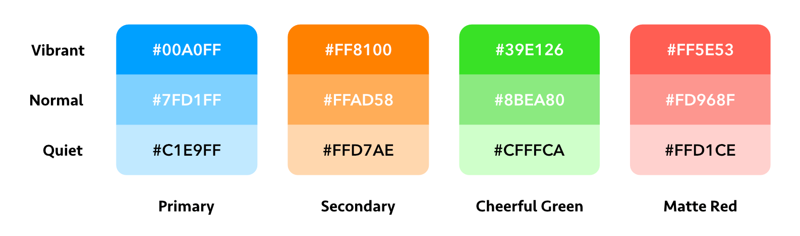
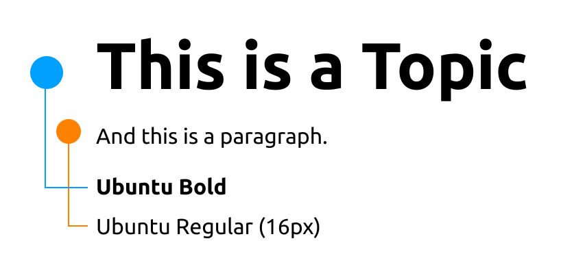
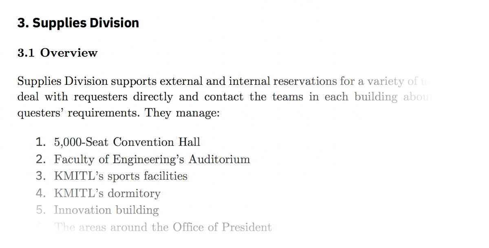

# Style Guide

!> The style of this **documentation** does not reflect the style of the **project**. Please refer to the guide below for the style guide of the **project**.
For example, this documentation is using _IBM Plex Sans_ as the body text, while the project is using _Ubuntu_ as the body text.

## Colors

Use this table to copy easily:

Colors | Primary | Secondary | Cheerful Green | Matte Red
--- | :---: | :---: | :---: | :---:
Vibrant | #00A0FF | #FF8100 | #39E126 | #FF5E53
Normal | #7FD1FF | #FFAD58 | #8BEA80 | #FD968F
Quiet | #C1E9FF | #FFD7AE | #CFFFCA | #FFD1CE

* Use the vibrant tone by default.
* Use the quiet tone when a subtle attention is needed.
* Use the normal tone else.
* Only use a white text on the vibrant tone.
* Only use a black text on the quiet tone.

## Typography

### Project's Typography

### Documents' Typography

* __Title:__ IBM Plex Sans Bold 16pt
* __Heading 1:__ IBM Plex Sans Regular 15pt
* __Heading 2:__ IBM Plex Sans Bold 13pt
* __Heading 3:__ CMU Serif Bold 12pt
* __Body:__ CMU Serif 12pt

?> The required fonts can be download from [SharePoint](http://kmitlthailand-my.sharepoint.com).

