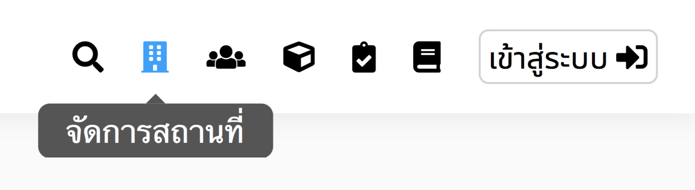
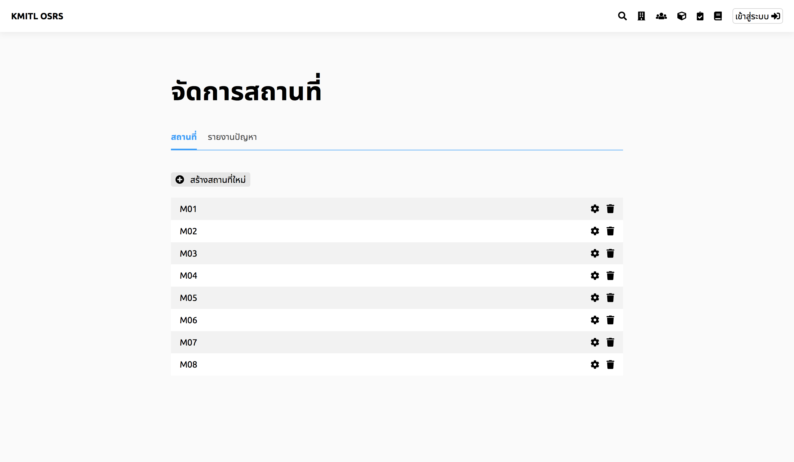

# เพื่มสถานที่เข้าในระบบ
> ต้องเข้าสู่ระบบก่อน
## 1. กดปุ่มจัดการสถานที่

## 2. กดปุ่มสร้างสถานที่ใหม่

กรอกชื่อสถานที่ใหม่ และ กดEnter
## 3. ระบุรายละเอียด
> ช่องที่มีเครื่องหมายดอกจันทร์ (\*) หมายถึงช่องนั้นจำเป็นต้องกรอก

> กรอกชื่อสถานที่ จำนวนที่นั่ง ประเภทสถานที่ ชื่อสำหรับใช้ใน URL (ภาษาอังกฤษเท่านั้น) คำอธิบาย  อัพโหลดรูปภาพ และ เลือกคุณสมบัติได้มากกว่าหนึ่งจากตัวเลือกที่มี

## 4. กดปุ่มบันทึก
