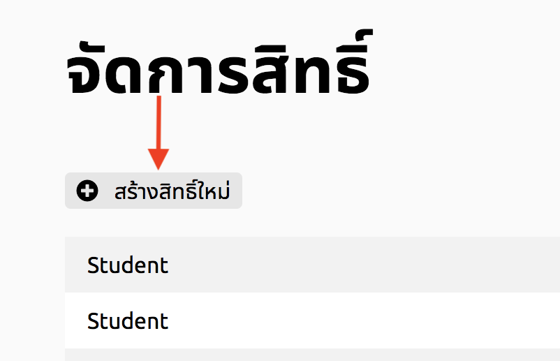

# สร้างกลุ่มผู้ใช้ใหม่
## 1. กดปุ่มจัดการสิทธิ์

 หน้าจอแสดงรายการสิทธิ์ที่มีอยู่
 
## 2. กดปุ่มสร้างสิทธิ์ใหม่

 เมื่อกดแล้วจะเข้าสู่หน้าสร้างสิทธิ์

## 3. สร้างสิทธิ์ใหม่
 กรอกชื่อสิทธิ์ เลือกสิทธิ์การเข้าถึงจากตัวเลือกที่มีอยู่

## 4. กดปุ่มบันทึก
