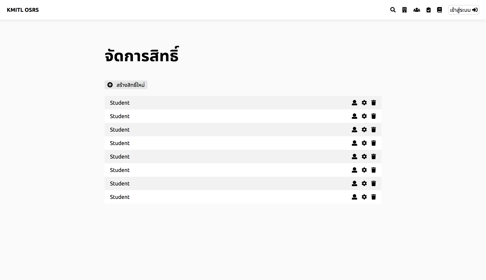

# ลบกลุ่มผู้ใช้
## 1. กดปุ่มจัดการสิทธิ์

 หน้าจอแสดงรายการสิทธิ์ที่มีอยู่

## 2. กดปุ่มถังขยะ

 เลือกกดจากรายการสิทธิ์หนึ่งที่ต้องการลบ

## 3. กดปุ่ม OK
 เมื่อกดแล้วจะลบสิทธิ์ผู้ใช้ออกจากระบบอย่างสมบูรณ์
