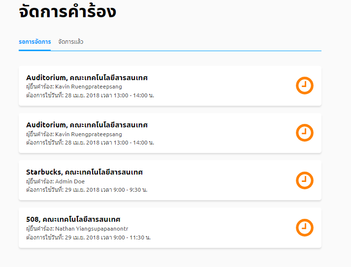

# อนุมัติการใช้สถานที่
> เฉพาะผู้อนุมัติเท่านั้นจึงอนุมัติการใช้สถานที่ได้

## 1. กดปุ่มจัดการคำร้อง
 
## 2. กดคำร้องที่รอการจัดการ
เมื่อทำขั้นตอนที่1แล้ว หน้าจอจะแสดงรายการคำร้องที่รอการจัดการอยู่ 
   
  กดเลือกคำร้องต้องการอนุมัติ จากรายการคำร้อง 
## 3. ดูรายละเอียดคำร้อง
เมื่อทำขั้นตอนที่2แล้ว จะเข้าสู่หน้ารายละเอียดคำร้องซึ่งผู้ใช้สามารถอนุมัติได้
  

## 4. กดปุ่มอนุมัติ

> บางคำร้องอาจต้องการผู้อนุมัติมากกว่า 1 คน การอนุมัติจึงจะเสร็จสมบูรณ์
