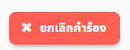

# ยกเลิกการขอใช้สถานที่
## 1. กดปุ่มคำร้องของฉัน
    
   เมื่อกดแล้วจะเข้าสู่หน้าแสดงรายการคำร้องของผู้ใช้ 
    

## 2. เลือกคำร้อง
   สามารถยกเลิกได้เฉพาะคำร้องที่รออนุมัติ มีลักษณะเป็นรูปนาฬิกา 
    
   กดเข้าไปในคำร้องแล้วจะเห็นรายละเอียดคำร้อง 
    

## 3. กดปุ่มยกเลิกคำร้อง
    
   เมื่อกดแล้วระบบจะแสดงผลว่าคำร้องนั้นได้ถูกยกเลิกแล้ว 
    
