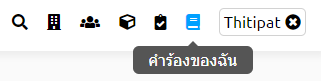
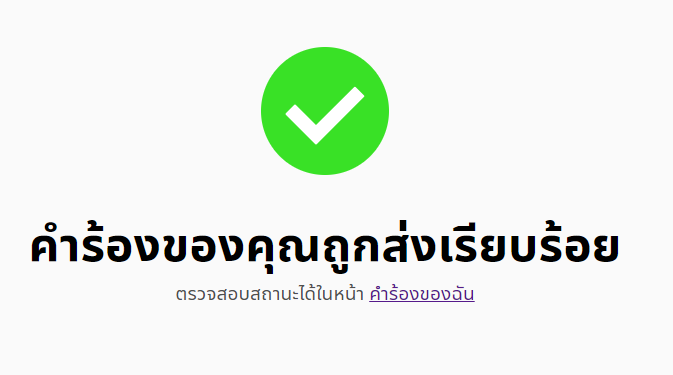

# ดูสถานะการขอใช้สถานที่
> ผู้ใช้งานต้องเข้าสู่ระบบก่อน เพื่อจะใช้งานส่วนนี้ได้

## 1. เข้าหน้าคำร้องของฉัน
กดปุ่มคำร้องของฉันที่อยู่ด้านขวาบนของจอ ในแถบนำทาง มีลักษณะเป็นรูปหนังสือ
 

หรือเมื่อทำการจองเสร็จก็สามารถกดไปยังหน้าคำร้องของฉันได้จากหน้าผลลัพท์การจอง (ตามภาพ)

ดูสถานะคำร้องได้ มี 4 สถานะ คือ อนุมัติ ปฏิเสธ รอการอนุมัติ และ ยกเลิก

- สีเขียว คือ อนุมัติแล้ว 
- สีเหลือง รูปนาฬิกา คือ รออนุมัติ 
- สีแดง แยกเป็น 2 สถานะ
  - หากเขียนว่า FAILED หมายถึงคำร้องนี้ถูกปฏิเสธ
  - หากเขียนว่า CANCELLED แสดงว่าผู้ใช้ยกเลิกคำร้องนั้นด้วยตนเอง

-------

หากต้องการดูข้อมูลเกี่ยวกับคำร้องนั้น ก็สามารถ กดที่คำร้องเพื่อดูรายละเอียดคำร้องนั้นโดยละเอียด ตัวอย่างดังภาพด้านล่าง 

