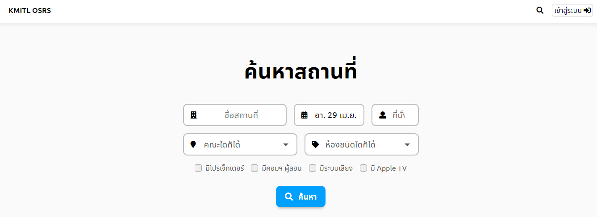
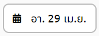
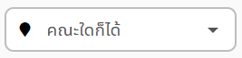
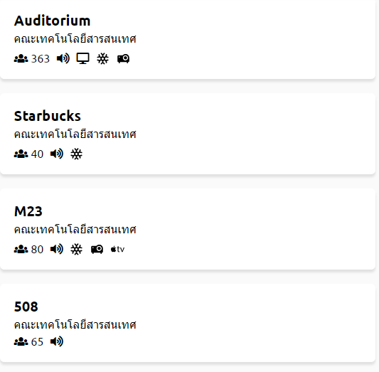
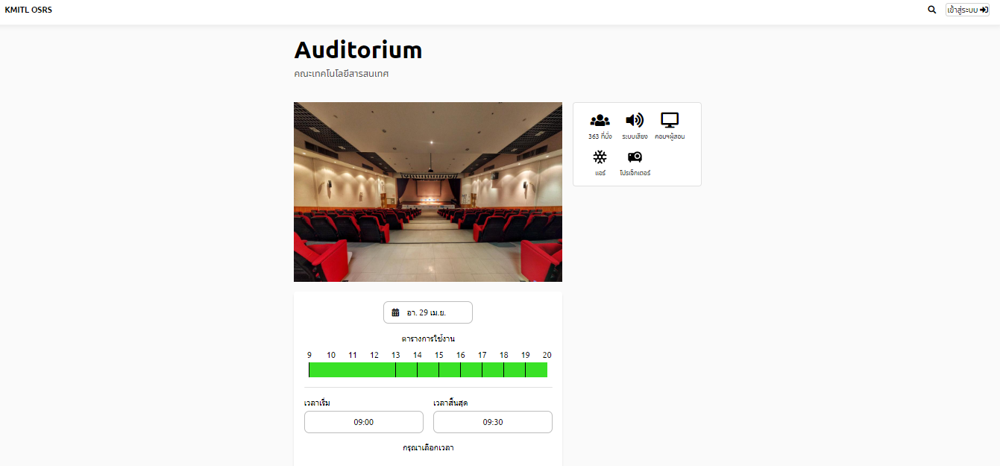

# ค้นหาสถานที่
## 1. เข้าสู่เว็บไซต์
โดยหน้าแรกของระบบ (space.itforge.io) จะขึ้นหน้าค้นหาสถานที่มาเป็นหน้าแรก หากท่านอยู่หน้าต่างอื่น ก็สามารถกดที่ 'KMITL OSRS' มุมบนซ้ายได้

## 2. ระบุรายละเอียด
> หากไม่ต้องการระบุรายละเอียด สามารถข้ามไปยังขั้นตอนที่3 ซึ่งจะเป็นการค้นกาสถานที่จากสิ่งที่ระบบกำหนดไว้ให้เบื้องต้น

**หัวข้อรายละเอียดที่สามารถระบุมีดังนี้**
1. ระบุชื่อสถานที่  

โดยการกรอกชื่อสถานที่ที่ต้องการค้นหา

2. ระบุวันเดือนปี  

โดยการกดเข้าไปในช่องนี้ จะปรากฎปฏิทินให้เลือก วัน เดือน ปี ที่สามารถค้นหาได้

3. ระบุจำนวนที่นั่งที่ต้องการใช้

โดยการพิมพ์ตัวเลขจำนวนที่นั่งที่ต้องการในช่องนี้

4. ระบุคณะ

ท่านสามารถกดเลือกคณะที่ท่านต้องการเลือกได้

5. ระบุประเภทห้อง
 
เมื่อกดปุ่มลูกศรลง   มีตัวเลือกดังนี้

  1.ห้องชนิดใดก็ได้
  2.ห้องเรียน
  3.ห้องประชุม
  4.หอประชุม
  5.แล็บคอมพิวเตอร์

6. ระบุอุปกรณ์ของห้องที่ต้องการใช้
 
จากภาพด้านบน ผู้ใช้สามารถกดกล่องสี่เหลี่ยม   เพื่อระบุอุปกรณ์ที่ต้องการใช้ในสถานที่ เมื่อกดแล้วกล่องจะเป็นแบบนี้  โดยผู้ใช้สามารถระบุอุปกรณ์ที่ต้องการใช้ได้มากกว่า1อุปกรณ์

## 3. กดปุ่มค้นหา
 
เมื่อกดปุ่มค้นหาแล้ว จะขึ้นเป็นแถบห้องต่างๆที่ตรงกับข้อมูลที่ผู้ใช้ระบุ ดังภาพตัวอย่างด้านล่าง 
  
สามารถกดเข้าไปเพื่อดูรายละเอียดห้องและจองห้องได้ รายละเอียดห้องจะเป็นดังภาตัวอย่างด้านล่าง 
  
> หากอยู่ในหน้าอื่น แล้วต้องการมายังหน้าค้นหาสถานที่ สามารถกดได้ที่ ปุ่มรูปแว่นขยาย  หรือ  
