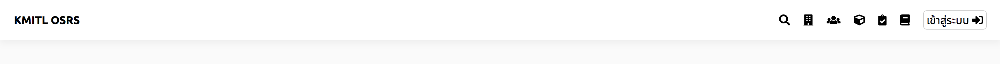
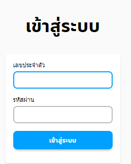
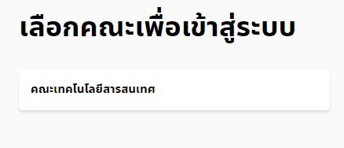

# วิธีเข้าสู่ระบบ
## 1. กดปุ่มเข้าสู่ระบบ
กดปุ่มเข้าสู่ระบบบนแถบนำทาง

## 2. เข้าสู่ระบบ
เมื่อทำขั้นตอนที่1 แล้วจะเข้ามายังหน้าจอดังภาพด้านล่าง การเข้าสู่ระบบต้อง กรอกรหัสนักศึกษา สจล. ในช่องเลขประจำตัว กรอกรหัสผ่านซึ่งเป็นรหัสเดียวกับอีเมลสถาบัน และกดปุ่มเข้าสู่ระบบ 
 
>หากเป็นผู้ดูแลระบบ เมื่อเข้าสู่ระบบมาแล้วจะมีหน้าจอปรากฎให้เลือกว่าจะดูแลจัดการระบบของคณะใด ดังตัวอย่างภาพด้านล่าง 
 
เมื่อกดที่คณะในภาพด้านบนจะทำให้ผู้ใช้เป็นผู้ดูแลจัดการระบบของคณะเทคโนโลยีสารสนเทศ ดังภาพด้านล่าง 

