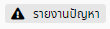
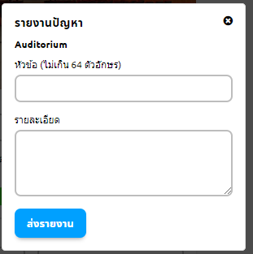
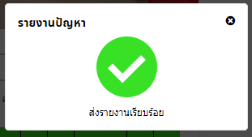

# แจ้งปัญหาของสถานที่
> ผู้ใช้งานต้องเข้าสู่ระบบ และ ค้นหาสถานที่ก่อน

## 1. กดปุ่มรายงานปัญหา
ปุ่มรายงานปัญหา  อยู่ด้านล่างสุดของหน้ารายละเอียดห้อง

## 2. กรอกข้อมูลปัญหา
 
กรอกหัวข้อปัญหา และ รายละเอียดปัญหา แล้ว กดปุ่มส่งรายงาน 
 
เมื่อส่งรายงานสำเร็จ ระบบจะแจ้งเตือนต่อผู้ใช้ สามารถกดปิดการแจ้งเตือนได้เลย
