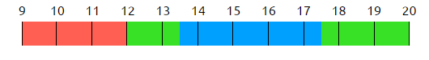
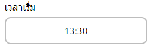
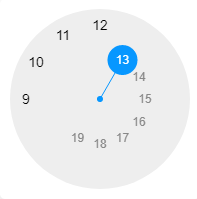
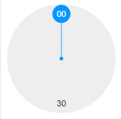
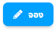
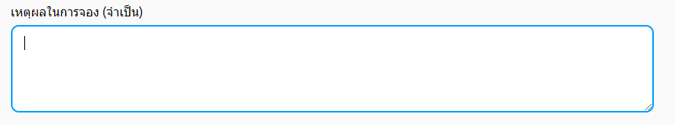
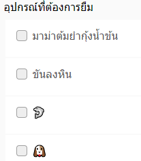

# จองสถานที่
## 1. เลือกวันเดือนปี

โดยการกดเข้าไปในช่องนี้ จะปรากฎปฏิทินให้เลือก วัน เดือน ปี ที่สามารถจองได้

## 2. เลือกช่วงเวลา
บนหน้าจอจะแสดงแถบช่วงเวลาทั้งหมดในวันที่เลือก

3 สีบนแถบแสดงช่วงเวลามีความหมายดังนี้
1. สีแดง - ช่วงเวลาที่ไม่สามารถจองได้
2. สีเขียว - ช่วงเวลาที่สามารถจองได้
3. สีฟ้า - ช่วงเวลาที่ผู้ใช้ต้องการจอง (โดยช่วงสีฟ้านี้เกิดจากการเลือก ช่วงเวลาเริ่มต้น และ ช่วงเวลาสิ้นสุด)

การกำหนดช่วงเวลาเริ่มต้น และ สิ้นสุดสามารถทำได้โดยกดไปยังตัวเลขบนช่องช่วงเวลาเริ่มต้น หรือ สิ้นสุด

 

กดที่เลขชั่วโมงจะปรากฎนาฬิกาให้เลือกเลขชั่วโมงดังภาพ

ผู้ใช้สามารถเลือกเลขชั่วโมงที่มีอยู่บนนาฬิกาได้โดยเลื่อนเม้าส์ไปคลิกที่เลขชั่วโมงที่ต้องการเป็นอันสำเร็จ

กดที่เลขนาทีจะปรากฎนาฬิกาให้เลือกเลขนาทีสองเลขได้แก่ 00 และ 30 ซึ่งหมายถึงเวลา 0 นาที และ 30 นาที

ผู้ใช้สามารถเลือกเลขนาทีที่มีอยู่บนนาฬิกาได้โดยเลื่อนเม้าส์ไปคลิกที่เลขนาทีที่ต้องการเป็นอันสำเร็จ

เมื่อกำหนดทั้งเลขชั่วโมงและนาทีแล้วจะปรากฎช่วงเวลาที่ต้องการบนช่อง ช่วงเวลาเริ่มต้น หรือ สิ้นสุด

*ตัวอย่างการเลือกเวลาด้านบนจะได้ผลลัพธ์*

## 3. กดปุ่มจอง
 
> โดยการจองนั้น จะต้องทำการเข้าสู่ระบบก่อน

## 4. กรอกรายละเอียด
 เมื่อเข้าสู่ระบบ และกดปุ่มจองแ้วจะเข้าสู่หน้ากรอกรายละเอียดโดยจำเป็นต้องกรอกเหตุผลในการจอง

 

## 5. เลือกอุปกรณ์เพิ่มเติม
 เมื่อเลื่อนลงมาจากช่องกรอกเหตุผล จะเจอช่องตัวเลือก ซึ่งหากต้องการอุปกรณ์เพิ่มเติม สามารถกดเลือกอุปกรณ์ที่ต้องการยืมเพิ่มเติม นอกจากที่ปกติมีให้ได้ จากตัวเลือกที่กำหนด ซึ่งจะแตกต่างกันไปในแต่ละห้อง

 

## 6. กดปุ่มส่งข้อมูล
 

 เมื่อกดปุ่มส่งข้อมูลแล้วระบบจะแจ้งเตือนว่าคำร้องถูกส่งไปยังผู้อนุมัติแล้ว

