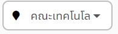
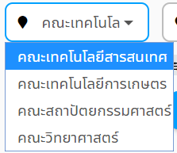
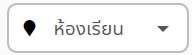
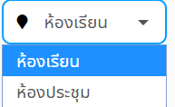
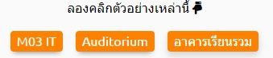

# ค้นหาสถานที่
> ก่อนการค้นหาสถานที่จำเป็นต้องเข้าหน้าค้น
เมื่อเข้ามาแล้วจะเข้าสู่หน้าแรกของเว็บไซต์ซึ่งมีตัวช่วยในการค้นหาอยู่ 
<!--  -->

## ขั้นที่ 1 - ระบุสถานที่ที่ต้องการ
โดยปกติระบบจะเริ่มต้นให้วันที่ปัจจุบันมาอัตโนมัติเพื่อให้ค้นหาสถานที่ว่างทั้งหมดภายในวันนั้นได้เลย (ภาพที่ 1.1) 
<!--  -->

หรือสามารถเลือกวันที่ต้องการโดยกด1ครั้งที่ช่องวันเดือนปี แล้วปฏิทินจะปรากฎขึ้นมา (ภาพที่ 1.2) 
<!--  -->

สามารถกดเลือกวันที่จากเลขบนปฎิทินโดยวันที่ที่เลือกได้เลขจะเป็นสีดำ แต่หากเป็นวันที่ที่เลือกไม่ได้เลขจะเป็นสีเทาอ่อน (ภาพที่ 1.3) 
<!--  -->
 
สามารถเลือกเวลาโดยการกดลูกศรซ้ายเพื่อเลื่อนกลับไปปฏิทินเดือนก่อนหน้า (ภาพที่ 1.4)   
กดลูกศรขวาเพื่อไปยังปฏิทินเดือนถัดไป (ภาพที่ 1.5) 
  
หรือสามารถกดเลือกเดือนที่ต้องการได้โดยการคลิกที่ชื่อเดือนจะปรากฎชื่อเดือนทั้ง12เดือนให้กดเลือก โดยเดือนที่เลือกได้เลขจะเป็นสีดำ แต่หากเป็นเดือนที่เลือกไม่ได้เลขจะเป็นสีเทาอ่อน (ภาพที่ 1.6) 
<!--  -->
 
สามารถกดเลือกปีที่ต้องการได้โดยการคลิกที่เลขปีจะปรากฎแถบให้กดปีที่สามารถเลือกได้ (ภาพที่ 1.7) 
<!--  -->
 
และสามารถระบุรายละเอียดสถานที่เพิ่มเติมโดยพิมพ์ชื่อสถานที่ที่ต้องการในช่อง 'ชื่อสถานที่' (ภาพที่ 1.8) 
 
แต่หากจำชื่อสถานที่ไม่ได้ ระบบก็มีตัวช่วย เป็นปุ่มชื่อ 'แสดงตัวเลือก' กดแล้วจะเห็นช่องตัวช่วย3ช่องอยู่ด้านบนปุ่ม (ภาพที่ 1.9) 
 
ตัวช่วยที่ 1 อยู่ด้านซ้ายมือสุด คือ ช่องตัวเลือกคณะ โดยระบบจะระบุให้คณะเทคโนโลยีสารสนเทศเป็นคณะเริ่มต้น (ภาพที่ 1.10) 
 
หากต้องการเปลี่ยนคณะ สามารถกดที่ช่องคณะจะปรากฎแถบคณะทั้งหมดให้กดเลือก (ภาพที่ 1.11) 
 
ตัวช่วยที่ 2 อยู่ตรงกลาง คือ ตัวช่วยในการระบุประเภทของสถานที่ โดยระบบจะให้ประเภทเริ่มต้นเป็น ห้องเรียน (ภาพที่ 1.12) 
 
แต่หากต้องการห้องประเภทอื่นก็สามารถกดที่ช่องนี้1ครั้ง เพื่อให้แถบประเทสถานที่ทั้งหมดปรากฎขึ้นมาให้กดเลือกประเภทที่ต้องการ (ภาพที่ 1.13) 
 
ตัวช่วยที่ 3 อยู่ด้านขวามือสุด คือ ช่องให้ระบุจำนวนที่นั่งที่รองรับได้ของสถานที่ที่ต้องการ โดยระบบจะไม่ระบุจำนวนที่นั่งเริ่มต้นให้ (ภาพที่ 1.14)  
 
และหากไม่ต้องการใช้ตัวช่วย ให้กดปุ่ม 'ซ่อนตัวเลือก' (ภาพที่ 1.15)   แล้วกลับไปเป็นการค้นหาแบบเริ่มต้น (ภาพที่ 1.16) 
<!--   -->

> ### เพิ่มเติม:
> ในหน้าเริ่มต้นจะมีปุ่มตัวช่วยในการเลือก เป็นตัวอย่างชื่อสถานที่ ซึ่งมีลักษณะเป็นปุ่มสีส้ม (ภาพที่ 1.17)   สามารถกดที่ปุ่มเพื่อให้ระบบกรอกชื่อสถานที่อัตโนมัติ (ภาพที่ 1.18)   

## ขั้นที่ 2 - ค้นหา
กดปุ่มค้นหา ซึ่งมีลักษณะเป็นปุ่มสีฟ้ารูปแว่นขยาย (ภาพที่ 2.1) 
 

จะปรากฎแถบสถานที่ต่างๆ ที่ตรงกับข้อมูลที่ระบุ (ภาพที่ 2.2) 
<!--  -->

> เพิ่มเติม: เมื่อกดเข้าไปยังแถบสถานที่ใดสถานที่หนึ่ง จะเข้าสู่หน้ารายละเอียดสถานที่ ซึ่งสามารถดูรายละเอียดสถานที่ (ภาพที่ 0.1) รายงานปัญหาสถานที่ หรือ จองสถานที่โดยรายละเอียดการใช้งานอยู่ในหัวข้ออื่น ของคู่มือการใช้งาน
<!--  -->
