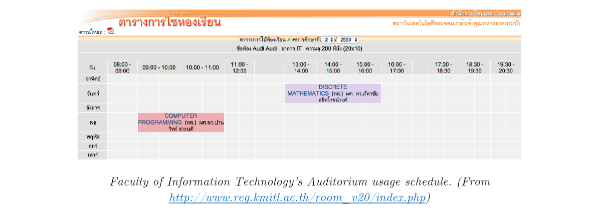

# Room Usage Schedule System Analysis
The Room Usage Schedule System displays a schedule of room usage of each faculty. Most faculties either don’t update their room usage or have them hidden, forcing all faculties to create their own schedules by themselves.

Rooms that are visible to all users are mostly large lecture halls and are from the facul-ties that constantly push new information to the service (for example, Prince Sirind-horn’s General Instruction Building).

The schedule gives information about:
-	subjects that will use a room for a whole semester
-	dates and times of use

The schedule, on the contrary, does not give information about events that will use a room only once or twice.

