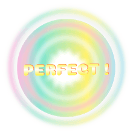

# ติดตั้งเกม
## ดาวน์โหลดเกม
หากคุณยังไม่ได้ดาวน์โหลดไฟล์เกม ก็สามารถดาวน์โหลดเกมได้ที่นี่ : [Download](https://github.com/sagelga/trashmelody/releases)

และทำการแตกไฟล์ `.zip` โดยตัวเกมนั้นอยู่ภายในโฟลเดอร์ `assets/`

## เริ่มเกม
เริ่มต้นเกมด้วยการคลิกที่ `desktop-1.0.jar` และเกมจะเปิดโดยอัตโนมัติ

หากเกมไม่เปิดทันที คุณอาจจะต้องกำหนด 'เปิดโดยใช้' และเลือก Java SE

ตัวที่ถูกเลือกอยู่ เป็นปุ่ม Start โดยหากว่าต้องการจะเข้า ผู้เล่นสามารถกด ‘ENTER’ เพื่อไปหน้าที่ผู้เล่นได้เลือกไว้

## เลือกด่านและความยาก
ผู้เล่นจะต้องเลือกเล่นด่านที่มีให้เลือกทั้ง 6 ด่าน โดยการกดปุ่ม ซ้าย / ขวาของคีย์บอร์ด เพื่อเลือกด่าน โดยด่านที่ถูกเลือกนั้น จะเป็นสีปกติ (ต่างจากด่านที่ไม่ได้เลือก ที่สีจะขาวกว่า) และเพลงประจำด่านก็จะถูกเปิดขึ้น เพื่อการเป็นการพรีวิวเพลง และเมื่อผู้เล่นได้เลือกด่านที่ต้องการที่จะเล่นแล้ว ผู้เล่นสามารถกดปุ่ม ‘ENTER’ เพื่อเริ่มเล่นเกม หรือกดปุ่ม ‘ESC’ เพื่อกลับไปสู่หน้าหลัก

และแต่ละด่านนั้น จะมีให้เลือกความยาก ตั้งแต่ระดับ Easy, Normal, Hard โดยความยากในแต่ละระดับนั้น หมายถึงโน้ตเพลงที่มีมากขึ้น และการหักคะแนนที่มากขึ้น โดยความเร็วที่จะต้องกดนั้นคงเดิม ไม่เปลี่ยนตามระดับความยาก

## การให้คะแนน
เมื่อผู้เล่นทำการแยกขยะ (กดคีย์ตามประเภทขยะ) เกมจะทำการคำนวณคะแนนและให้คะแนนตามความถูกต้องในการแยกขยะและตามระดับความยากของเกม

หากผู้เล่นกดช้า/เร็วเกินไป หรือกดแยกประเภทไม่ถูกต้อง คะแนนที่จะได้จะถูกลดลงลดหลั่นกันไปตามแตกต่างระหว่างเวลาที่ให้กดและเวลาที่ผู้เล่นกด โดยเกมจะแสดงสถานะว่าผู้เล่นกดโน้ตเพลงนั้นแล้วได้กี่คะแนน
| ภาพ                                             | ประเภท  |
| ----------------------------------------------- | ------- |
|   | Missed  |
|      | Bad     |
|     | Cool    |
|     | Good    |
|  | Perfect |

## หน้าผลลัพธ์
หลังจากผู้เล่นได้ทำการเล่นเพลงเสร็จเป็นที่เรียบร้อยแล้ว ตัวเกมจะสร้างผลลัพธ์ให้ผู้เล่นได้ดู ว่ากดได้ประเภทใดบ้าง และกี่คะแนน โดยจะมีการแสดงเกรด ตั้งแต่ A, B, C, D และ F บอกตามประสิทธิภาพของผู้เล่น ว่าได้คะแนนมากขนาดใด โดยผู้เล่นสามารถเข้าไปเล่นด่านนั้นใหม่ เพื่อแก้ไขคะแนน High Score ได้

