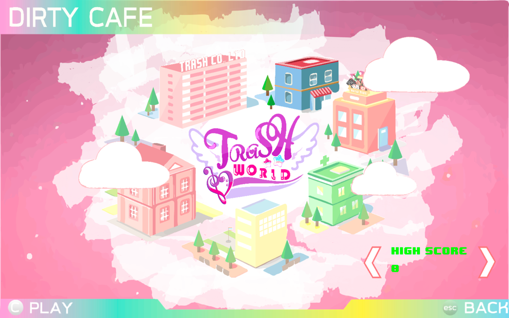

# วิธีการเล่นเกม
เริ่มต้นเกมด้วยการคลิกที่ `desktop-1.0.jar` และเกมจะเปิดโดยอัตโนมัติ

หากเกมไม่เปิดทันที คุณอาจจะต้องกำหนด 'เปิดโดยใช้' และเลือก Java SE

ตัวที่ถูกเลือกอยู่ เป็นปุ่ม Start โดยหากว่าต้องการจะเข้า ผู้เล่นสามารถกด ‘ENTER’ เพื่อไปหน้าที่ผู้เล่นได้เลือกไว้

## เลือกด่านและความยาก
ผู้เล่นจะต้องเลือกเล่นด่านที่มีให้เลือกทั้ง 6 ด่าน โดยการกดปุ่ม ซ้าย / ขวาของคีย์บอร์ด เพื่อเลือกด่าน โดยด่านที่ถูกเลือกนั้น จะเป็นสีปกติ (ต่างจากด่านที่ไม่ได้เลือก ที่สีจะขาวกว่า) และเพลงประจำด่านก็จะถูกเปิดขึ้น เพื่อการเป็นการพรีวิวเพลง และเมื่อผู้เล่นได้เลือกด่านที่ต้องการที่จะเล่นแล้ว ผู้เล่นสามารถกดปุ่ม ‘ENTER’ เพื่อเริ่มเล่นเกม หรือกดปุ่ม ‘ESC’ เพื่อกลับไปสู่หน้าหลัก

และแต่ละด่านนั้น จะมีให้เลือกความยาก ตั้งแต่ระดับ Easy, Normal, Hard โดยความยากในแต่ละระดับนั้น หมายถึงโน้ตเพลงที่มีมากขึ้น และการหักคะแนนที่มากขึ้น โดยความเร็วที่จะต้องกดนั้นคงเดิม ไม่เปลี่ยนตามระดับความยาก
