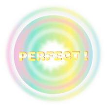
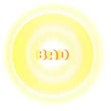
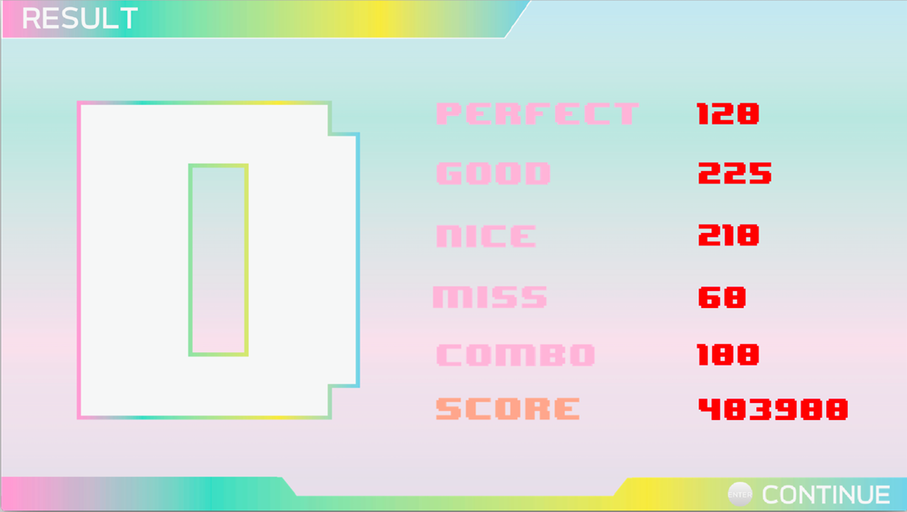

# กฎการเล่นเกม
ผู้เล่นต้องทำการแยกขยะลงถังที่ถูกต้อง เมื่อผู้เล่นแยกขยะลงถังที่ถูกต้องผู้เล่นจะได้รับคะแนนตามความแม่นยำที่กดได้

ภายในเกมจะมีขยะอยู่ 12 ลักษณะ โดยมีประเภทของขยะ 4 ประเภทได้แก่
- ขยะอันตราย
- ขยะรีไซเคิล
- ขยะเปียก
- ขยะทั่วไป

โดยเมื่อเกมเริ่มต้นขึ้น จะมีขยะขึ้นมาเพื่อให้ผู้เล่นได้ทำการคัดแยก โดยที่ผู้เล่นจะต้องทำการคัดแยกเมื่อขยะนั้นอยู่ในเส้นคัดแยก (เส้นสีขาว) ด้วยการกดแป้นบนคีย์บอร์ด

## การให้คะแนน
เมื่อผู้เล่นทำการแยกขยะ (กดคีย์ตามประเภทขยะ) เกมจะทำการคำนวณคะแนนและให้คะแนนตามความถูกต้องในการแยกขยะและตามระดับความยากของเกม

หากผู้เล่นกดช้า/เร็วเกินไป หรือกดแยกประเภทไม่ถูกต้อง คะแนนที่จะได้จะถูกลดลงลดหลั่นกันไปตามแตกต่างระหว่างเวลาที่ให้กดและเวลาที่ผู้เล่นกด โดยเกมจะแสดงสถานะว่าผู้เล่นกดโน้ตเพลงนั้นแล้วได้กี่คะแนน

| ภาพ                                             | ประเภท  | คะแนนที่ได้รับ |
| ----------------------------------------------- | ------- | ---------- |
|  | Perfect | 8,000      |
|     | Good    | 7,000      |
|     | Cool    | 5,000      |
|      | Bad     | 2,000      |
|   | Missed  | 0          |

## หลอดเลือด
หากว่าผู้เล่นทำการกดแยกขยะได้ไม่ถูกต้อง (Missed) หรือได้ Bad เกมจะทำการหักหลอดเลือดตามประเภทความผิดพลาด
แต่ผู้เล่นก็สามารถได้รับเลิอดคืนมาจากการแยกขยะให้ได้ Perfect, Great, หรือ Nice โดยก็จะได้มากน้อยตามระดับความถูกต้องจนเลือดเต็มหลอดอีกครั้ง
หากว่าแถบเลือดลดลงเหลือ 0 เกมจะจบทันที

| ประเภท  | เลือดที่ได้รับ |
| ------- | --------- |
| Perfect | 30        |
| Good    | 20        |
| Cool    | 10        |
| Bad     | -300      |
| Missed  | -500      |

## หน้าผลลัพธ์
หลังจากผู้เล่นได้ทำการเล่นเพลงเสร็จเป็นที่เรียบร้อยแล้ว ตัวเกมจะสร้างผลลัพธ์ให้ผู้เล่นได้ดู ว่ากดได้ประเภทใดบ้าง และกี่คะแนน โดยจะมีการแสดงเกรด ตั้งแต่ A, B, C, D และ F บอกตามประสิทธิภาพของผู้เล่น ว่าได้คะแนนมากขนาดใด โดยผู้เล่นสามารถเข้าไปเล่นด่านนั้นใหม่ เพื่อแก้ไขคะแนน High Score ได้

โดยเกณฑ์การให้เกรดนั้นมีดังนี้
| เกรด | เปอร์เซนต์คะแนน   |
| ---- | --------------- |
| A    | > 90%           |
| B    | > 65% และ < 90% |
| C    | > 50% และ < 65% |
| D    | > 40% และ < 50% |
| F    | < 40%           |

## ประเภทขยะ
### ขยะอันตราย
| ภาพ                                                   | ชื่อขยะ     |
| ----------------------------------------------------- | --------- |
|    | ทินเนอร์    |
|  | สเปรย์ฉีดผม |
|  | น้ำมันหล่อลื่น  |
|  | บุหรี่       |

### ขยะรีไซเคิล
| ภาพ                                                     | ชื่อขยะ       |
| ------------------------------------------------------- | ----------- |
|     | ถาดพลาสติก   |
|     | เศษกระดาษ   |
|     | แก้วพลาสติก   |
|          | กระดาษใช้แล้ว |
|      | กล่องลัง      |
|  | ขวดพลาสติก   |

### ขยะเปียก
| ภาพ                                            | ชื่อขยะ   |
| ---------------------------------------------- | ------- |
|   | ป๊อปคอร์น |
|     | โดนัท    |
|     | แกงกะหรี่ |
|       | ชาเขียว  |
|  | ไอศกรีม  |

### ขยะทั่วไป
| ภาพ                                                  | ชื่อขยะ     |
| ---------------------------------------------------- | --------- |
|  | ถุงพลาสติก  |
|     | จานเซรามิค |
|  | หลอดยาสีฟัน |
|         | ผ้าขี้ริ้ว     |
|      | ดินสอ      |
