# กฎการเล่นเกม
ผู้เล่นต้องทำการแยกขยะลงถังที่ถูกต้อง เมื่อผู้เล่นแยกขยะลงถังที่ถูกต้อง ผู้เล่นจะได้รับคะแนนตามความแม่นยำที่กดได้ เช่น perfect, great, nice, bad, miss แต่ถ้ากดได้ bad, miss, แยกขยะผิด หรือไม่กดก็จะถูกลดเลือด เมื่อแถบเลือดลดลงเหลือ 0 เกมจะจบและผู้เล่นก็จะแพ้

ผู้เล่นต้องเล่นให้จบและทำคะแนนให้สูงที่สุด โดยสามารถเล่นให้ high score สูงขึ้นเรื่อยๆได้

ภายในเกมจะมีขยะอยู่ 12 ลักษณะ โดยมีประเภทของขยะ 4 ประเภทได้แก่
- ขยะอันตราย
- ขยะรีไซเคิล
- ขยะเปียก
- ขยะทั่วไป

โดยเมื่อเกมเริ่มต้นขึ้น จะมีขยะขึ้นมาเพื่อให้ผู้เล่นได้ทำการคัดแยก โดยที่ผู้เล่นจะต้องทำการคัดแยกเมื่อขยะนั้นอยู่ในเส้นคัดแยก (เส้นสีขาว) ด้วยการกดแป้นบนคีย์บอร์ด

## การควบคุม
เพื่อทำการคัดแยกขยะที่เส้นคัดแยก ผู้ใช้จะต้องคัดแยกด้วยแป้นคีย์บอร์ดตามประเภทของขยะดังนี้
- `D` สำหรับถังขยะอันตราย
- `F` สำหรับถังขยะรีไซเคิล
- `J` สำหรับถังขยะเปียก
- `K` สำหรับถังขยะทั่วไป

## ประเภทขยะ
### ขยะอันตราย
| ภาพ                                                   | ชื่อขยะ     |
| ----------------------------------------------------- | --------- |
| 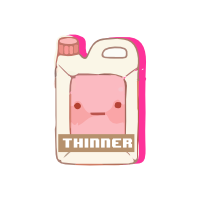   | ทินเนอร์    |
| 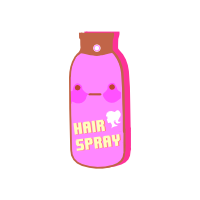 | สเปรย์ฉีดผม |
| 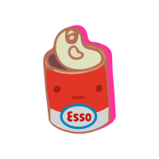 | น้ำมันหล่อลื่น  |
| 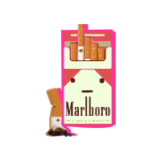 | บุหรี่       |

### ขยะรีไซเคิล
| ภาพ                                                     | ชื่อขยะ       |
| ------------------------------------------------------- | ----------- |
| 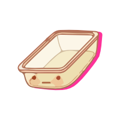    | ถาดพลาสติก   |
| 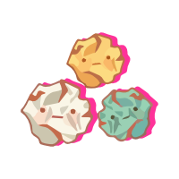    | เศษกระดาษ   |
| 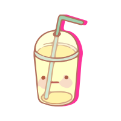    | แก้วพลาสติก   |
| 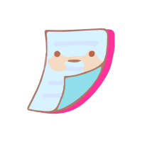         | กระดาษใช้แล้ว |
| 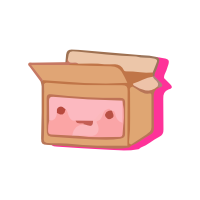     | กล่องลัง      |
| 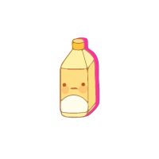 | ขวดพลาสติก   |

### ขยะเปียก
| ภาพ                                            | ชื่อขยะ   |
| ---------------------------------------------- | ------- |
| 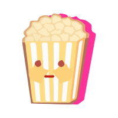  | ป๊อปคอร์น |
| 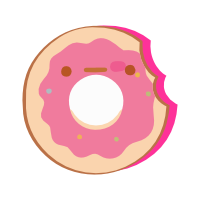    | โดนัท    |
| 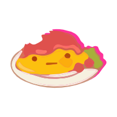    | แกงกะหรี่ |
| 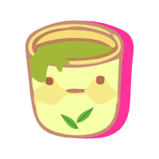      | ชาเขียว  |
| 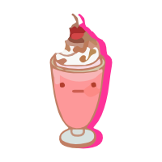 | ไอศกรีม  |

### ขยะทั่วไป
| ภาพ                                                  | ชื่อขยะ     |
| ---------------------------------------------------- | --------- |
| 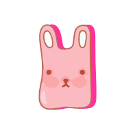 | ถุงพลาสติก  |
| 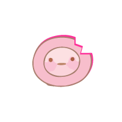    | จานเซรามิค |
| 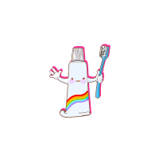 | หลอดยาสีฟัน |
| 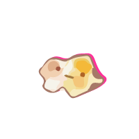        | ผ้าขี้ริ้ว     |
| 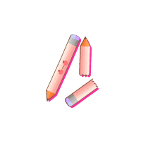     | ดินสอ      |
